- title: The rise and fall of extensible programming languages

*****************************************************************************************
- template: title

# **The rise and fall** of extensible programming languages

---

**Tomas Petricek**, Charles University, Prague

_<i class="fa fa-at"></i>_ [tomas@tomasp.net](mailto:tomas@tomasp.net) | [@tomaspetricek](http://twitter.com/tomaspetricek)    
_<i class="fa fa-globe"></i>_ [https://tomasp.net](https://tomasp.net)  

*****************************************************************************************
- template: subtitle

# Entry points
## Where do you encounter them?

-----------------------------------------------------------------------------------------
- template: lists

# Adding data types to Algol

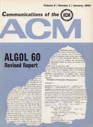

## Algol 58/60

- A beautiful mathematical achievement
- Influential in theory, but not real use
- Lacked data types (records) of COBOL

## Algol 68

- Adds "data types" known as "modes"
- Primitive modes (int, bytes, sema, file, format, ...)
- Declarations (structures, arrays, references, ...)

-----------------------------------------------------------------------------------------
- template: image
- class: smaller2x

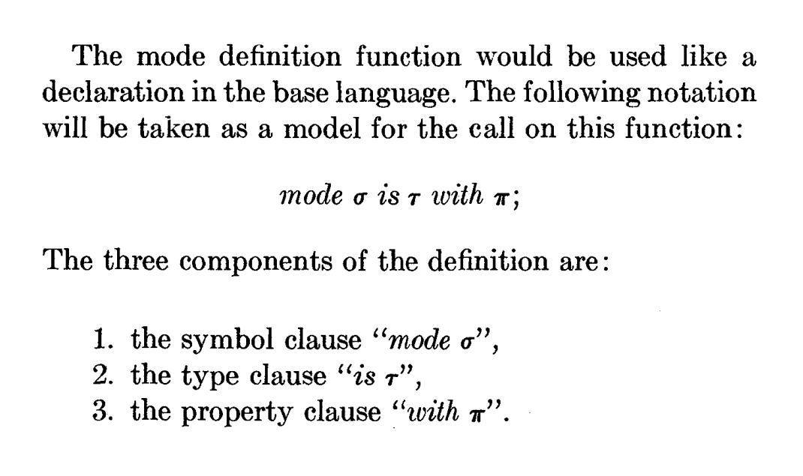

# Semantic extensibility

"The objects involved in the processing of a program
are divided into classes, each characterized by a mode."

"The principal component of the semantic extension
mechanism is a function which permits the definition
of new modes."

-----------------------------------------------------------------------------------------
- template: image

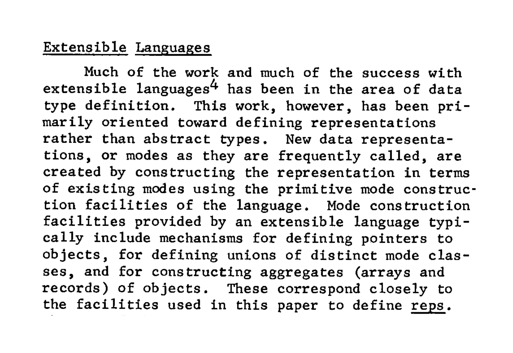

# Abstract data types in Clu

**Language developed by Liskov in mid-1970s**

Data definitions in "extensible languages" related to "abstract data types".

-----------------------------------------------------------------------------------------
- template: lists

# The early history of Smalltalk

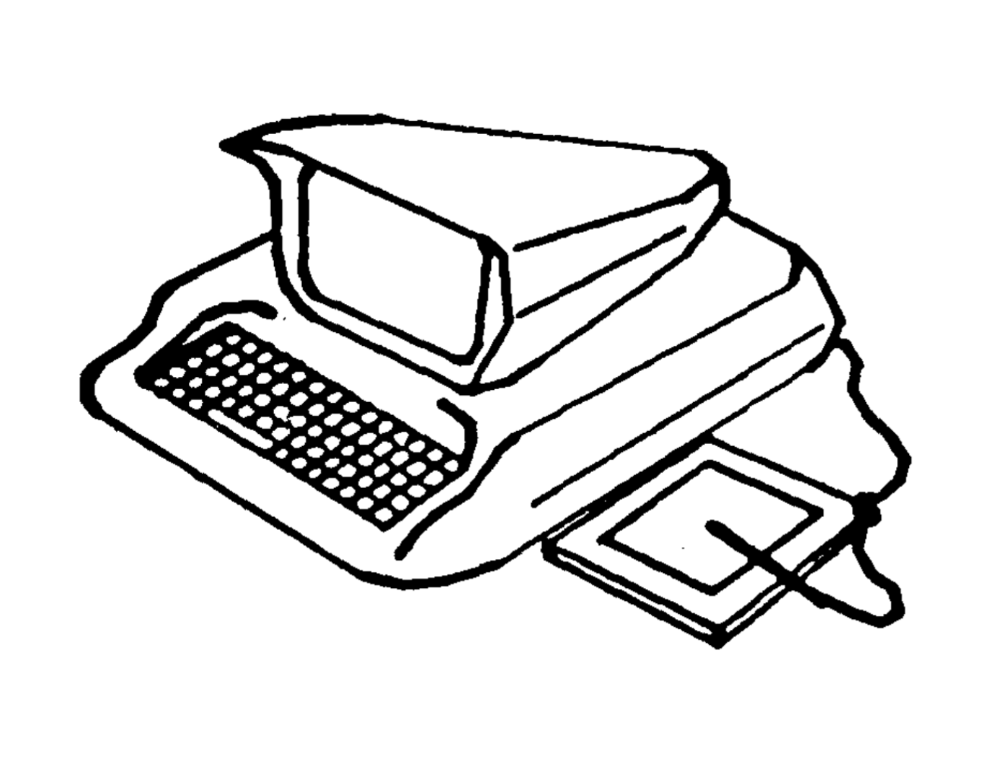

## Conference in 1969

[In 1969] there was a conference on Extensible Languages in which almost
every famous name in the field attended.

## Work on extensible languages

The debate was great and weighty—it was a religious war of unimplemented
poorly thought out ideas. (...) But it was all talk—no one had done anything yet.

-----------------------------------------------------------------------------------------
- template: image

# Programming Languages: History and Fundamentals

Influential book published in 1969

-----------------------------------------------------------------------------------------
- template: image

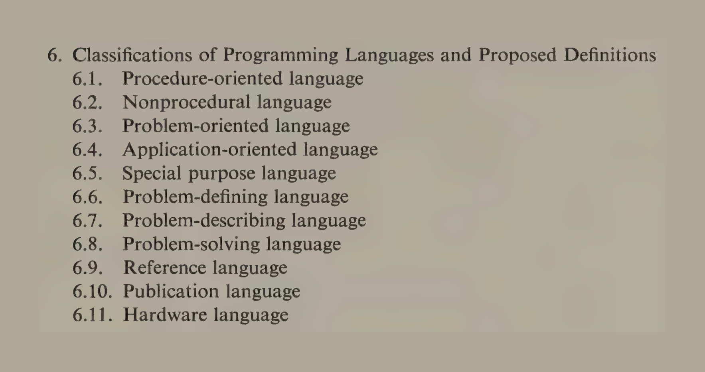

# Programming Languages: History and Fundamentals

Influential book published in 1969

**No extensible programming languages in the  table of contents!**

-----------------------------------------------------------------------------------------
- template: largeicons

# A brief history of the field

- *fa-users* **Working Conference on Extensible Languages**  
  Talks on data types, PPL, held at CMU (1968)
- *fa-chess* **Extensible Languages Symposium**  
  Every famous name attended - held in Boston (1969)
- *fa-book* **International Symposium on Extensible Languages**  
  Still a somewhat random program! - In Grenoble (1971)
- *fa-person-chalkboard* **Extensibility in programming language design**  
  "Most prefer to buy rather than build" (AFIPS'75)

*****************************************************************************************
- template: subtitle

# Vision
## The vision and the reality

-----------------------------------------------------------------------------------------
- template: image
- class: smaller2x

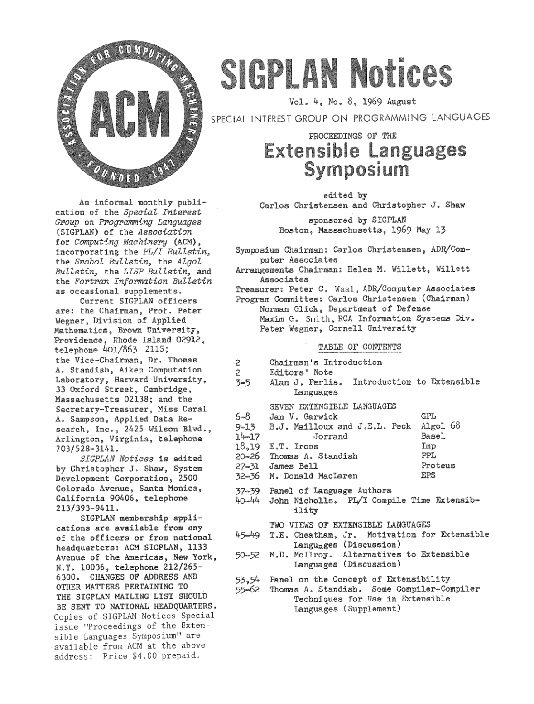

# Chairman's intro (1969)

**The ultimate [objective] is simple and attractive.
A single universal programming system [that] includes a base language & a meta-language.**

A program [consists of], sta&shy;tements in the meta-language which expand (...) the base
language, [followed by a program in the derived language.]

-----------------------------------------------------------------------------------------
- template: image
- class: smaller2x

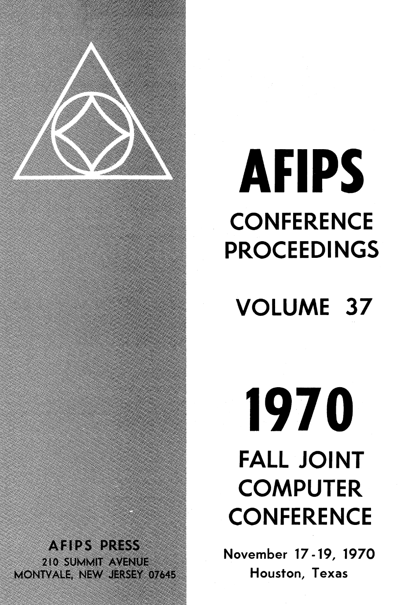

# An appealing idea

**Definition mechanisms in extensible languages (1970)**

One simple premise underlies the proposals: that a "user" should
be capable of modi&shy;fying the definition of that language,
in order to define for himself the particular language
which corresponds tb his needs.

-----------------------------------------------------------------------------------------
- template: lists

# Every famous name attended

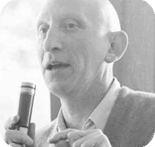

## Alan Perlis introduction (1969)

Discovery of something new in program&shy;ming languages
has somewhat the same sequence of emotions as falling in love.

Sharp elation followed by euphoria, a feeling of uniqueness, and ultimately the wandering eye (the urge to generalize).

I hope that Extensible Languages will have a  
long enough appeal for us in this rapidly changing  
world that we can draw from its juices.

-----------------------------------------------------------------------------------------
- template: image

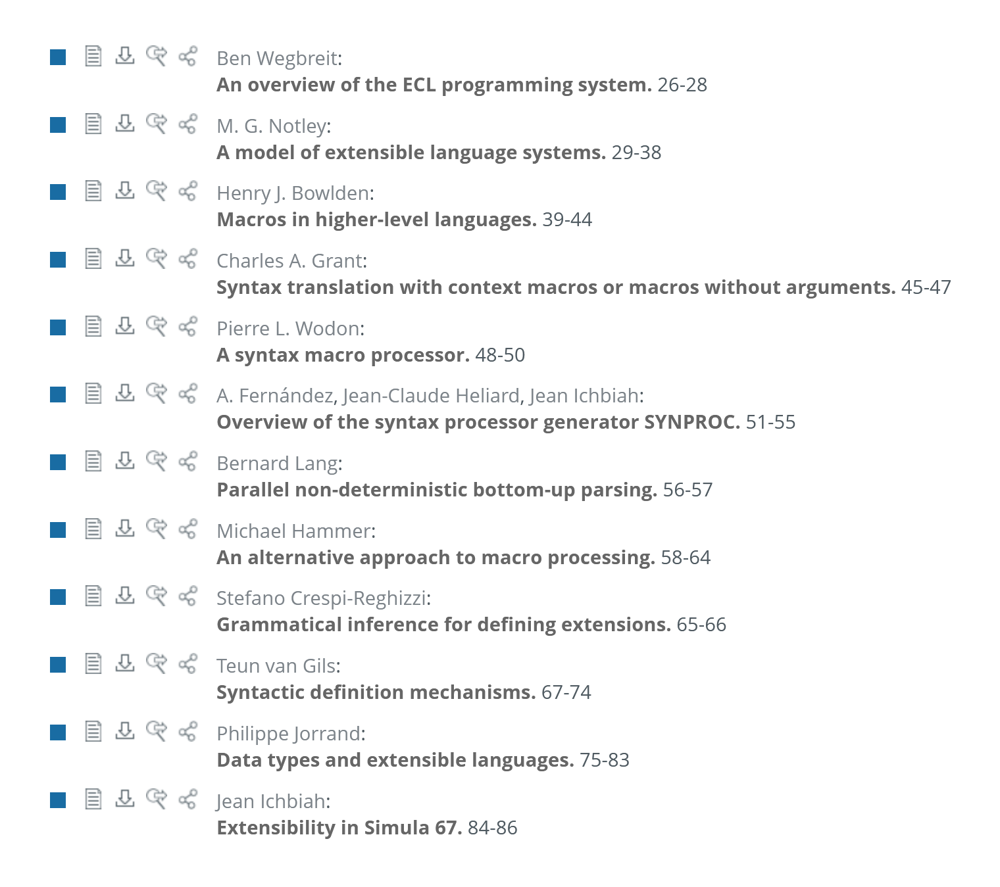

# Extensible languages (1971)

**Macros and parsing**

New look at languages like Simula 67, Algol N

**Critical reflections  
and failure reports**

4 papers on the ECL programming system

-----------------------------------------------------------------------------------------
- template: lists

# Extensibility in ECL

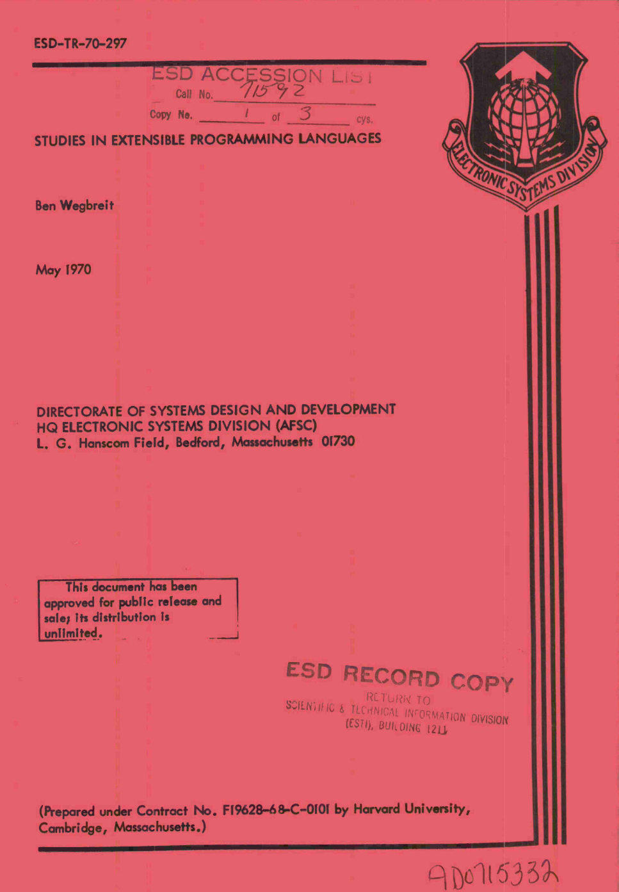

## Syntactic extension
Specification of new syntactic forms

## Data type extension
Define new information structures

## Operator extension
Add operations to new & existing types

## Control extension
Coordination of asynchronous processes

-----------------------------------------------------------------------------------------
- template: image

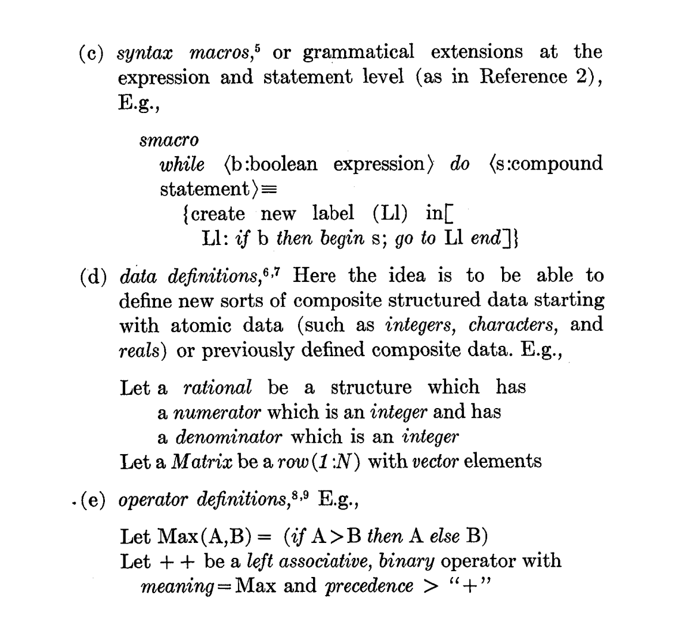

# Extension techni&shy;ques review (1975)

---

**Paraphrase** in terms of something known

---

**Orthophrase** adding orthogonal feature by "processor surgery"

**Metaphrase** altering interpretation of an existing thing

*****************************************************************************************
- template: subtitle

# Reflections
## What happened to extensible languages

-----------------------------------------------------------------------------------------
- template: lists
- class: smaller

# Reflections on extensible languages

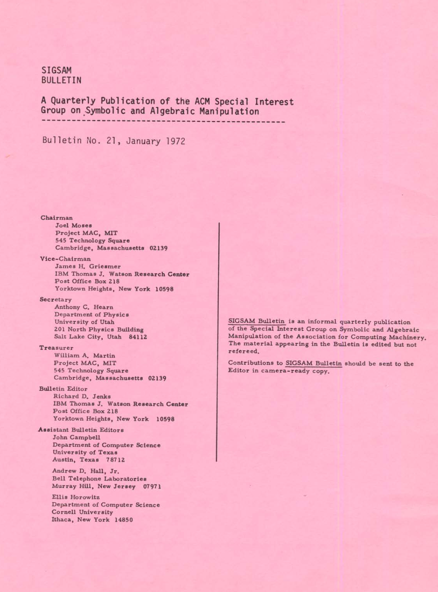

## Cheatham (1971)

There are clearly many at this conference who feel that we are still not there (...). I do not share this opinion. Rather, I think that in a very strong sense "we have arrived".

## Standish (1975)

The belief that "we could make it possible for unsophisticated users to manufacture personalized
languages (...) with great ease" was "probably a bit overambitious."

-----------------------------------------------------------------------------------------
- template: icons

# Reflections
## What works and what does not?

- *fa-toolbox* Do-it-yourself kit philosophy
- *fa-plug-circle-check* Easily reached extensions (types, operations)
- *fa-cogs* Hard extensions requiring system surgery
- *fa-car* Most prefer to buy rather than to build

-----------------------------------------------------------------------------------------
- template: largeicons

# Extensible languages today?

- *fa-shapes* **Defining new data types & operations**  
  Standard feature of all languages
- *fa-language* **Customizing syntax via macros**  
  Available in some languages, but dangerous
- *fa-cog* **Redefinition of existing structures**    
  Exists in very specialized contexts (monads)
- *fa-envelope-open-text* **Extensible languages as such**  
  LISP and an occasional revival of the vision

*****************************************************************************************
- template: subtitle

# Conclusions
## Extensible programming languages

-----------------------------------------------------------------------------------------
- template: title

# **Conclusions**

**Why extensible languages never caught up?**

- Custom languages is a very appealing vision!
- Conceptually coherent, not technically coherent?
- Lost to abstract data types & object-orientation?

---

**Tomas Petricek**, Charles University, Prague

_<i class="fa fa-at"></i>_ [tomas@tomasp.net](mailto:tomas@tomasp.net) | [@tomaspetricek](http://twitter.com/tomaspetricek)    
_<i class="fa fa-globe"></i>_ [https://tomasp.net](https://tomasp.net)  

*****************************************************************************************
- template: content
- class: condensed

# References

https://dl.acm.org/toc/sigplan/1969/4/8
https://dl.acm.org/doi/pdf/10.1145/1499949.1500003
https://dl.acm.org/doi/pdf/10.1145/1086784.1086785
