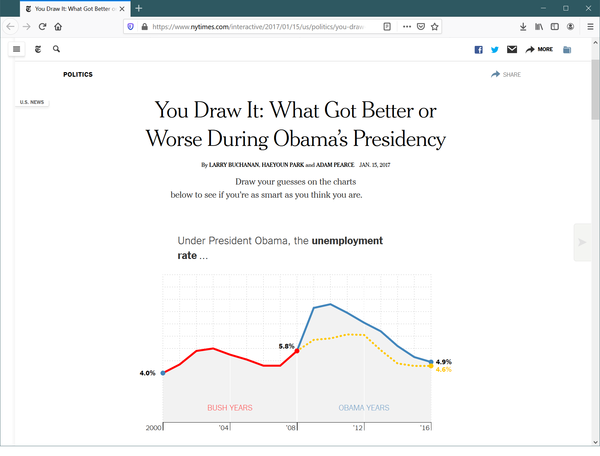

- title: Towards simple and open data visualization tools

*****************************************************************************************
- template: title

# **The Gamma and Compost.js**<br/> Towards simple and open data visualization tools


---

**Tomas Petricek**, Charles University

_<i class="fa fa-envelope"></i>_ [petricek@d3s.mff.cuni.cz](mailto:petricek@d3s.mff.cuni.cz)  
_<i class="fa-solid fa-circle-right"></i>_ [https://tomasp.net](https://tomasp.net)   
_<i class="fa-brands fa-twitter"></i>_ [@tomaspetricek](http://twitter.com/tomaspetricek)

*****************************************************************************************
- template: image
- class: larger


# Data journalism

---

Visualizations tell powerful stories

**But EXTREMEly hard to develop**

*****************************************************************************************
- template: icons

# Can we make it easier?

## Advancing the state of the art

- *fa-magnifying-glass* Can be understood by the reader
- *fa-hand-dots* Can be created by non-experts
- *fa-repeat* Keep the reproducibility of code
- *fa-atom* Offer flexibility for experts

*****************************************************************************************
- template: subtitle

# The Gamma
## Data exploration for non-programmers

*****************************************************************************************
- template: icons

# The Gamma
## Language that understands data

 - *fa-code* Dot-driven - _Recognition over recall_ 
 - *fa-check* Complete & correct - _Options based on data_
 - *fa-user* User-centric - _Ideas from spreadsheets_
 - *fa-plug* Extensible - _Can add other data_
 
*****************************************************************************************
- template: image


# Type providers

Map data into The Gamma system

---

**Data cubes**  
Gradual slicing  
of dimensions

**Graph data**  
Path patterns  
with holes


*****************************************************************************************
- template: subtitle

# Compost.js
## Composable charting abstractions

*****************************************************************************************
- template: image


# What is a chart?

---

A very long list...

_Bar chart_  
_Column chart_  
_Line chart_  
_Area chart_  
_Scatter chart_  
_Histogram_  
_Combo chart???_

*****************************************************************************************
- template: image


# What is a chart?

---

Uh...

_Maybe chart is just an SVG graphics with text, shapes and pixel coordinates?_

*****************************************************************************************
- template: content

# What is a chart?

**D3 is a too low-level answer**

```
x = d3.scaleLinear([0, m - 1], [0, width])
y = d3.scaleLinear([0, 1], [height, 0])
z = d3.interpolateCool
d3.area().x((d, i) => x(i)).y0(d => y(d[0])).y1(d => y(d[1]))
```

---

**Google Charts is a too high-level answer**

```javascript
var options = {
  vAxis: {title: 'Cups'}, hAxis: {title: 'Month'},
  seriesType: 'bars', series: {5: {type: 'line'}} };
chart.draw(data, options);
```

*****************************************************************************************
- template: image



# What is a chart?

---

Also interactivity!

_A chart where the reader has to make a guess before seeing the answer._

*****************************************************************************************
- template: subtitle

# DEMO
## Creating charts with Compost.js

*****************************************************************************************
- template: icons

# What is a chart
## Fundamentals of a chart

 - *fa-map* Projections _from domain values to pixels_
 - *fa-shapes* Shapes _such as areas and lines_
 - *fa-link* Composition _of multiple shapes and text_
 - *fa-mouse-pointer* Interactivity _state depends on user input_

*****************************************************************************************
- template: subtitle

# DEMO
## You Guess charts in The Gamma

*****************************************************************************************
- template: subtitle

# ExtremeXP
## Possible research directions?

*****************************************************************************************
- template: icons

# ExtremeXP
## Possible research directions

- *fa-database* Exposing Extreme data in The Gamma?
- *fa-vial-circle-check* Using "You Guess" in experiment modelling?
- *fa-chart-simple* Quick chart prototyping with Compost.js?
- *fa-wand-magic-sparkles* Using LLMs to write Compost or Gamma code?

*****************************************************************************************
- template: title

# Thank you!

---

**Tomas Petricek**, Charles University  

_<i class="fa fa-envelope"></i>_ [petricek@d3s.mff.cuni.cz](mailto:petricek@d3s.mff.cuni.cz)  
_<i class="fa-solid fa-circle-right"></i>_ [https://tomasp.net](https://tomasp.net)   
_<i class="fa-brands fa-twitter"></i>_ [@tomaspetricek](http://twitter.com/tomaspetricek)

*****************************************************************************************
- template: content
- class: condensed

# References

**Project home pages**

- Compost.js library - https://compostjs.github.io
- The Gamma home page - https://thegamma.net
- The Gamma demos - https://turing.thegamma.net/

**Relevant papers**

- Petricek, T. (2020) _The Gamma: Programmatic Data Exploration for Non-programmers._ IEEE VL/HCC
- Petricek, T. (2021) _Composable data visualizations._ JFP 31: e13.
- Petricek, T. (2017) _Data exploration through dot-driven development._ European Conference on Object-Oriented Programming (ECOOP)

*****************************************************************************************
- template: content
- class: condensed

# References

**Other possibly relevant work**

- Petricek, T., et al. (2022) _AI Assistants: A Framework for Semi-Automated Data Wrangling._ IEEE TKDE (2022).
- Perera, R., et al. (2022) _Linked visualisations via Galois dependencies._ Proceedings of the ACM on PL 6. POPL (2022): 1-29.
- Petricek, T., Geddes, F., and Sutton, C. (2018) _Wrattler: Reproducible, live and polyglot notebooks._ USENIX TaPP.
- Petricek, T., Guerra, G, and Syme, D. (2016) _Types from Data: Making Structured Data First-class Citizens in F._ Proceedings of PLDI 2016: 477-490.