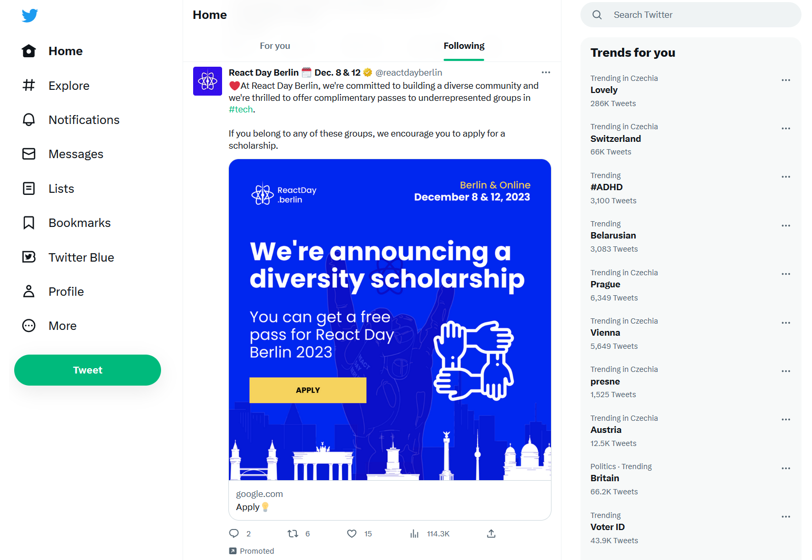

- title: Programming Systems Deserve a Theory Too!

*****************************************************************************************
- template: title

# **Oops!** Opening the Software Black Box

---

**Tomas Petricek**, Charles University

_<i class="fa fa-envelope"></i>_ [petricek@d3s.mff.cuni.cz](mailto:petricek@d3s.mff.cuni.cz)  
_<i class="fa-solid fa-circle-right"></i>_ [https://tomasp.net](https://tomasp.net)   
_<i class="fa-brands fa-twitter"></i>_ [@tomaspetricek](http://twitter.com/tomaspetricek)

*****************************************************************************************
- template: image
- class: larger

# Most Software is Black Box

---

**End users have**

No way to find out why? & how?

No way to adapt to their needs...

*****************************************************************************************
- template: icons

# Black Box Nature
## Questioning basic assumptions

- *fa-user-lock* Distinguish programmer and user
- *fa-laptop-code* Separate coding, compiling, running
- *fa-money-bills* Product of social & technical forces!

*****************************************************************************************
- template: lists
- class: smaller border

# Interdisciplinary Approach

## Computer science

New basic theory of programming  
based on interaction with a system

## History and philosophy

Understand how black boxing  
happens and imagine alternatives

*****************************************************************************************
- template: lists
- class: smaller border

# Track Record

## Established programming researcher
- Highly-cited, influenced multiple grants
- ACM SIGPLAN Research Highlight

## Independent creative research
- Information-rich programming
- Obtained funding for a small team

## Interdisciplinary expertise
- Part of 5-year inter-disciplinary project
- Manuscript submitted to CUP

*****************************************************************************************
- template: title

# Thank you!

---

**Tomas Petricek**, Charles University  

_<i class="fa fa-envelope"></i>_ [petricek@d3s.mff.cuni.cz](mailto:petricek@d3s.mff.cuni.cz)  
_<i class="fa-solid fa-circle-right"></i>_ [https://tomasp.net](https://tomasp.net)   
_<i class="fa-brands fa-twitter"></i>_ [@tomaspetricek](http://twitter.com/tomaspetricek)
