- title: Pop-up from Hell

*****************************************************************************************
- template: title

# Pop-up from Hell
## On the growing opacity of software systems

---

**Tomas Petricek**, Charles University  
_<i class="fa fa-envelope"></i>_ [tomas@tomasp.net](mailto:tomas@tomasp.net)  
_<i class="fa-solid fa-circle-right"></i>_ [https://tomasp.net](https://tomasp.net)   
_<i class="fa-brands fa-twitter"></i>_ [@tomaspetricek](http://twitter.com/tomaspetricek)

*****************************************************************************************
- template: content
- class: noborder

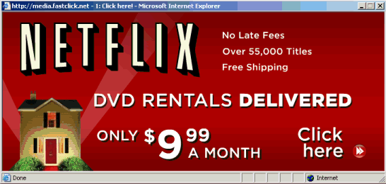

-----------------------------------------------------------------------------------------
- template: lists
- class: border

# Christopher Alexander keynote (1996)

##

##

**The technical way in which you currently look at programming is almost as if you were willing to be "guns for hire."**

What I am proposing [is] a view of programming as the natural genetic infrastructure of a living world (...) could  
then have the result that a living structure in our towns, houses, work places, cities, becomes an attainable thing.

-----------------------------------------------------------------------------------------
- template: image
- class: smaller

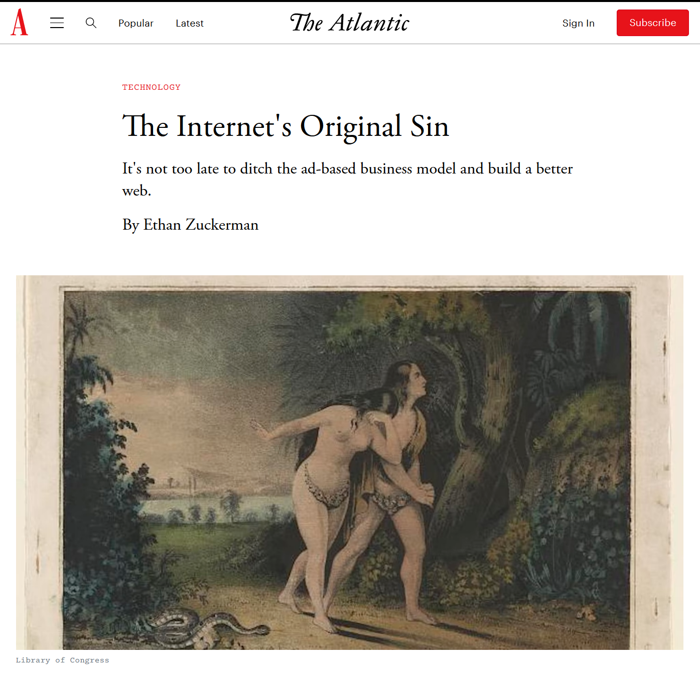

# Apology

Along the way, we ended up creating one of the most hated tools in the advertiser’s toolkit: the   
pop-up ad.

**I wrote the code to launch the window and run an  
ad in it. I’m sorry. Our intentions were good.**

*****************************************************************************************
- template: subtitle

# Pop-ups and the web
## A longer version of the story

-----------------------------------------------------------------------------------------
- template: lists
- class: smaller

# Technical aspects

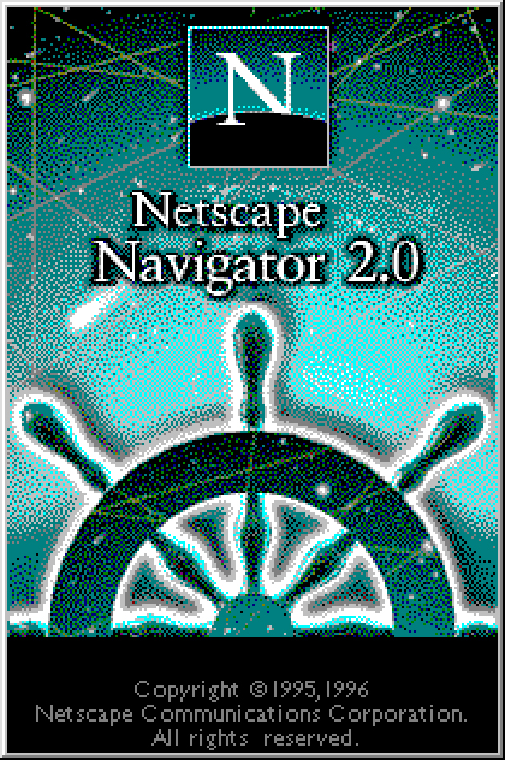

## JavaScript language

- The Open, Cross-Platform Object Scripting Language For Enterprise Networks and the Internet

## Browser scripting

- Netscape Navigator 2.0 (1995)
- `window.open` and `window.onunload`
- Both available in JavaScript 1.0

-----------------------------------------------------------------------------------------
- template: image

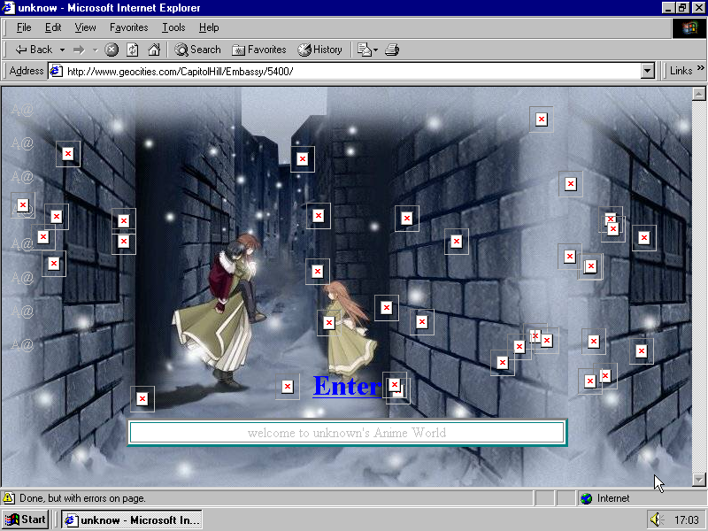

# Social aspects

**Geocities**

Creative online com-munity of the 1990s

**Subject of interest to internet historians (Screen by Olia Lialina)**

Easy to copy and adapt fun JavaScript hacks!

-----------------------------------------------------------------------------------------
- template: subtitle

# DEMO
## Pop-up from Hell

-----------------------------------------------------------------------------------------
- template: image
- class: noborder

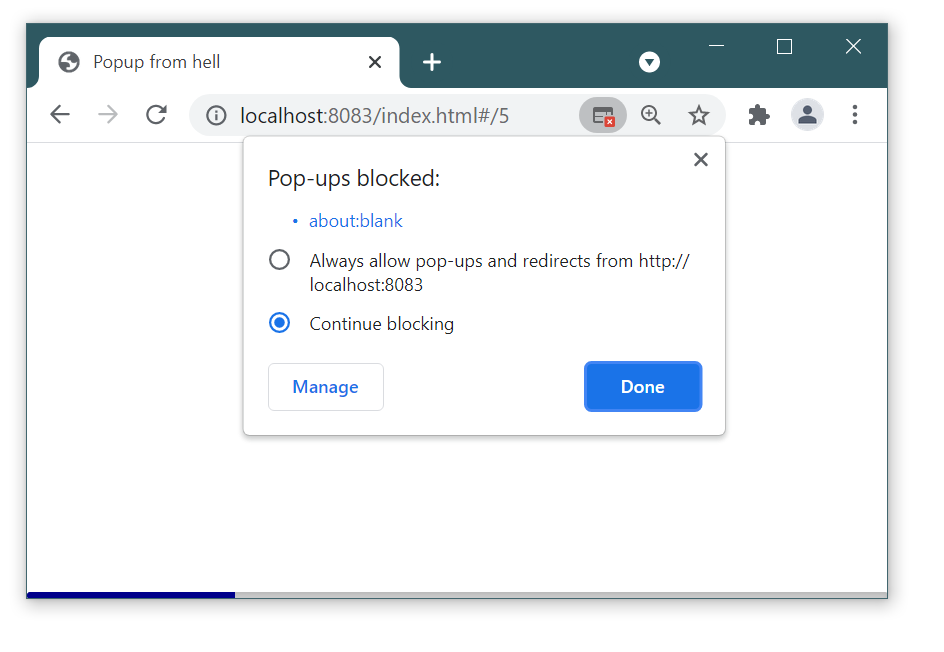

# No more fun :-(

**Popup blocking commonplace in
the early 2000s**

Blocks popups on page load, unload and timer events, but not on click

-----------------------------------------------------------------------------------------
- template: image

# Well, actually...

**Is this the evolution  
of the pop-up ad idea?**

Same user experience, recreated using harder to block technique

*****************************************************************************************
- template: subtitle

# Reflections
## Growing opacity of the web

-----------------------------------------------------------------------------------------
- template: content
- class: two-column bw

## 1990s

*fa-scroll* Simple scripts

*fa-code* View source

*fa-clipboard* Copy & paste

*fa-window-restore* Popups work!

---

## 2000s

*fa-mobile-screen-button* Complex apps

*fa-cog* Transpiled code

*fa-shapes* Canvas + WASM

*fa-square-check* Opaque elements

-----------------------------------------------------------------------------------------
- template: subtitle

# DEMO
## Google Docs vs. Office for the web

-----------------------------------------------------------------------------------------
- template: image
- class: smaller

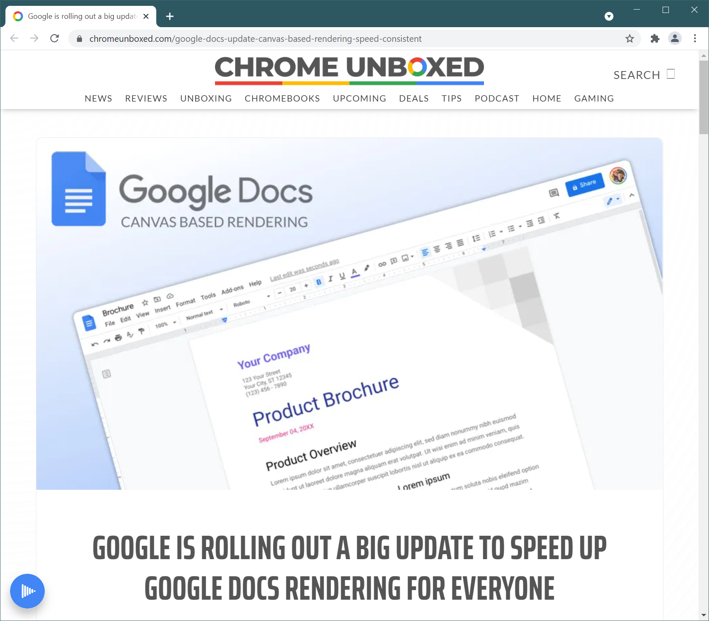

# Canvas rendering

**Replace built-in editable element with custom code**

Announced in May 2021

Better performance!  
Accessibility issues?  
May affect extensions?

-----------------------------------------------------------------------------------------
- template: icons

# Embedding
## Use of system inside programs

- *fa fa-folder-open* Program running in an operating system
- *fa fa-globe* Web page embedded in a browser
- *fa fa-object-group* Smalltalk program embedded in a VM
- *fa fa-desktop* Smalltalk VM embedded in a host OS

-----------------------------------------------------------------------------------------
- template: lists
- class: smaller noborder

# Deep vs shallow

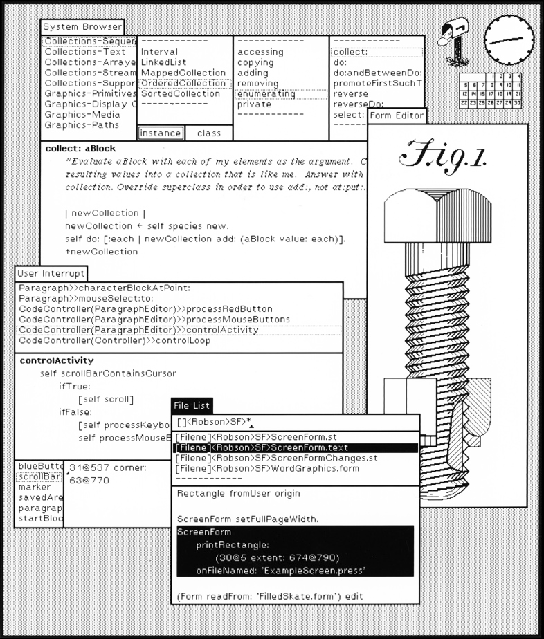

## Shallow embedding

- Reuse system features
- Limited user control
- Legible to the system
- Allows accessibility, blocking

## Deep embedding

- Redo everything from scratch
- Lose commonality, accessibility
- Gain control and flexibility

-----------------------------------------------------------------------------------------
- template: largeicons

# Why deep embedding happens?

- *fa-window-restore* **Popups from hell**  
  Avoiding being understood by browser

- *fa-cogs* **Compilation to JavaScript**  
  Use "better" programming languages

- *fa-palette* **Replacing built-in features**  
  Programmers think they can do better

-----------------------------------------------------------------------------------------
- template: lists
- class: condensed

# Is deep embedding inevitable?

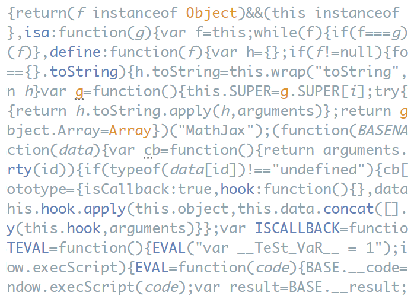

## Good engineering reasons

- Better developer tools
- Performance, user experience

## Restricts the user freedom!

- Limits transparency
- Limits unanticipated use

## Reasons that may prevent it

- "Small projects" cannot afford this!
- Culture or policy may be against it

*****************************************************************************************
- template: subtitle

# Atom vs Code
## Editor mini-wars of the 2010s

-----------------------------------------------------------------------------------------
- template: image
- class: smaller

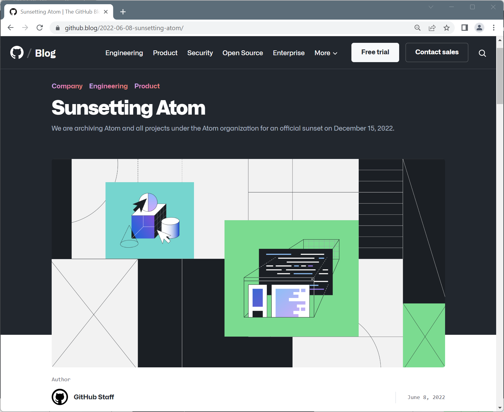

# Atom (*2014 - †2022)

Hackable editor for  
the 21st century

  

# VS Code (*2015)

Build and debug modern web & cloud applications.

-----------------------------------------------------------------------------------------
- template: lists
- class: noborder smaller2x

# Comparing Atom and Code

## Technical similarities

- Open source with a key backer
- Electron with JavaScript++
- Extensible via plugins

## Technical differences

- Code runs plugins in a separate process
- Plugins limited to using an API
- Done for good engineering reasons!

-----------------------------------------------------------------------------------------
- template: subtitle

# DEMO
## Hacking the Atom editor

-----------------------------------------------------------------------------------------
- template: image
- class: larger

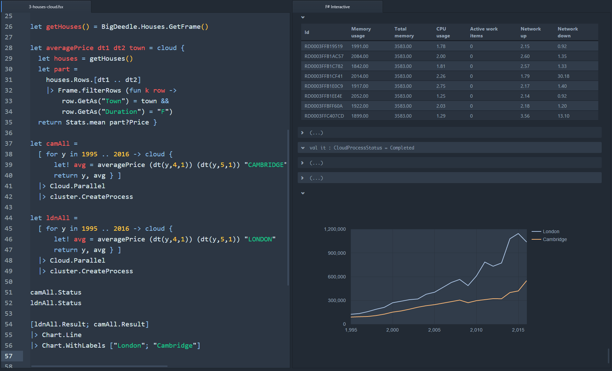

# Is this useful?

**FsLab plugin for F# data science**

Not possible in Code, until more extensibility points added.

-----------------------------------------------------------------------------------------
- template: image

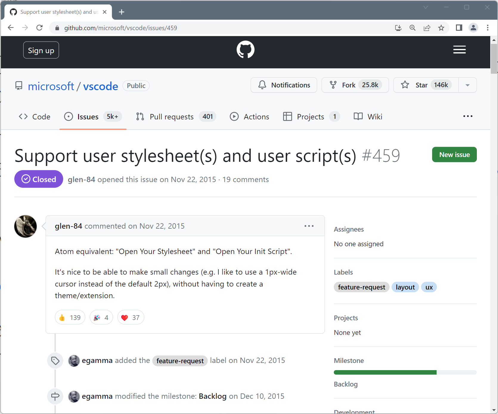

# Force for change!

**Openness allows unanticipated extensibility**

Popular new ideas may inspire later API change

-----------------------------------------------------------------------------------------
- template: image
- class: smaller

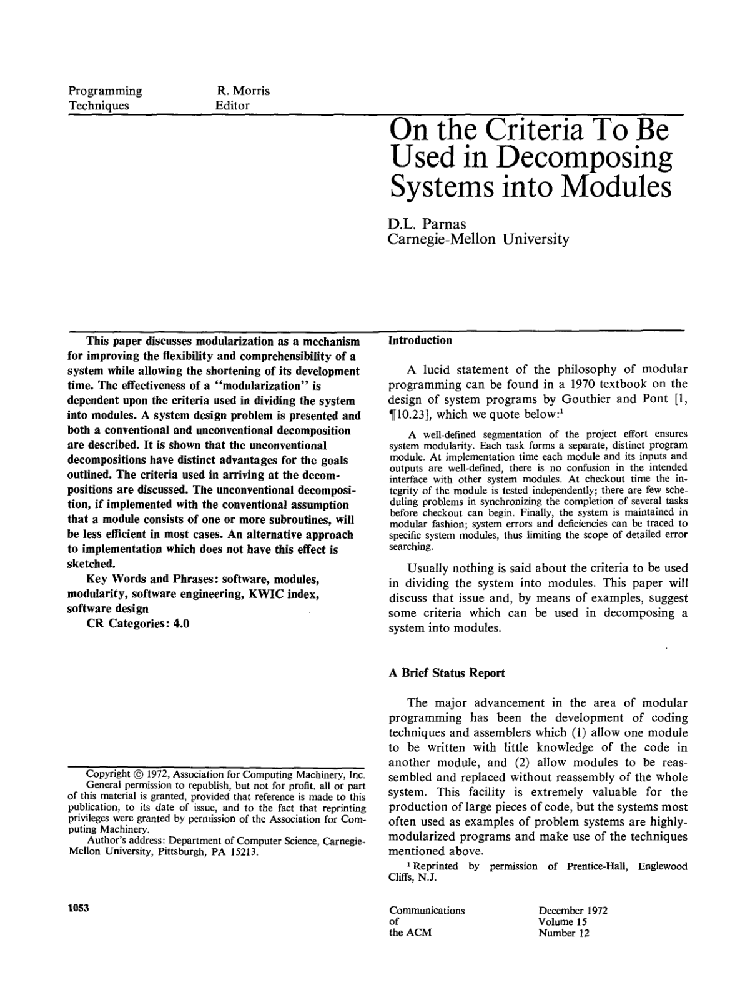

# Good engineering reasons strike again

**Information hiding**

Allow later adaptations  
and system evolution

---

**But how reliably  
can we anticipate?**

-----------------------------------------------------------------------------------------
- template: content

# Information sharing or hiding (1/3)

The reason for the project workbook is distribution of information.

The problem is not to restrict information, but to ensure that relevant information gets to all the people who need it.

**Fred Brooks (1975)**

-----------------------------------------------------------------------------------------
- template: content

# Information sharing or hiding (2/3)

We propose that one begins with a list of difficult design decision or design
decisions which are likely to change.

Each module is then designed to hide such a
decision from the others.

**Dave Parnas (1972)**

-----------------------------------------------------------------------------------------
- template: content

# Information sharing or hiding (3/3)

I dismissed Parnas's concept as a "recipe for disaster" (...). Parnas was right, and I was wrong.

I am now convinced that information hiding is the only way of raising the level of
software design.

**Fred Brooks (1995)**

-----------------------------------------------------------------------------------------
- template: icons

# Sharing and hiding
## Has information hiding won?

- *fa-git-alt fa-brands* Open source software!
- *fa-bug* UNIX process metadata
- *fa-table* Data science notebooks
- *fa-music* MIDI devices since 1980s

-----------------------------------------------------------------------------------------
- template: lists

# MIDI SysEx messages

**Many old MIDI instruments continue to be musically viable [due to] its least
“designed” aspect: system exclusive (SysEx) messages.**

The content of SysEx messages was never standardized (...). In practice,
[they] were used in a semi-conventionalized way as a means for externalizing
the complete state of a musical device.

*****************************************************************************************
- template: subtitle

# Conclusions
## Not willing to be guns for hire?

-----------------------------------------------------------------------------------------
- template: lists
- class: smaller

# Growing opacity of software systems

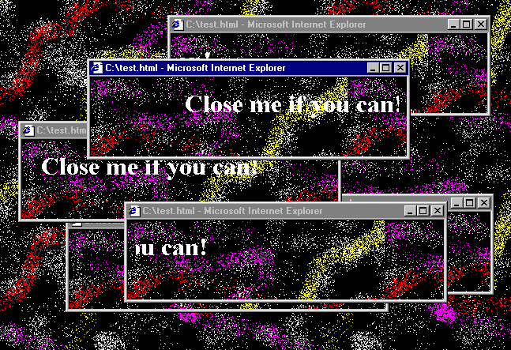

## Web and deep embedding

- Opacity via growing complexity
- Strive to make software legible
- Legibility to system & users

## Editors and information hiding

- Opacity via explicit restriction
- Information hiding is overrated?
- Allow unintended extension!

-----------------------------------------------------------------------------------------
- template: title
- class: closing

# Conclusions

**On the growing opacity of software systems**  

- Where good engineering reasons lead us!
- How to achieve 90s web qualities today?
- How to build systems without information hiding?

---

**Tomas Petricek**, Charles University  
_<i class="fa fa-envelope"></i>_ [tomas@tomasp.net](mailto:tomas@tomasp.net)  
_<i class="fa-solid fa-circle-right"></i>_ [https://tomasp.net](https://tomasp.net)   
_<i class="fa-brands fa-twitter"></i>_ [@tomaspetricek](http://twitter.com/tomaspetricek)

-----------------------------------------------------------------------------------------
- template: image

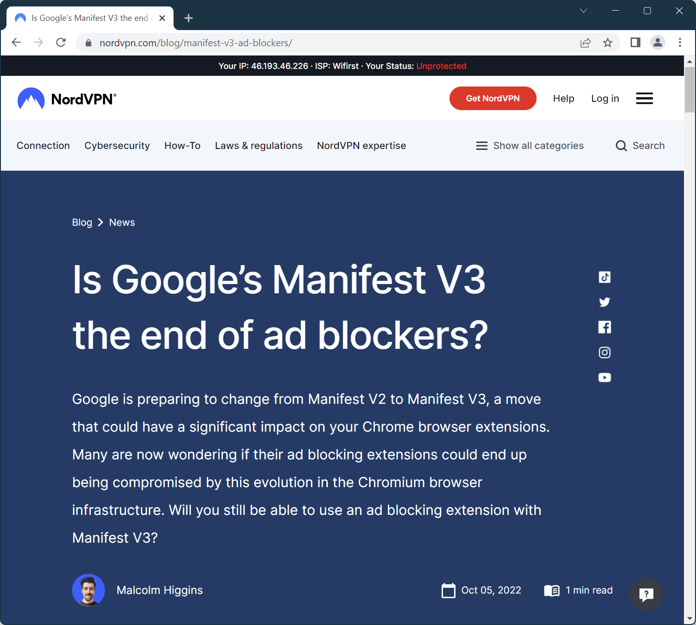

# Google Manifest v3

**API for web browser extensions in Chrome**

"V3 extensions enjoy enhancements in security, privacy, and performance"

**Adds limitations on request blocking and number of rules**

-----------------------------------------------------------------------------------------
- template: image

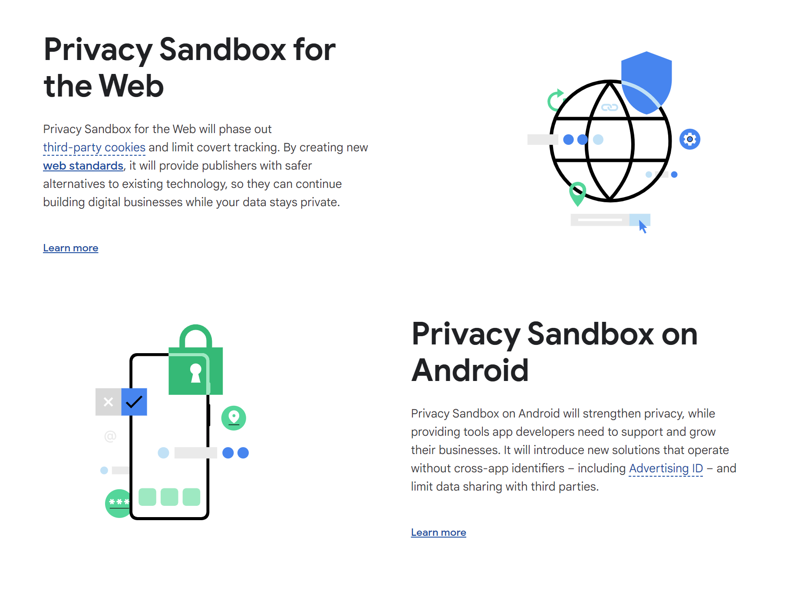

# Google Privacy Sandbox

**Advertising API replacing cookies**

"In practice, we expect that Privacy Sandbox will harm Web privacy, and further cement Google’s control over the Web."

*****************************************************************************************
- template: content
- class: condensed

# References

- [The Origins of Pattern Theory, the Future of the Theory, And the Generation of a Living World](https://www.patternlanguage.com/archive/ieee.html)
- [Seasonal Restoration](https://blog.geocities.institute/archives/6620)
- [The Internet's Original Sin](https://archive.is/NxfXW)
- ["You Are Not Expected to Understand This": How 26 Lines of Code Changed the World](https://press.princeton.edu/books/paperback/9780691208480/you-are-not-expected-to-understand-this)
- [JavaScript: the first 20 years](https://dl.acm.org/doi/10.1145/3386327)
- [Google Docs will now use canvas based rendering: this may impact some Chrome extensions](https://workspaceupdates.googleblog.com/2021/05/Google-Docs-Canvas-Based-Rendering-Update.html)
- [Google Docs is switching to canvas-based rendering. Here's what that means](https://zapier.com/blog/google-docs-canvas-based-rendering/)
- [Sunsetting Atom](https://github.blog/2022-06-08-sunsetting-atom/)
- [Tracing a Paradigm for Externalization: Avatars and the GPII Nexus](https://www.shift-society.org/salon/papers/2017/revised/externalization.pdf)
