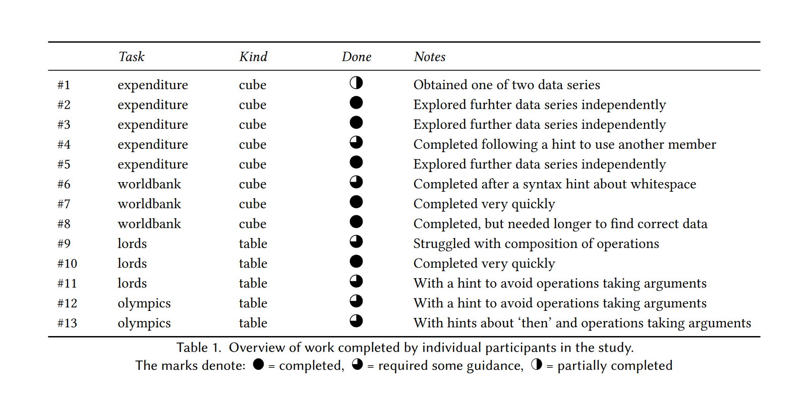
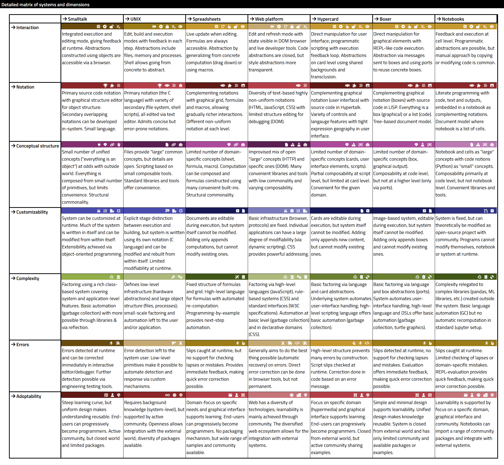

- title: Programming Systems Deserve a Theory Too!

*****************************************************************************************
- template: title

# Programming systems
## Deserve a theory too!

---

**Tomas Petricek**, Charles University  
_<i class="fa fa-envelope"></i>_ [tomas@tomasp.net](mailto:tomas@tomasp.net)  
_<i class="fa-solid fa-circle-right"></i>_ [https://tomasp.net](https://tomasp.net)   
_<i class="fa-brands fa-twitter"></i>_ [@tomaspetricek](http://twitter.com/tomaspetricek)

*****************************************************************************************
- template: subtitle

# Introduction
## Programming systems

-----------------------------------------------------------------------------------------
- template: image
- class: twolineh

# _Programming_ Languages

Programming is  
writing code

Formal semantics, implementation, paradigms, types

------

**We know how   
to study this!**

-----------------------------------------------------------------------------------------
- template: image
- class: noborder twolineh

# _Programming_ Systems

Interacting with a stateful system

Feedback, liveness, interactive user interfaces

------

**But how do we  
study this?**

-----------------------------------------------------------------------------------------
- template: lists
- class: smaller border

# Paradigm shift in 1990s

## Scientific paradigm shifts

- The past is a foreign country
- Paradigms are incommensurable
- Old notions stop making any sense

## From systems to languages

- From CLOS and Flavors to mixins
- From running system to code
- From state & interaction to semantics

*****************************************************************************************
- template: subtitle

# Iterative prompting
## Programming for data science

-----------------------------------------------------------------------------------------
- template: image
- class: larger

# Journalism

**Tooling gap between Excel and Python**

Data querying, aggregation and visualization

**Very hard with  
current tools!**

-----------------------------------------------------------------------------------------
- template: subtitle

# DEMO
## Data exploration in The Gamma

-----------------------------------------------------------------------------------------
- template: icons

# The Gamma
## What makes it interesting?

- *fa-code* Syntax is just member access
- *fa-list* Program using just auto-completion!
- *fa-brain* Recognition over recall principle
- *fa-square-check* Makes correct and complete suggestions

-----------------------------------------------------------------------------------------
- template: image
- class: left

# The Gamma

What can we claim  
using HCI methods?

**Non-experts can use this to explore data**

"This is actually pretty simple to use."

-----------------------------------------------------------------------------------------
- template: image

# Data wrangling

**Cleaning messy data takes 80% of time!**

Match data, identify types and semantics, fill missing values, remove outliers

----

**Automatic tools work some 95% of time...**

-----------------------------------------------------------------------------------------
- template: subtitle

# DEMO
## AI assistants in Wrattler

-----------------------------------------------------------------------------------------
- template: icons

# Iterative prompting
## Programming system pattern

- *fa-hand-point-up* Powerful programming interaction principle
- *fa-border-all* Data exploration, cleaning and more
- *fa-window-maximize* Perfect middle ground between code & UIs?
- *fa-layer-group* Two-layer conceptual structure

*****************************************************************************************
- template: subtitle

# Complementary science
## Learning from past systems

-----------------------------------------------------------------------------------------
- template: subtitle

# DEMO
## How Tomas learned programming

-----------------------------------------------------------------------------------------
- template: lists
- class: border smaller

# Learning from past systems

## What's cool about 90s web?

- Source code available & accessible
- Easily extractable & copyable snippets
- Poor engineering in a poor language!

## Complementary science

- Do (serious) history to recover ideas
- Lost due paradigm shifts in science
- Even more powerful for computing!

-----------------------------------------------------------------------------------------
- template: icons

# Good old systems
## What have we forgotten about?

- *fa-hand-back-fist* **Pygmalion** - program by direct manipulation
- *fa-arrow-up-right-from-square* **HyperCard** - usability, levels, editing = running
- *fa-file* **Boxer** - program as fully transparent document
- *fa-cogs* **Interlisp** - code = data, modifiable live via code!

-----------------------------------------------------------------------------------------
- template: subtitle

# DEMO
## Recovering Commodore 64 BASIC

-----------------------------------------------------------------------------------------
- template: icons

# Commodore 64
## What makes this interesting?

- *fa-keyboard* Editing and running as one mode of interaction
- *fa-gamepad* Load code even to run a game!
- *fa-newspaper* Learning by copying code from magazines
- *fa-plug* High convenience with escape hatches (POKE)

-----------------------------------------------------------------------------------------
- template: lists
- class: smaller

# How to look at programming systems?

## They are interactive

- Hard to see interaction "on paper"
- Screencast, interactive essay
- What makes for a rigorous demo?

## What to say about them

- Here is a cool new system!
- Essential characteristics?
- Compare, improve & stand on the shoulders of giants

*****************************************************************************************
- template: subtitle

# Technical dimensions
## Qualitative systems analysis

---------------------------------------------------------------------------------------------------
- template: lists

# Technical dimensions

## What is a dimension

- Capture interesting properties
- Cover old and new systems
- Allow qualitative comparison

## Example dimensions

- Modes of interaction
- Uniformity, conceptual structure
- Learnability & sociability

---------------------------------------------------------------------------------------------------
- template: image
- class: larger

# Technical dimensions catalogue

**Analysis of:**

LISP machines, UNIX, Web, Hypercard, Spreadsheets, Haskell, Boxer, Dark, etc.

---------------------------------------------------------------------------------------------------
- template: lists
- class: border

# How to use dimensions

## Analysis tool

- What makes system interesting?
- Compare against existing
- Does not say what's good!

## Design space mapping

- Discover design opportunities
- Are there blank areas?
- Graphical self-sustainable systems!

*****************************************************************************************
- template: title
- class: closing

# Conclusions

**Programming systems deserve a theory too!**  

- Shift from systems to languages
- Interesting old and new systems
- Technical dimensions as step one

---

**Tomas Petricek**, Charles University  
_<i class="fa fa-envelope"></i>_ [tomas@tomasp.net](mailto:tomas@tomasp.net)  
_<i class="fa-solid fa-circle-right"></i>_ [https://tomasp.net](https://tomasp.net)   
_<i class="fa-brands fa-twitter"></i>_ [@tomaspetricek](http://twitter.com/tomaspetricek)

*****************************************************************************************
- template: content
- class: condensed

# References & Demos

- [**Technical dimensions** of programming systems](http://tomasp.net/techdims)
- [**The Gamma**: Tools for open data-driven storytelling](https://thegamma.net/)
- [**The Gamma**: Democratizing data science](http://turing.thegamma.net/)
- [**Histogram**: You have to know the past to understand the present](https://tomasp.net/histogram/)
- [**The Lost Ways of Programming**: Commodore 64 BASIC](https://tomasp.net/commodore64/)

- J. Jakubovic, J. Edwards, T. Petricek (2023). [Technical dimensions of programming systems](https://programming-journal.org/2023/7/13/). Programming Journal
- J. Jakubovic, T. Petricek (2022) [Ascending the Ladder to Self-Sustainability](http://tomasp.net/academic/papers/self-sustainability/) Onward!
- T. Petricek (2022) [The Gamma Programmatic Data Exploration for Non-programmers](http://tomasp.net/academic/papers/iterative/). VL/HCC
- T. Petricek, J. Geddes, & C. Sutton (2018). Wrattler: Reproducible, live and polyglot notebooks. TaPP
