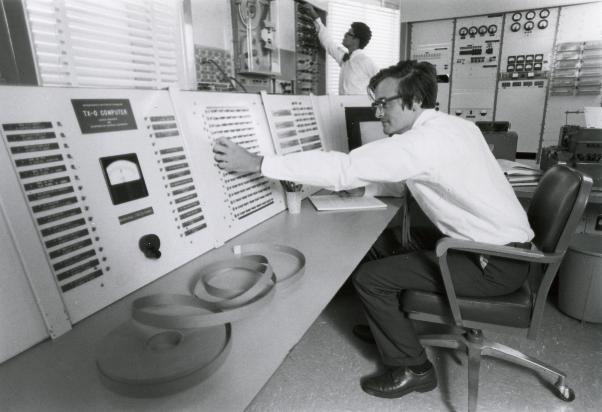

- title: Interactive programming as a shift from language to gesture

*****************************************************************************************
- template: title

# Interactive programming
## As a shift from language to gesture

---

**Tomáš Petříček**, Faculty of Mathematics and Physics  
[petricek@d3s.mff.cuni.cz](mailto:petricek@d3s.mff.cuni.cz) |
[https://tomasp.net](https://tomasp.net)

*****************************************************************************************
- template: icons

# Language and gesture
## In the context of programming

- *fa-language* Programming language as a non-obvious metaphor
- *fa-hands* Gesture as interaction with the system
- *fa-microchip* Evolving relationship from 1940s to today
- *fa-book* Any parallels to philosophical thinking?

*****************************************************************************************
- template: content
- class: two-column

# How programming became language

### Gesture

**ENIAC** ('45) programmed  
by plugging cables

-----

### Language

**Algol** ('60) programs as entities in a formal language

*****************************************************************************************
- template: lists
- class: border

# Origins of the linguistic metaphor

## Cybernetic discourse

Programming as translation from human language into "the language the machine can understand"

## Automatic coding

Using computer itself to "take over routine, mechanizable aspects of the programming process"

*****************************************************************************************
- template: icons

# Cultures of programming

## The birth of programming language

* *fa-keyboard* **Hacker culture**  
  Tricks behind clever automatic coding systems

* *fa-not-equal* **Mathematical culture**  
  Formal devices inspired by Chomsky's grammars

* *fa-user-tie* **Managerial culture**  
  Practical need for machine-independence

*****************************************************************************************
- template: image

# From physical to virtual gesture

**TX-0 computer**  
at MIT from 1958

---

**Interactive programming**  
Inspect program state  
modify while running

*****************************************************************************************
- template: content
- class: two-column

# Object-oriented programming

### Language

**Simula** ('67) language "talks" about object behaviour

-----

### Gesture

**Smalltalk** ('76) interactive medium for information

*****************************************************************************************
- template: subtitle

# Demo
## Interacting with Smalltalk 78

*****************************************************************************************
- template: image
- class: smaller2x

# 1990s paradigm shift in programming research

From programming systems to programming languages

**From gestures to languages?**

---

Language perspective incommensurable with the gesture perspective

*****************************************************************************************
- template: icons

# Language and gesture
## In the context of programming

- *fa-shapes* It needs to exist to be manipulated by gestures!
- *fa-display* Physical and virtual work equally well
- *fa-shuffle* Gesture and language are intertwined
- *fa-hand-sparkles* Are programming gestures limited to the concrete?

*****************************************************************************************
- template: image

# Unimate (1960s)

**Programming by demonstration**

Guided through steps in "training mode"

Repeats the steps in "production mode"

*****************************************************************************************
- template: lists
- class: border

# Pygmalion programming system

## Inspired by iconic reasoning

Branch of geometry in ancient India which used only diagrams

## Gesture without language

Iconic representation of parameters,  
emphasis on doing rather than telling

*****************************************************************************************
- template: image

# Enacting the factorial function

**Abstracting gesture?**

Abstract computation described using icon manipulation

**Image rather than language!**

*****************************************************************************************
- template: subtitle

# Demo
## Pygmalion reconstruction

*****************************************************************************************
- template: title

# Conclusions

**Language, gesture, picture in programming**

- Complex interactions between the three!
- Shifts between linguistic and gestural
- Gestures manipulate language or pictures

---

**Tomáš Petříček**, Faculty of Mathematics and Physics  
[petricek@d3s.mff.cuni.cz](mailto:petricek@d3s.mff.cuni.cz) |
[https://tomasp.net](https://tomasp.net)

*****************************************************************************************
- template: content
- class: condensed

# References

* Nofre et al. (2014) [When technology became language: the origins of the linguistic conception of computer programming, 1950-1960](https://pubmed.ncbi.nlm.nih.gov/24988794/)
* Smith (1977) [Pygmalion: A Computer program to Model and Stimulate Creative Thought](https://link.springer.com/book/10.1007/978-3-0348-5744-4)
* Habušta (2024) [Reconstructing the Pygmalion programming environment](https://dspace.cuni.cz/handle/20.500.11956/192915)
* Petricek (to appear) [Cultures of Programming](https://tomasp.net/academic/drafts/cultures/draft-2024-v2.pdf)
* Gabriel (2012) [The structure of a programming language revolution](https://dl.acm.org/doi/10.1145/2384592.2384611)
