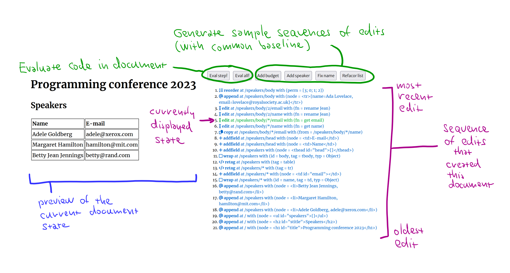

- title: Programming systems deserve a theory too!

*****************************************************************************************
- template: title

# Programming systems  _deserve a theory too!_

---

**Tomas Petricek**, Charles University, Prague  
Work by/with Joel Jakubovic & Jonathan Edwards

_<i class="fa fa-envelope"></i>_ [tomas@tomasp.net](mailto:tomas@tomasp.net)  
_<i class="fa fa-globe"></i>_ [https://tomasp.net](https://tomasp.net)  
_<i class="fa-brands fa-twitter"></i>_ [@tomaspetricek](http://twitter.com/tomaspetricek)    

*****************************************************************************************
- template: image
- class: twolineh

# _Programming_ Languages

Programming is  
writing code

Formal semantics, implementation, paradigms, types

------

**We know how   
to study this!**

*****************************************************************************************
- template: image
- class: noborder twolineh

# _Programming_ Systems

Interacting with a stateful system

Feedback, liveness, interactive user interfaces

------

**But how do we  
study this?**

*****************************************************************************************
- template: icons

# Different paradigms
## Different ways of thinking & working

- *fa-flask* **Different research methodologies**  
  Soundness vs. programming experience

- *fa-landmark-dome* **Different paradigmatic achievements**  
  Smalltalk vs. Algol and operational semantics

- *fa-folder-open* **Different research questions**  
  Verification vs. making programs open

*****************************************************************************************
- template: lists

# Technical dimensions

## Taking the first step

- Standing on the shoulders of giants?
- Qualitative research methodology for evaluating programming systems

## Dimensions of systems

- Charting the territories
- Design choices for interesting problems
- Analysis of the past & design of the new

*****************************************************************************************
- template: subtitle

# Demo
## Technical dimensions matrix

*****************************************************************************************
- template: lists

# Examples of dimensions

## Modes of interaction

- Writing code vs. debugging code
- User levels in HyperCard

## Explicit structure

- Structured representation vs. text
- Bytes vs. soup of objects vs. cons cells

## Self-sustainability

- Can system be modified from within itself?

*****************************************************************************************
- template: subtitle

# Demo
## Commodore 64 BASIC recreation

*****************************************************************************************
- template: largeicons

# Opening the software blackbox

- *fa-brands fa-git-alt* **Freedom to modify software...**  
  Open-source, but can you change it?

- *fa-table-list* **Browsers in object-oriented systems?**  
  Not in Java! Abstraction & encapsulation!

- *fa-brands fa-internet-explorer* **View source on the 1990s web**  
  Not with WASM and `<canvas>`

- *fa-magnifying-glass* **Opening the software blackbox?**  
  Explicit structure + self-sustainability

*****************************************************************************************
- template: lists

# Two ideas

## Explicit structure

- Document with code and data
- Smalltalk image easier to navigate
- Also contain evaluation trace!

## Edit history

- Can be replayed to get the document
- Makes merging documents easier
- Record and/or analyse past edits?

*****************************************************************************************
- template: content
- class: nologo

# Demo: Conference planning

*****************************************************************************************
- template: subtitle

# Demo
## Document-based programming

*****************************************************************************************
- template: title

# Programming systems  _deserve a theory too!_

- [Technical dimensions of programming systems](https://tomasp.net/techdimss)
- [Ascending the Ladder to Self-Sustainability](https://dl.acm.org/doi/abs/10.1145/3563835.3568736)
- [The Lost Ways of Programming: Commodore 64 BASIC](https://tomasp.net/commodore64/)
- [Live & Local Schema Change: Challenge Problems](https://arxiv.org/pdf/2309.11406.pdf)

---

**Tomas Petricek**, Charles University, Prague

_<i class="fa fa-envelope"></i>_ [tomas@tomasp.net](mailto:tomas@tomasp.net)  
_<i class="fa fa-globe"></i>_ [https://tomasp.net](https://tomasp.net)  
_<i class="fa-brands fa-twitter"></i>_ [@tomaspetricek](http://twitter.com/tomaspetricek)    
