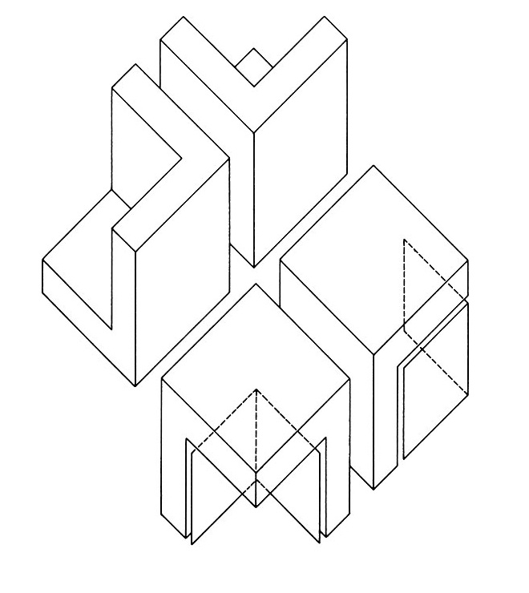

- title: Critical Architecture/Software Theory

*****************************************************************************************
- template: title

# _Critical_ Architecture/Software _Theory_

---

**Tomas Petricek**, Charles University, Prague

_<i class="fa fa-envelope"></i>_ [tomas@tomasp.net](mailto:tomas@tomasp.net)  
_<i class="fa fa-globe"></i>_ [https://tomasp.net](https://tomasp.net)  
_<i class="fa-brands fa-bluesky"></i>_ [@tomasp.net](https://bsky.app/profile/tomasp.net)    

*****************************************************************************************
- template: content

# Good talk topics?

-----------------------------------------------------------------------------------------
- template: content
- class: two-column img280

# Good talk topics?

**Programming systems research and vision?**

---

**Upcoming book on the history of programming?**

-----------------------------------------------------------------------------------------
- template: image

# Not so good talk topics?

---

**Some books  
I've read recently**

**Thoughts on how this relates to software**

---

Thanks for the invitation to PPIG!

*****************************************************************************************
- template: subtitle

# Meaning
## Meaning in architecture

-----------------------------------------------------------------------------------------
- template: imageanim
- class: image

# Brutalist architecture?

**Bad example for the purpose of my talk...**

---

No bad feelings!

Focus on function,  
not conveying meaning

-----------------------------------------------------------------------------------------
- template: image

# Dancing House by Gehry & Milunić

**aka Fred & Ginger**

90s deconstructivism

End of the era of communist panel housing estates

**Meaning is there,  
if uncomplicated**

-----------------------------------------------------------------------------------------
- template: subtitle

# Column
## From structure to message

-----------------------------------------------------------------------------------------
- template: content
- class: two-column imgh340

# From function to style

**Parthenon** (5th cent. BC)  
Classical Doric order

---

**Villa Savoye** (1931)  
Le Corbusier's modernism

-----------------------------------------------------------------------------------------
- template: image
- class: larger

# U.S. National Archives

**Unironical reference to classical past**

**Emphasise tradition**

c.f. Executive Order  
on Promoting Beautiful Federal Civic Architecture

-----------------------------------------------------------------------------------------
- template: imageanim
- class: image larger

# Gehry's Loyola Law School (LA)

"... saw classicising typology suitable for the study of law."

---

**More literal but also more critical use**

**Fits the context!**

*****************************************************************************************
- template: subtitle

# Double coding
## Mechanism for critical architecture

-----------------------------------------------------------------------------------------
- template: image
- class: smaller

# Haunted House - Fondazione Prada

**Makeover of an old industrial site into a gallery.**

Ironical remark on how the fashion industry works?

---

_"Koolhaas’s very corporate clients (...)
regard his chic criticism of a bored
elite as just another bit of fun."_

-----------------------------------------------------------------------------------------
- template: lists

# Double coding

## Form and function

* Form of a modern art gallery
* New spatial typology for art
* Still, many aspects undetermined!

## Epistemic freedom

* Modernist "form follows function"
* Aesthetics and ornament!
* Use it for ironical remark?
* Form without any external references?

-----------------------------------------------------------------------------------------
- template: image

# Anticodes

**Václav Havel**  
"Let everyone go  
their own way"  

---

**Critical reflection**  
Double coding   
as a mechanism

-----------------------------------------------------------------------------------------
- template: image

# Double coding in code poetry

**water.c** ([demo](https://code-poetry.com/water))

Read and executed  
by the computer

Read and interpreted by the human

-----------------------------------------------------------------------------------------
- template: image

# Obfuscated C Code Contest (1989)

**What does this  
snippet print?**

---

Double coding for  
light-hearted irony

**Can it be used  
more seriously?**

-----------------------------------------------------------------------------------------
- template: icons

# Undetermined
## What is undetermined in software

- *fa-code* Variable names, syntax, comments
- *fa-database* Representation and data structures
- *fa-regular fa-square-check* User interface / mode of interaction
- *fa-project-diagram* Aspects of software architecture

*****************************************************************************************
- template: subtitle

# Criticism
## Destabilizing meaning

-----------------------------------------------------------------------------------------
- template: content

-----------------------------------------------------------------------------------------
- template: lists

# Parc de La Villette

## Deconstructive architecture

- Give up on the dream of pure form
- Challenge values and methods
- Reveal what is normally hidden

## Disrupting forms and practices

- Design as layering of structures
- Folies are distortions of a cube
- Form follows formulas!

-----------------------------------------------------------------------------------------
- template: image
- class: smaller

# Parc de La Villette

_The superimposition of the three systems (points, lines, surfaces) creates the park as it generates a series of calculated tensions which reinforce the dynamism of the place. Each of the three systems displays its own logic and independence._

-----------------------------------------------------------------------------------------
- template: image

# Folies

**Deconstruction   
of the cube form**

_[The folies] desta&shy;bilize meaning (...). They put in question, dislocate,
destabilise or deco&shy;nstruct the edifice of this configuration._

-----------------------------------------------------------------------------------------
- template: lists
- class: bigger

# House VI

## Peter Eisenman

- PhD on the formal basis of architecture (grammar!)
- Formalism, without function

## Houses series

- Autonomous architecture
- Structure does not follow function
- Shapes only refer to other shapes

-----------------------------------------------------------------------------------------
- template: image
- class: smaller2x

# Disrupting domestic mindlessness

_My work attacks the concept of occupation as given. (...)_

_[And] the holes in the floor in the room attack the
notion of how you occupy and how you step across the living
room?_

**The occupiers adopt a new choreography of living**

-----------------------------------------------------------------------------------------
- template: content
- class: two-column smallf nologo

# Eisenman Alexander debate

**Alexander:** _The thing that strikes me about your friend’s building (...)
is that somehow in some intentional way it is not harmonious. [He]
intentionally wants to produce an effect of disharmony.
(...)_

**Eisenman:** _That is correct._

**Alexander:** _I find that incomprehensible.
I find it very irresponsible.
I find it nutty._

---

_I feel sorry for the man. I also
feel incredibly angry because he is fucking up the world._

(...)

**Eisenman:** _I am not preaching disharmony. I am suggesting
that disharmony might be part of the cosmology that
we exist in. (...) An architecture that puts its head
in the sand [does not deal] with the present anxiety._

-----------------------------------------------------------------------------------------
- template: icons

# Disharmony
## Disrupting software mindlessness

- *fa-landmark* Architects use the language of architecture
- *fa-floppy-disk* Can we use software critically?
- *fa-user-tie* Apparent _harmony_ or user convenience?
- *fa-diagram-project* Seemingly _rigorous_ development methods?

*****************************************************************************************
- template: subtitle

# Meaning
## Meaning in software

-----------------------------------------------------------------------------------------
- template: image

# Form follows function?

**Product listing with filtering and sorting**

---

Default order matters!  
What filtering criteria?  
Is legibility required?

**Function is probably data collection anyway.**

-----------------------------------------------------------------------------------------
- template: image
- class: smaller2x

# Form follows function?

_Ultimately, the 'functionalist' sign differed little from its classical
counterpart.._

_Shapes were derived not from function itself, but from
other disciplinary references (...) in
order to suggest a functional meaning._

-----------------------------------------------------------------------------------------
- template: imageanim
- class: smaller2x image

# Classified children:

_A critical analysis of the digital interfaces and representations that mediate adoption in the United States_ (Higgins, 2023)

---

**Adoption listings mindlessly adopts the software pattern!**

-----------------------------------------------------------------------------------------
- template: subtitle

# DEMO
## Disrupting product listing

-----------------------------------------------------------------------------------------
- template: largeicons

# Disrupting product listing

- *fa-map-location-dot* **Let the user get a bit lost**  
  Don't you get lost in a second hand book store?
- *fa-brain* **Question rationality**  
  There is no perfect book to buy next!
- *fa-tablet-screen-button* **Unironical critical software**  
  Going beyond satire - could this be used?

*****************************************************************************************
- template: subtitle

# Software
## Towards critical software

-----------------------------------------------------------------------------------------
- template: lists

# Towards critical software

## Léon Krier

_Architect cannot build a new  
world, but he can imagine it._

## Critical mechanisms

- Deautomatize mindless user actions
- Form based on formal considerations
- Plans that reveal contradictions
- Critical reading of existing works

-----------------------------------------------------------------------------------------
- template: imageanim
- class: image

# 99.999% availability vs. climate crisis?

**Constant availability established idea**

---

Low-tech magazine's solar powered web site!

-----------------------------------------------------------------------------------------
- template: image
- class: smaller

# Pure formalism?

Cats provide functional programming abstractions that are core, (...)
modular, approachable and efficient.

[It] provides a foundation
for an ecosystem of pure, typeful libraries (...)

---

**Why not graph theory instead of categories?**

-----------------------------------------------------------------------------------------
- template: image

# Eisenman's House X

Questions the basic notion of going from simple forms towards more complex.

-----------------------------------------------------------------------------------------
- template: lists

# Questioning methodology

## Eisenman's House X

 - Composed of primitive   
   transformed L shapes
 - _"Process is now considered incomprehensible"_

## Vibe coding

Start from hundreds of generated  
code you do not understand?

-----------------------------------------------------------------------------------------
- template: lists

# Room for critical expression

## Minor art forms
- Parks, monuments, decorations
- Avantgarde stage sets
- Esolangs, obfuscated C, demoscene

## Unbuildable plans
- It does not have to compile!
- Political significance of a way  
  of seeing and leaving things out
- Software architecture? Specifications?

-----------------------------------------------------------------------------------------
- template: image

# Campo Marzio

_(Piranesi, 1970s)_

**Combines ancient ruins and inventions**

Critique of rationalism  
Autonomous parts  
No infrastructure  
Messy vitality

-----------------------------------------------------------------------------------------
- template: lists
- class: smaller

# Esoteric langauges

## Piet programming language
- Visual programming language!
- Domain of reprogramming should  
  resemble the domain of use?

## Unlambda language
- Purely functional (SKI calculus)
- Reveals how much of Haskell is not obvious!

## Can we do more than this?

*****************************************************************************************
- template: subtitle

# Conclusions
## Critical Architecture and Software

---------------------------------------------------------------------------------------------------
- template: title
- class: conclusion

# _Critical_ Architecture/Software _Theory_

- **Software needs more questioning!**  
  Critique in software engages the community?

- **Learning from critical architecture**  
  Deconstructive plans, parks, folies, monuments...

- **Work in progress... what do you think?**  
  Read more at [tomasp.net/architecture](https://tomasp.net/architecture)

---

**Tomas Petricek**, Charles University, Prague  
_<i class="fa fa-envelope"></i>_ [tomas@tomasp.net](mailto:tomas@tomasp.net)  | _<i class="fa-brands fa-bluesky"></i>_ [@tomasp.net](https://bsky.app/profile/tomasp.net)    

