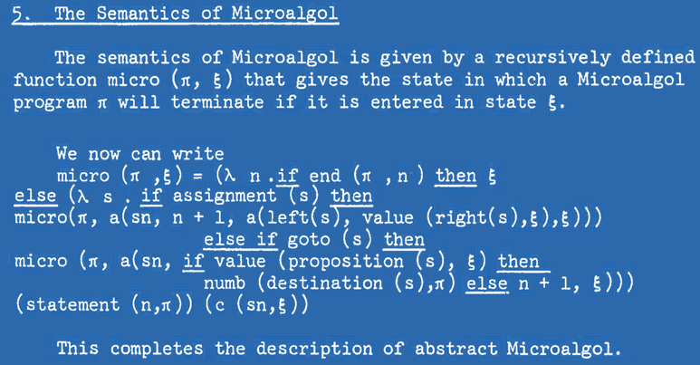

- title: Computational Substrates for Document-Oriented Programming

****************************************************************************************************
- template: title

# Cultures of Programming
## The Development of Programming<br/> Concepts and Methodologies


---

**Tomas Petricek**, Charles University, Prague  

_<i class="fa fa-envelope"></i>_ [tomas@tomasp.net](mailto:tomas@tomasp.net)  
_<i class="fa fa-globe"></i>_ [https:/<span style="margin:0px 0px 0px -12px">/</span>tomasp.net](https://tomasp.net)  
_<i class="fa-brands fa-bluesky"></i>_ [@tomasp.net](https://bsky.app/profile/tomasp.net)    

****************************************************************************************************
- template: image
- class: nologo
- background-color: #153374
- style: p { color:#F1DEC2; } p strong { color:#F1DEC2; } .body1 img { border-color:#F1DEC2; }


What is a correct program? What education makes a good programmer?

<br />

---

**History of program&shy;ming as interactions between five cultures  
of programming.**

****************************************************************************************************
- template: subtitle

# Cultures
## The five cultures of programming

----------------------------------------------------------------------------------------------------
- template: content
- background-color: #153374
- class: nologo
- style: .cult { margin-right:30px; text-align:center; padding:0px 10px 0px 10px;display:inline-block;
    background:#2C68AC;} strong { color:#F1DEC2; font-size:20pt; }
   img { max-height:250px; border-style:none; margin-top:5px; }

<p class="cult"><strong>Managerial</strong><br></p>
<p class="cult"><strong>Hacker</strong><br></p>
<p class="cult"><strong>Humanistic</strong><br></p>
<p class="cult"style="margin-right:75px"><strong>Mathematical</strong><br></p>
<p class="cult"><strong>Engineering</strong><br></p>

----------------------------------------------------------------------------------------------------
- template: codeanim
- class: code
- style: h1 { font-family:Felipa; } pre { margin-right:20px; } pre code { font-size:12pt; }

```text
float Q_rsqrt( float number )
{
  long i;
  float x2, y;
  const float threehalfs = 1.5F;

  x2 = number * 0.5F;
  y  = number;

  // evil floating point bit level hacking
  i  = * ( long * ) &y;             
  // what the fuck?
  i  = 0x5f3759df - ( i >> 1 );
  y  = * ( float * ) &i;

  // 1st iteration
  y  = y * ( threehalfs - ( x2 * y * y ) );
  // 2nd iteration, this can be removed
  // y  = y * ( threehalfs - ( x2 * y * y ) );
  return y;
}
```

# What code is beautiful?

---

<br>

**Hacker culture**

Values clever code that shows understanding of the machine operation

----------------------------------------------------------------------------------------------------
- template: code
- class: code larger
- style: h1 { font-family:Felipa; } pre { margin-right:20px; } pre code { font-size:10pt; }

```text
#define submerge const char*_=O%239?" ":"\t;\t";O*=2654435761;int
#define _cOb8(...) int s,on,__VA_ARGS__;int main(int O, char**Q)

  _cOb8(o_,     _oO8ocQOcOb,       _ocQbo8oo,      _oO8ocOb_
    ){ ;           { ;;;              ;;}             ;{
      ;;             ;{              ; }              {;;}
     }   float   the;;  static things ;; for (;;){ us :;;
    ; ;  break; the;  ;; long grass  ;unsigned squall  ; }
   { } ; while (1){soft:;  submerge us;;    in: sleep (0) ;
    ; ;  printf    (_);   quietly :on  ;;   the; soil:; };
   {{ };           ; ; ;;             ;{ ;            }; {
  {  ;   shake: time (1) ;register   *_, the =clock(s  );
    ;} ; volatile    *_,  winds     ; ;  double wills ;{
      ;  char the    ,*   fire     ;; short companion,*_;}
    ; {  union    {}*_,  together  ;; ;   void *warms  ;}
   } ;;            ;{;              ;} ;              ;;
    ; ;  if (1) wet  :;    raise    (1);  struct{}ure  ;; ;
   ; ;   free (0);for(;;){  newborn :; ;     daughter :; ;
   ;{ ;  extern al,  **     world   ,*re;const ructed  ;};
 ;  ; ;  continue;on:;;    floods   :; ;    of: water :;};}
; ;{ ; ;          ;; {  ;          ; }  ;             }  ; ;  }
```

# Beautiful code?

---

<br>

**Humanistic culture**

Use double coding to speak to the human as well as  
to the machine

----------------------------------------------------------------------------------------------------
- template: image
- class: larger
- style: h1 { font-family:Felipa; } .body1 img { margin-top:60px; border:solid 10px #2C68AC; border-radius:20px; }


# What code is beautiful?

---

<br>

**Engineering culture**

Simple, well-structured. Readability is valued more than cleverness.

----------------------------------------------------------------------------------------------------
- template: image
- class: larger
- style: h1 { font-family:Felipa; } .body1 img { margin-top:70px; border:solid 10px #2C68AC; border-radius:20px; background-color;red; }



# What code is beautiful?

---

<br>

**Mathematical culture**

Code achieves great expressivity using a combination of small number of orthogonal features.

----------------------------------------------------------------------------------------------------
- template: image
- class: larger
- style: h1 { font-family:Felipa; } .body1 img { margin-top:70px; border:solid 10px #2C68AC; border-radius:20px; background-color;red; }


# What code is beautiful?

---

<br>

**Managerial culture**

Structure of code enables appropriate organization of development teams and project management.

****************************************************************************************************
- template: subtitle

# Collaborations
## Cultures meet to give rise to shared concepts

----------------------------------------------------------------------------------------------------
- template: largeicons

# History of types

- *fa-pen-nib* **1903** - Avoiding logical paradoxes (Russell)
- *fa-gears* **1956** - Numbers in two modes (FORTRAN)
- *fa-database* **1957** - Data description cards (FLOW-MATIC)
- *fa-clipboard* **1974** - Abstract data types (Clu)
- *fa-terminal* **1978** - Meta-language for a theorem prover (ML)
- *fa-not-equal* **1989** - Types in proof assistants (Alf and Rocq)
- *fa-hand-pointer* **2012** - Unsound type systems (TypeScript)

----------------------------------------------------------------------------------------------------
- template: content
- class: two-column nologo

# Types in programming

**FORmula TRANslator  
rather than a language**

Arguments in fixed or  
floating-point mode


---

**Algorithmic Language**

Types (integer, real, Boolean) denote properties of values;  
Subscripts for arrays


----------------------------------------------------------------------------------------------------
- template: image


# IBM COMTRAN

**Electronic versions of paper-based records**

Data records with specific string formatting

----------------------------------------------------------------------------------------------------
- template: lists

# Towards a universal language


## Mathematical models
- Data spaces (McCarthy, '59)   
- Product $A \times B$, union $A \oplus B$
- Set-theoretical types (Hoare, '72)

## Types in Algol 68

* A long and difficult struggle
* Whereas ALGOL 60 has values of [three types],  
  ALGOL 68 features an infinity of “modes”.

----------------------------------------------------------------------------------------------------
- template: lists
- style: .body img { max-width:220px !important; }

# From mathematics to engineering


## Lambda-calculus models (Morris '69)
Models type checking via derivation rules

## Types are not sets (Morris '73)
Authentication and secrecy problems   
Now in Cedar system at Xerox PARC

## Abstract data types (Liskov '74)
Type checking done at runtime in Clu  
Cites Reynolds ("personal communication")

----------------------------------------------------------------------------------------------------
- template: image
- class: smaller
- style: .body1 img { margin-top:40px; border:solid 10px #2C68AC; border-radius:20px; }


# LCF/ML (1978)

**Abstract data types**  
for proof terms

**Data types**  
for convenient programming

**Type checking**  
for proof correctness

----------------------------------------------------------------------------------------------------
- template: icons

# Types
## Cultural reconciliation at last...?

- *fa-not-equal* Proof assistants and dependent types
- *fa-globe* Type providers and data as types
- *fa-right-left* Modelling types as relations
- *fa-list* Unsound type systems for the real world

****************************************************************************************************
- template: subtitle

# Clashes
## Cultures clash and struggle for control

----------------------------------------------------------------------------------------------------
- template: icons

# Object-orientation
## Struggle for control over a concept

- *fa-cart-flatbed-suitcase* **1960s** - Mathematical simulations in **Simula**
- *fa-tablet-screen-button* **1970s** - Personal dynamic media in **Smalltalk**
- *fa-computer* **1980s** - From **Smalltalk** to **C++** and **Java**
- *fa-industry* **1990s** - **UML** and new development processes

----------------------------------------------------------------------------------------------------
- template: image
- style: h2 { margin:30px 0px 0px 0px; font-size:28pt; font-weight:500; } p { margin:15px 0px 0px 0px; line-height:1.1em; }


## SIMULA "1"

Activity declarations  
vs. processes  

Remote accessing

## SIMULA 67

Classes and objects  

Record handling inspired by Hoare

----------------------------------------------------------------------------------------------------
- template: lists

# Three cultures of Smalltalk


## Humanistic (early 70s)
"Computer for Children of All Ages"  
Learning and educational focus

## Hacker (late 70s)
Experimentation tool at Xerox

## Engineering (80s-90s)
From Tektronix to IBM Visual Age  
Test-driven development, design patterns

----------------------------------------------------------------------------------------------------
- template: content
- class: two-column nologo
- style: .body img { max-width:180px; margin-left:30px; }

# Object-oriented methodology

**How do you design   
software using objects?**

Objects as active actors   
Responsibilities of objects


---

**From objects to software development processes**

Objects support requirements analysis, team structuring


----------------------------------------------------------------------------------------------------
- template: icons

# Clashes
## Disagreements and struggles for control

- *fa-shapes* What is object-oriented programming?
- *fa-layer-group* Interpretation of structured programming
- *fa-square-check* Is formal verification possible?
- *fa-folder-open* Interactive programming vs. applications

****************************************************************************************************
- template: subtitle

# Conclusions
## Cultures of Programming

----------------------------------------------------------------------------------------------------
- template: title
- style: h1 { letter-spacing:-1px; font-size:43pt } h2 { margin-bottom:60px } .items p { margin-top:0px; margin-bottom:5px; } .items i { margin-right:15px; }

# Thanks to HAPOC & PROGRAMme!
## Book comes out in January 2026 as open-access

<div class="items">

_<i class="fa fa-microscope"></i>_ All models are wrong, but some are useful

_<i class="fa fa-comments"></i>_ Framing for history &amp; current debates

_<i class="fa fa-vials"></i>_ Programming is a pluralistic enterprise

</div>

---

**Tomas Petricek**, Charles University, Prague

_<i class="fa fa-envelope"></i>_ [tomas@tomasp.net](mailto:tomas@tomasp.net)  
_<i class="fa fa-globe"></i>_ [https:/<span style="margin:0px 0px 0px -12px">/</span>tomasp.net](https://tomasp.net)  
_<i class="fa-brands fa-bluesky"></i>_ [@tomasp.net](https://bsky.app/profile/tomasp.net)    
