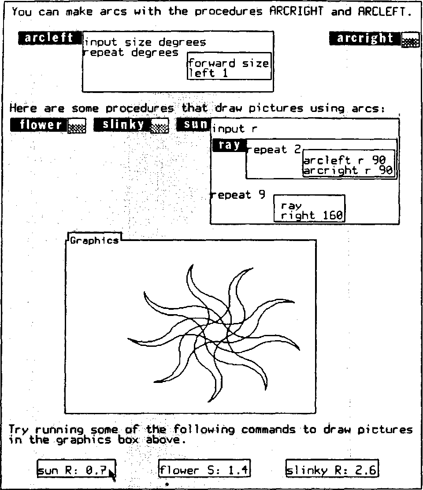
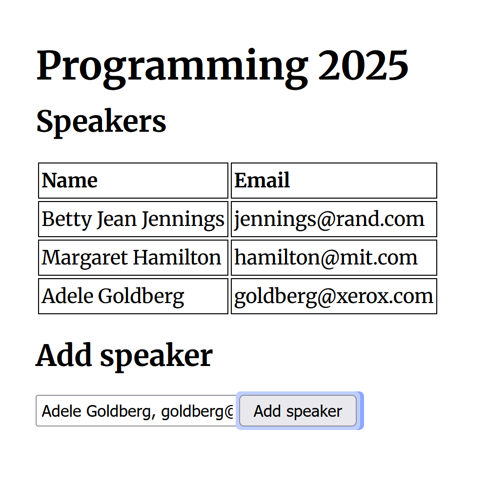
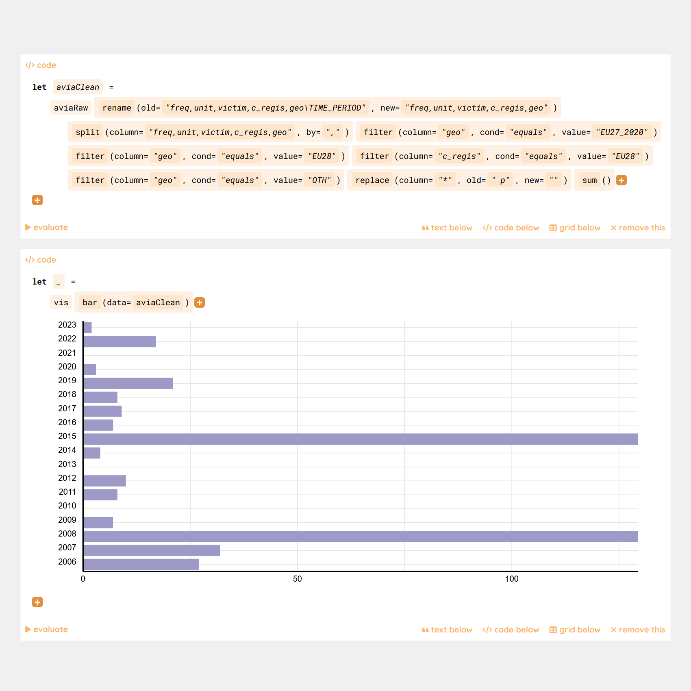
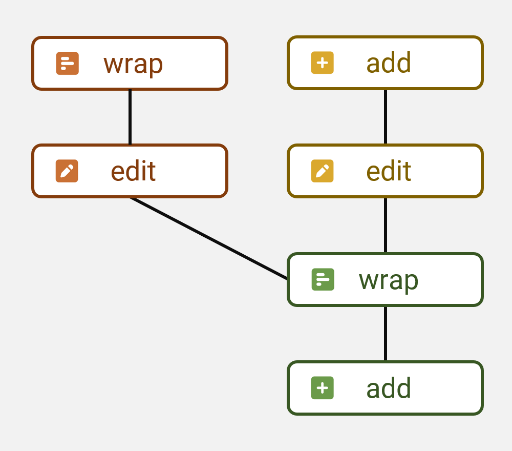
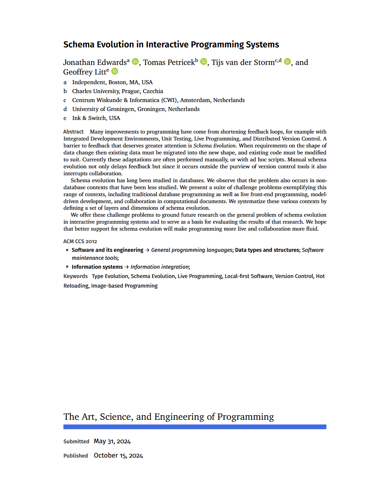

- title: Denicek - Computational Substrate for Document-Oriented End-User Programming

*****************************************************************************************
- template: title

# Denicek: **Computational substrate for document-oriented end-user programming**

---

**Tomas Petricek**, Charles University, Prague  
Joint work with Jonathan Edwards

_<i class="fa fa-envelope"></i>_ [tomas@tomasp.net](mailto:tomas@tomasp.net)  
_<i class="fa fa-globe"></i>_ [https://tomasp.net](https://tomasp.net)  
_<i class="fa-brands fa-bluesky"></i>_ [@tomasp.net](https://bsky.app/profile/tomasp.net)    

*****************************************************************************************
- template: icons

# Programming experiences
## Hard to implement for current languages!

- *fa-users* Local-first collaborative editing
- *fa-hand-pointer* Programming by demonstration
- *fa-rotate* Incremental recomputation
- *fa-database* Schema change control
- *fa-bug* End-user debugging
- *fa-shapes* Concrete programming

*****************************************************************************************
- template: lists

# What to talk about

## Programming substrates

- Systems based on edits
- Static and dynamic structure
- Merging techniques & complexity

## Research methodologies

- What matters about a substrate?
- Proofs and evaluation?
- Establishing a research field?

*****************************************************************************************
- template: subtitle

# Demo
## 5 minute sales pitch

*****************************************************************************************
- template: largeicons

# Unreasonable effectiveness of merge

- *fa-pen-to-square* **Collaborative editing**  
  Merge edits with fewer conflicts
- *fa-hand-pointer* **Programming by demonstration**  
  Replay edits done at an earlier point in history
- *fa-rotate* **Incremental recomputation**  
  Invalidate conflicting evaluated edits

*****************************************************************************************
- template: content
- class: two-column

# Research methodology

### Design

Co-design with prototype

6 formative examples

---

### Evaluation

Notebook case study

Heuristic evaluation

*****************************************************************************************
- template: subtitle

# (Not) Formative example
## The obligatory demo?

*****************************************************************************************
- template: subtitle

# Formative example
## Building a counter app

*****************************************************************************************
- template: image

# ‹Programming› 25

**The Art, Science,  
and Engineering  
of Programming**

18 paper talks  
6 co-located workshops  
Effekt tutorial  

*****************************************************************************************
- template: subtitle

# Formative example
## Organizing a conference

*****************************************************************************************
- template: content

# Merging edits

Merge edit histories $E, E_1$ and $E, E_2$ with a shared prefix:

- $\mathcal{M}_E(E_1,E_2) = E_1, E_2'$  
- $\mathcal{M}_E(E_2,E_1) = E_2, E_1'$

---
 

Reconciliation of independent edits $e_1$ and $e_2$ produces:

- $e_2', e_2'', \ldots$ that have the effect of $e_2$
- added after $e_1$, modified to respect the effects of $e_1$

*****************************************************************************************
- template: lists

# Merging edits

## Apply to newly added

- $e_1$ is adding new nodes to the doc
- $e_2$ targets nodes in affected location
- Generate $e_1'$ targeting the new node
- Resulting edits are: $e_1, e_2, e_1'$

## Transform matching references

- $e_1$ changes structure of some node
- $e_2$ target is inside the transformed one
- Modify $e_2$ to respect the new structure

*****************************************************************************************
- template: image

# Schema change

**Program layers**

- Schema  
- Code  
- Data

---

**Convergence vs. divergence**  
Can users pick only some later edits?

*****************************************************************************************
- template: largeicons

# Design considerations

- *fa-spell-check* **Static vs. dynamic typing**  
  Explicitly distinguish type and value edits!
- *fa-list-ol* **Dealing with lists and indices**  
  Append & edit item scenario is hard to support!
- *fa-pen-to-square* **Non-conditionality of edits**  
  Effect should not depend on existing document state
- *fa-circle-question* **Expressivity of selectors**  
  Support conditions (all checked) or rich (by tag)?
- *fa-arrow-right-arrow-left* **Merging capabilities**  
  Move $e_1$ after $e_2$, or also before $e_2$?

*****************************************************************************************
- template: subtitle

# Evaluation
## Datnicek notebook system

*****************************************************************************************
- template: largeicons

# Evaluation
## How to study programming substrates?

- *fa-users* **Datnicek notebook case study**  
  Build by us, but after finishing Denicek design
- *fa-list-check* **Olsen (2007) - Evaluating UI systems**  
  Importance, generality, flexibility, expressive match
- *fa-table-cells* **Jakubovic et al. (2024) - Technical dimensions**  
  Modes of interaction, feedback loops, notations
- *fa-users* **No user studies!**  
  Usability of strange research prototypes...?

*****************************************************************************************
- template: title

# Denicek **computational substrate**

- **Join the substrates revolution...**  
  Come to the Substrates workshop on June 3!
- **This need some clever people...**  
  Looking for PhD students and post-docs!

---

**Tomas Petricek**, Charles University, Prague

_<i class="fa fa-envelope"></i>_ [tomas@tomasp.net](mailto:tomas@tomasp.net)  
_<i class="fa fa-globe"></i>_ [https://tomasp.net](https://tomasp.net)  
_<i class="fa-brands fa-bluesky"></i>_ [@tomasp.net](https://bsky.app/profile/tomasp.net)    
