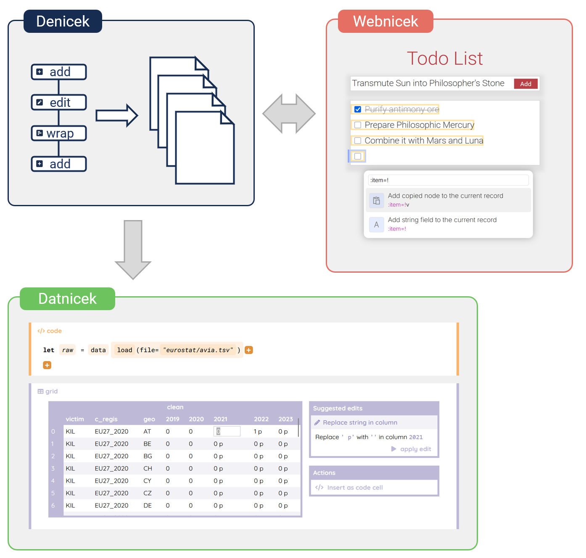
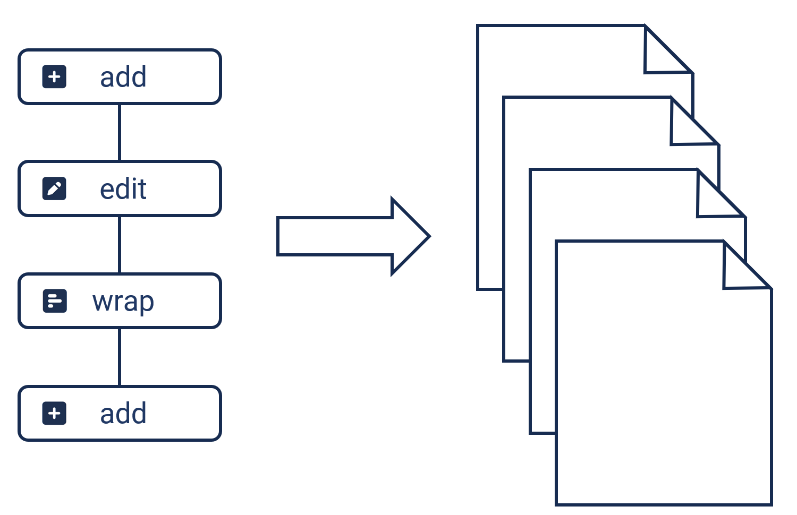
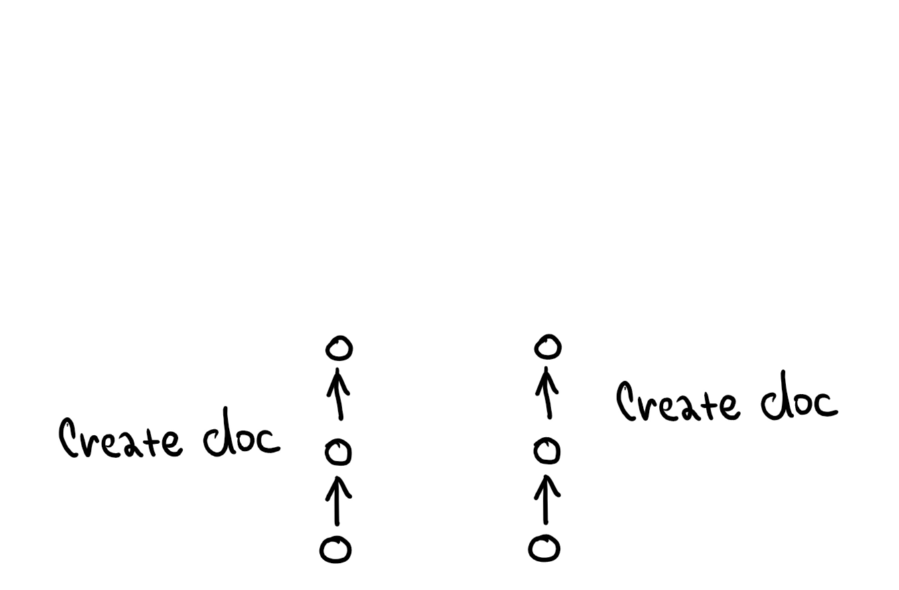
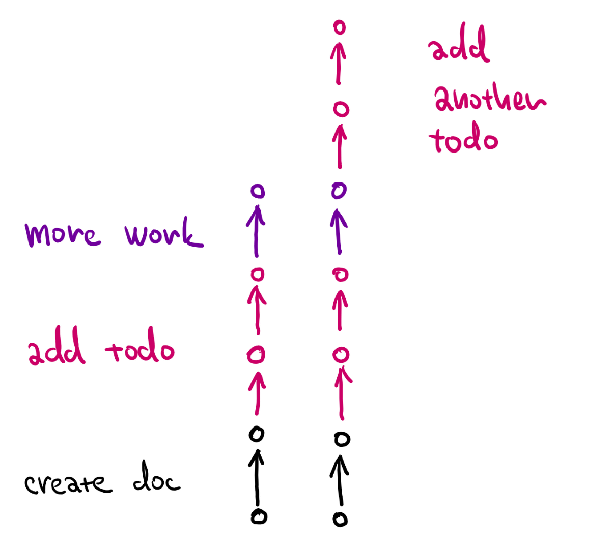
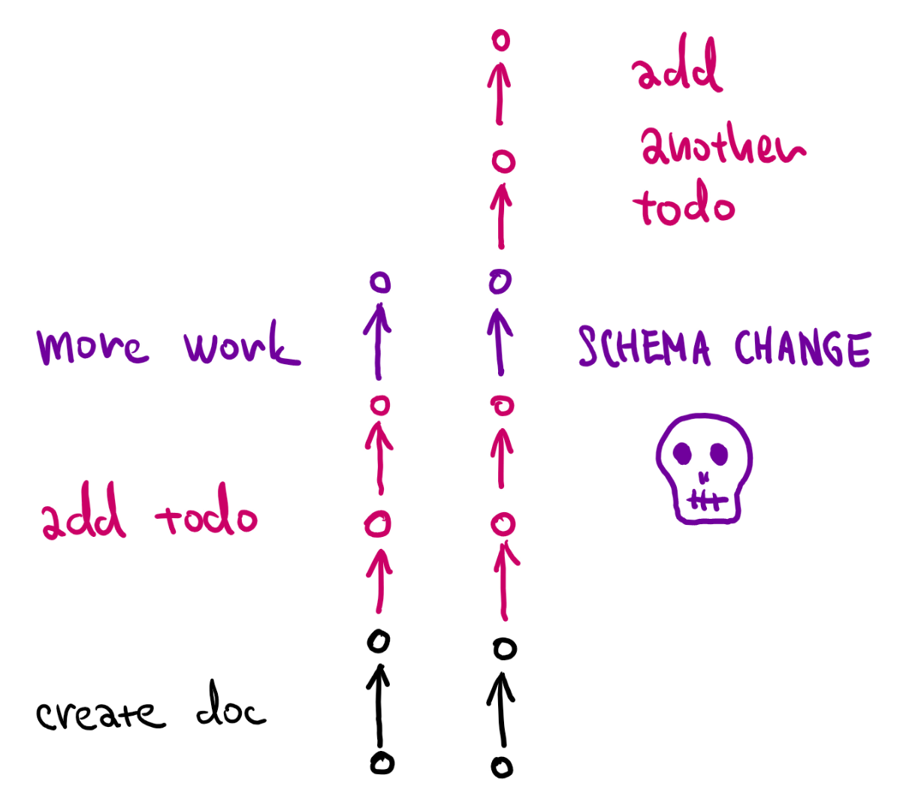
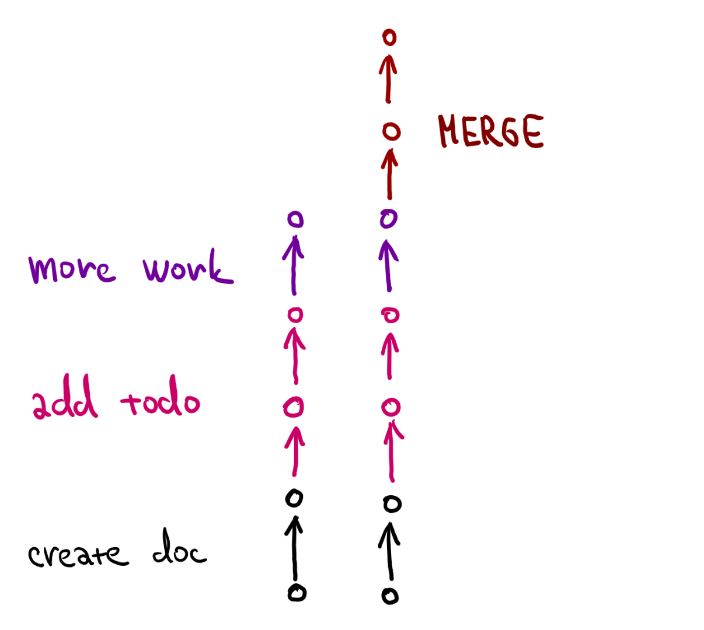

- title: Computational Substrates for Document-Oriented Programming

****************************************************************************************************
- template: title

# **Computational Substrates for** Document-Oriented Programming

---

**Tomas Petricek**, Charles University, Prague  

_<i class="fa fa-envelope"></i>_ [tomas@tomasp.net](mailto:tomas@tomasp.net)  
_<i class="fa fa-globe"></i>_ [https://tomasp.net](https://tomasp.net)  
_<i class="fa-brands fa-bluesky"></i>_ [@tomasp.net](https://bsky.app/profile/tomasp.net)    

****************************************************************************************************
- template: subtitle

# Essence
## What do all of these have in common?

----------------------------------------------------------------------------------------------------
- template: image
- class: smaller

# Boxer (1986)

**Environment for creating interactive textbooks**

Spatial metaphor  
Naive realism

----------------------------------------------------------------------------------------------------
- template: image

# Subtext (2005)

**Non-textual programming system based on copying**

First-class copy&paste  
Concrete programming

----------------------------------------------------------------------------------------------------
- template: image
- class: smaller

# Jupyter/IPython (2001)

**Literate programming environment for data science**

Notebook with cells  
Code, outputs, text  

----------------------------------------------------------------------------------------------------
- template: image

# Hypercard (1987)

**Hypermedia authoring system for end-users**

Stacks of cards  
User levels  
HyperTalk language

----------------------------------------------------------------------------------------------------
- template: subtitle

# Definition
## Document-oriented programming system

----------------------------------------------------------------------------------------------------
- template: largeicons

# Definition
## Document-oriented programming system

* *fa-file-code* **Primary notation is document**  
  Contains other data and code notations
* *fa-hand-pointer* **Interaction through document**  
  Authoring and using through the same interface
* *fa-rotate* **Editing running at the same time**  
  No separation between edit-time and run-time

----------------------------------------------------------------------------------------------------
- template: lists
- class: bigger

# Why document-oriented systems?

## Programming research
What is the formal model?  
Can we type check them?  
What are their design choices?

## Human-centric research
Better support non-programmers  
Support progression to expert  
More open and transparent!

****************************************************************************************************
- template: subtitle

# Denicek
## Substrate for end-user doc programming

----------------------------------------------------------------------------------------------------
- template: content

# Programming experiences

----------------------------------------------------------------------------------------------------
- template: content
- class: three-column nologo
- style: img { width:200px; border-style:none; }
    h3 { color:black; font-size:26pt }  p { font-size:24pt; }

# Programming experiences

### Collaboration

Merge edits made independently by different users

---

### Demonstration

Specify program by showing concrete document action

---

### Schema change

Adapt references when document structure changes

----------------------------------------------------------------------------------------------------
- template: image
- class: noborder
- style: p { margin:5px 0px 0px 0px; } .body1 { margin-right:-30px; }

# Denicek

**Computational substrate for end-user document-oriented programming**

 

Makes implementing  
such systems easy!

----------------------------------------------------------------------------------------------------
- template: image
- class: noborder
- style: p { margin:5px 0px 0px 0px; }

# Webnicek

**Web-based end-user programming tool**

 

Co-developed with the Denicek substrate

Six formative examples

----------------------------------------------------------------------------------------------------
- template: image
- class: noborder
- style: p { margin:5px 0px 0px 0px; }

# Datnicek

**Simple data science notebook system**

 

Collaborative editing

Programming by demonstration

Incremental evaluation

----------------------------------------------------------------------------------------------------
- template: content
- class: noborder
- style: h1 { font-size:38pt; } .body img { max-width:550px; margin-left:80px }

# Denicek: **Document and Edit history**

----------------------------------------------------------------------------------------------------
- template: content
- class: noborder
- style: h1 { font-size:38pt; } .body img { max-width:550px; margin-left:80px }

# Denicek: **Document and Edit history**

----------------------------------------------------------------------------------------------------
- template: content
- class: noborder
- style: h1 { font-size:38pt; } .body img { max-width:550px; margin-left:80px }

# Denicek: **Document and Edit history**

----------------------------------------------------------------------------------------------------
- template: content
- class: noborder
- style: h1 { font-size:38pt; } .body img { max-width:550px; margin-left:80px }

# Denicek: **Document and Edit history**

----------------------------------------------------------------------------------------------------
- template: content
- class: noborder
- style: h1 { font-size:38pt; } .body img { max-width:550px; margin-left:80px }

# Denicek: **Document and Edit history**

----------------------------------------------------------------------------------------------------
- template: subtitle

# Demo
## Conference planning in Webnicek

----------------------------------------------------------------------------------------------------
- template: image
- class: smaller noborder
- style: .body1 img { width:300px }

# Collaborative editing

----------------------------------------------------------------------------------------------------
- template: image
- class: smaller noborder
- style: .body1 img { width:300px }

# Collaborative editing

One user changes the document structure

----------------------------------------------------------------------------------------------------
- template: image
- class: smaller noborder
- style: .body1 img { width:300px }

# Collaborative editing

One user changes the document structure

Another user changes  
data in the document

---

**Can we merge the edits?**  

----------------------------------------------------------------------------------------------------
- template: image
- class: noborder
- style: .body1 img { width:500px }

# Merging edits

**Linearize like rebase**

----------------------------------------------------------------------------------------------------
- template: image
- class: noborder
- style: .body1 img { width:500px }

# Merging edits

**Linearize like rebase**

----------------------------------------------------------------------------------------------------
- template: image
- class: noborder
- style: .body1 img { width:500px }

# Merging edits

**Linearize like rebase**

Add data first, then change document structure is easy!

----------------------------------------------------------------------------------------------------
- template: image
- class: noborder
- style: .body1 img { width:500px }

# Merging edits

**Linearize like rebase**

Add data first, then change document structure is easy!

----------------------------------------------------------------------------------------------------
- template: image
- class: noborder
- style: .body1 img { width:500px }

# Merging edits

**Linearize like rebase**

Add data first, then change document structure is easy!

Change structure, then add new data is tricky!

----------------------------------------------------------------------------------------------------
- template: lists
- class: noborder nologo
- style: .body img { max-width:400px !important; max-height:600px !important; margin-top:0px !important; }

# Three primitive operations

## Apply edit history
Compute the current  
document state

## Merging of histories
Turn branching into  
a linear history

## Conflict detection
Report merge conflicts

----------------------------------------------------------------------------------------------------
- template: content
- style: h1 { font-size:38pt; } h3 { margin-bottom:0px; margin-top:10px;}

# Merging of edit histories

### Merging
Given $E, E_1$ and $E, E_2$ with a shared prefix $E$:

<blockquote>

$\mathcal{M}_E(E_1, E_2) = E, E_1, E_2'$  
$\mathcal{M}_E(E_2, E_1) = E, E_2, E_1'$

</blockquote>

---

### Edit reconciliation
Given $e_1$ and $e_2$, produce $e_2', e_2'', \ldots$ that can be applied after $e_1$

- Apply $e_1$ to nodes newly added by $e_2$
- Transform references in $e_2$ according to $e_1$

----------------------------------------------------------------------------------------------------
- template: subtitle

# Demo
## Programming by demonstration

----------------------------------------------------------------------------------------------------
- template: image
- class: smaller noborder

# The unreasonable effectiveness of merge

Simply replay edits on top of the current history!

----------------------------------------------------------------------------------------------------
- template: image
- class: smaller noborder

# The unreasonable effectiveness of merge

Simply replay edits on top of the current history!

----------------------------------------------------------------------------------------------------
- template: image
- class: smaller noborder

# The unreasonable effectiveness of merge

Simply replay edits on top of the current history!

**Does not work if the  
document evolves...**

----------------------------------------------------------------------------------------------------
- template: image
- class: smaller noborder

# The unreasonable effectiveness of merge

Branch off from the original document version & merge

----------------------------------------------------------------------------------------------------
- template: image
- class: smaller noborder

# The unreasonable effectiveness of merge

Branch off from the original document version & merge

----------------------------------------------------------------------------------------------------
- template: image
- class: smaller noborder

# The unreasonable effectiveness of merge

Branch off from the original document version & merge

**Merging logic adapts edits to the new schema**

----------------------------------------------------------------------------------------------------
- template: largeicons
- style: h1 { font-size:40pt; }

# The unreasonable effectiveness of merge

* *fa-users* **Collaborative-document editing**  
  Merge edits done independently
* *fa-arrow-pointer* **Programming by demonstration**  
  Replay edits correctly using merge
* *fa-arrows-rotate* **Incremental recomputation**  
  Remove conflicting evaluated edits
* *fa-clone* **Concrete programming**  
  Edit formula before it was copied

----------------------------------------------------------------------------------------------------
- template: subtitle

# Demo
## Denicek-based data exploration

****************************************************************************************************
- template: subtitle

# Design choices
## Document-oriented programming systems

----------------------------------------------------------------------------------------------------
- template: icons

# Design
## Four clusters of design choices

- *fa-file-lines* Document shape, representation, modularity
- *fa-code* Programming model, embedding, capabilities
- *fa-address-card* Display and editing mechanism
- *fa-circle-play* Evaluation mode and state representation

----------------------------------------------------------------------------------------------------
- template: image
- style: em { color:#d22d40; font-style:normal; }
- class: smaller

# Display mechanism

---

**Naive realism**  
Boxer, Webstrates

---

**Renderer with widgets**  
Jupyter, Forms/3

---

**API calls**  
Ampleforth, Hypercard

---

**Memory-mapped**  
_BootstrapLab_, (BASIC :-)

----------------------------------------------------------------------------------------------------
- template: image
- style: em { color:#d22d40; font-style:normal; }

# Evaluation state

---

**Ephemeral results**  
Spreadsheets, Jupyter

---

**Materialized results**  
Hypercard, Webstrates

---

**Internalized execution**  
_Boxer_, BootstrapLab

---

**Materialized execution**  
Denicek, Subtext

****************************************************************************************************
- template: title
- style: h1 { font-size:40pt; color:#003657; } .items p { margin-top:0px; margin-bottom:5px; color:#d22d40; } i { margin-right:10px; }

# **Computational Substrates for**  Document-Oriented Programming

_<i class="fa fa-laptop-code"></i>_ Interesting kind of **programming systems**...

_<i class="fa fa-microscope"></i>_ For **user-centric** and **theory** research

_<i class="fa fa-pen-nib"></i>_ Ask me about **Denicek** and **design choices**

---

**Tomas Petricek**, Charles University, Prague

_<i class="fa fa-envelope"></i>_ [tomas@tomasp.net](mailto:tomas@tomasp.net)  
_<i class="fa fa-globe"></i>_ [https://tomasp.net](https://tomasp.net)  
_<i class="fa-brands fa-bluesky"></i>_ [@tomasp.net](https://bsky.app/profile/tomasp.net)    
