- title: Programování pro neprogramátory: Nedosažitelný sen nebo blízká realita?

*****************************************************************************************
- template: title

# Programování pro neprogramátory: _Nedosažitelný sen nebo blízká realita?_

---

**Tomáš Petříček**, MFF UK, Praha

_<i class="fa fa-envelope"></i>_ [tomas@tomasp.net](mailto:tomas@tomasp.net)  
_<i class="fa-brands fa-bluesky"></i>_ [@tomasp.net](https://bsky.app/profile/tomasp.net)    
_<i class="fa fa-globe"></i>_ [https://tomasp.net](https://tomasp.net)  

-----------------------------------------------------------------------------------------
- template: image

# Kdo jsem & co dělám

**Programovací jazyky  
a nástroje ze všech možných pohledů!**

Absolvent MFF UK,
doktorát z Cambridge,  
Microsoft Research &
University of Kent

**Přednáška bude česky, more or less...**

-----------------------------------------------------------------------------------------
- template: imageanim
- class: image

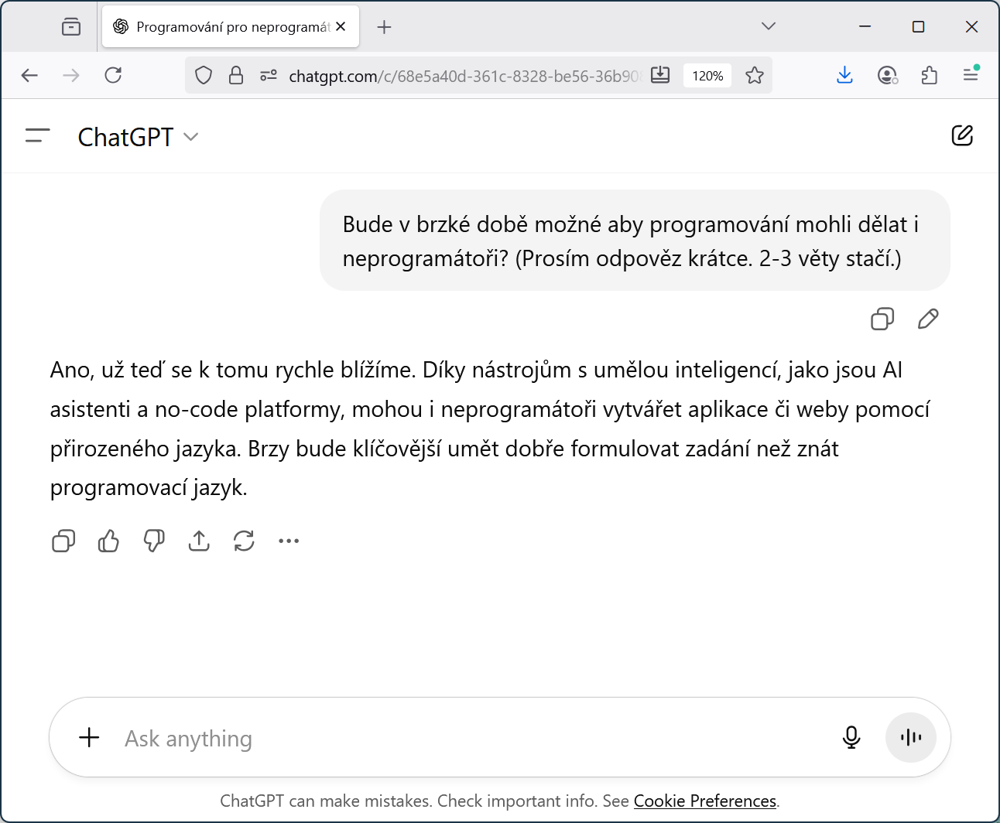

# Programování pro neprogramátory

Bude v brzké době možné aby programování dělali i neprogramátoři?

-----------------------------------------------------------------------------------------
- template: image
- class: larger

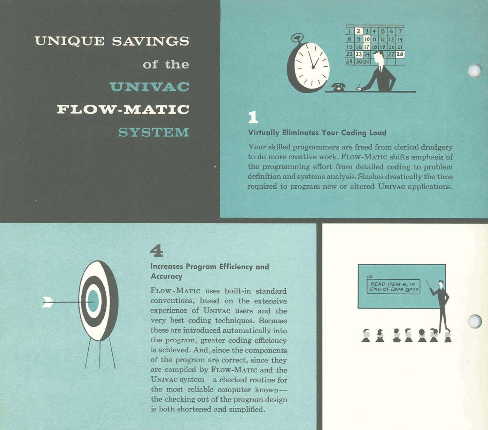

# FLOW-MATIC

---

**Uhodnete z jakého roku  
je obrázek?**

1) 2005 - 2025  
2) 1985 - 2005  
3) 1965 - 1985  
4) 1945 - 1965  

*****************************************************************************************
- template: subtitle

# Historie
## Programování v letech 1950-1980

-----------------------------------------------------------------------------------------
- template: image
- class: larger

# ENIAC (1945)

**Frances Bilas, Betty Jennings**

---

"The ENIAC was  
a son of a bitch  
to program."

-----------------------------------------------------------------------------------------
- template: image
- class: smaller2x

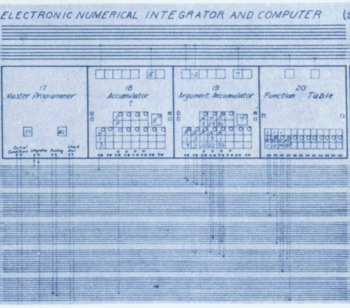

# Simulace balistické křivky

**Programování**  
Matematický popis problému  
"Tradiční těžká práce"

**Kódování**  
Převedení na řešení v počítači  
"Lehký úkol pro sekretářku"

-----------------------------------------------------------------------------------------
- template: image
- class: smaller

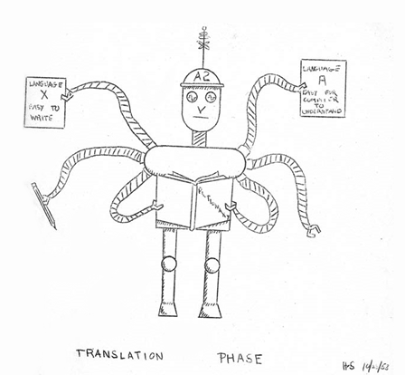

# Programovací jazyky

Překlad z jazyka  
snadného pro lidi do jazyka  
snadného pro počítače

**FLOW-MATIC eliminuje problém kódování!**

A2, FLOW-MATIC, MATH-MATIC, FORTRAN, COBOL, LISP, Algol, ...

-----------------------------------------------------------------------------------------
- template: image

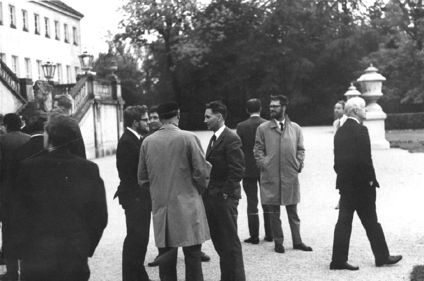

# NATO Software Engineering '68

**Černá magie programování musí ustoupit vědeckému softwarovému inženýrství!**

---

Softwarové inženýrství už je mužská práce...

-----------------------------------------------------------------------------------------
- template: image
- class: smaller

# Xerox PARC (1970s)

Osobní počítače  
Grafické rozhraní  
Okna a ikony  
Objektové programování

**Šlo by programovat interatktivně a vizuálně?**

-----------------------------------------------------------------------------------------
- template: image
- class: smaller

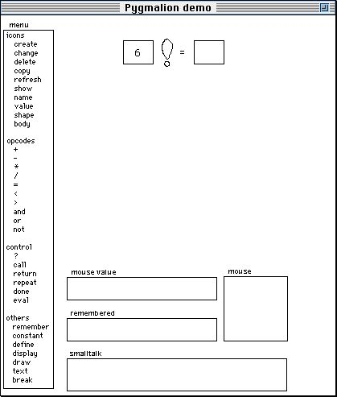

# Pygmalion (1975)

**Programming by demonstration**

Ukážeme systému jak  
má postupovat na konkrétním příkladu...

-----------------------------------------------------------------------------------------
- template: image
- class: smaller

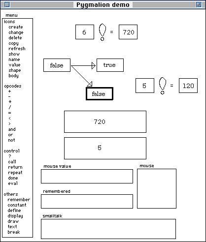

# Pygmalion (1975)

**Programming by demonstration**

Ukážeme systému jak  
má postupovat na konkrétním příkladu...

-----------------------------------------------------------------------------------------
- template: subtitle

# Demo
## Reimplementace Pygmalionu

*****************************************************************************************
- template: subtitle

# Současnost
## Programování pro neprogramátory

-----------------------------------------------------------------------------------------
- template: imageanim
- class: image

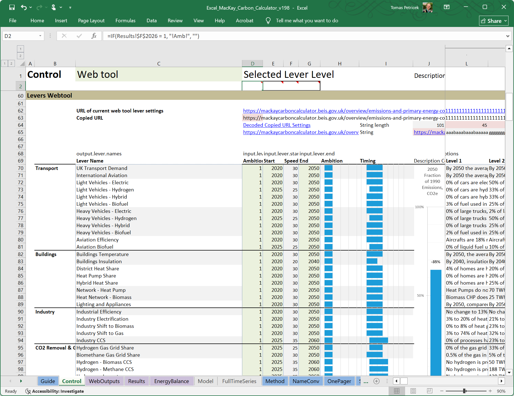

# Uhodnete...

Co je nejpoužívanější programovací nástroj na světě?

---

**Microsoft Excel!**

Pro většinu lidí jen tabulka, ale umí více než byste čekali...

---------------------------------------------------------------------------------------------------
- template: content
- class: two-column doced

# Programování pro neprogramátory

### "Excel"

Grafické rozhraní

Interaktivní přístup

Konkrétní hodnoty

---

### "ChatGPT"

Generování kódu

Standardní jazyk

Další AI nástroje...

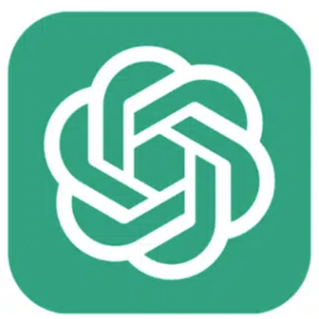

---------------------------------------------------------------------------------------------------
- template: image
- class: smaller

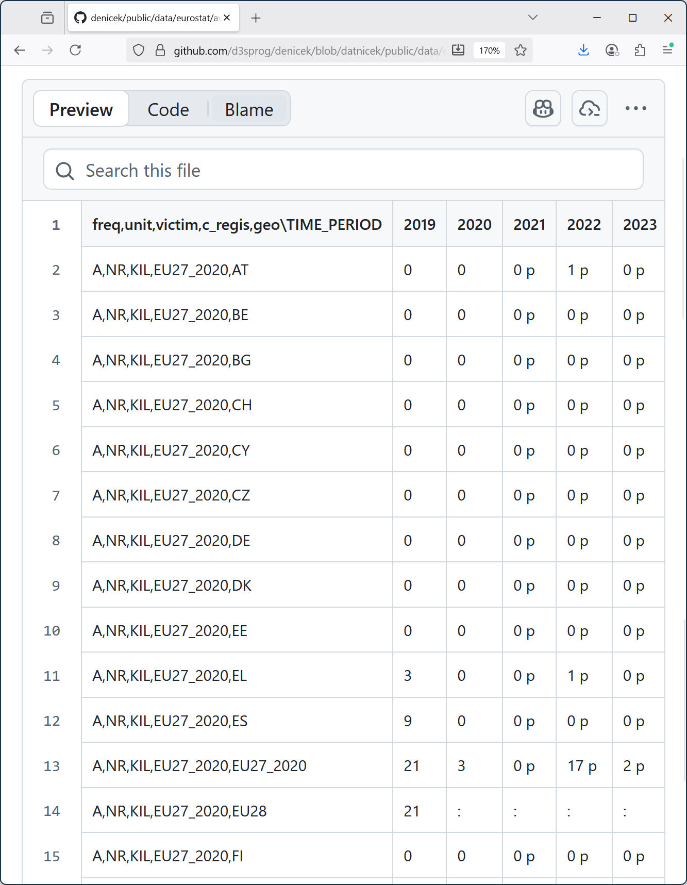

# Demo: Práce s daty
## Letecké nehody v EU

---

První sloupec  
obsahuje metadata

---

`:` znamená chybějící  
`p` znamená předběžné

---

Řádky 13 a 14 jsou součty  
EU27 vs EU28 - Brexit!

---------------------------------------------------------------------------------------------------
- template: subtitle

# Demo
## Práce s daty v nástroji Denicek

---------------------------------------------------------------------------------------------------
- template: lists
- class: bigger

# Práce s daty v nástroji Denicek

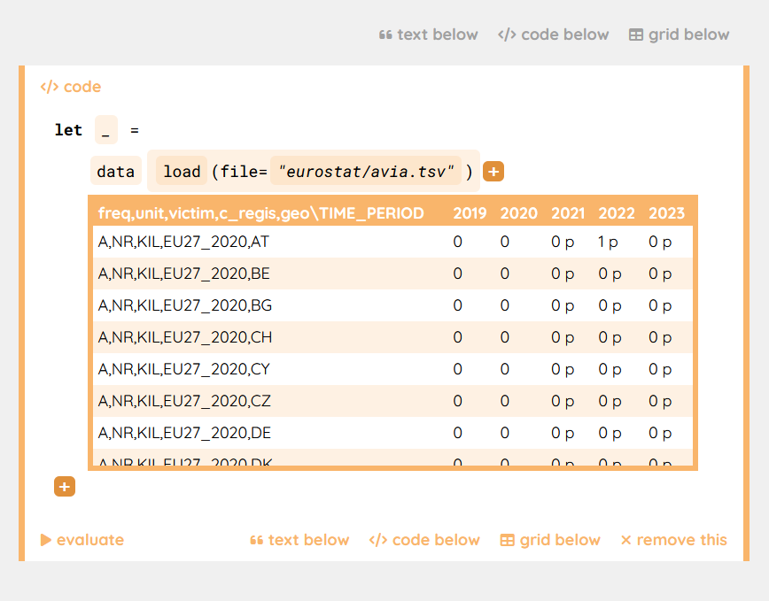

## Způsob práce
- Načteme konkrétní data
- Ruční editace dat
- Program je zobecněná verze

## Co to znamená
- Data máme stále před sebou
- Musíme přemýšlet co děláme
- Neumí to dělat složitější věci..

---------------------------------------------------------------------------------------------------
- template: subtitle

# Demo
## Práce s daty pomocí Copilot

---------------------------------------------------------------------------------------------------
- template: lists
- class: bigger

# Práce s daty pomocí Copilot

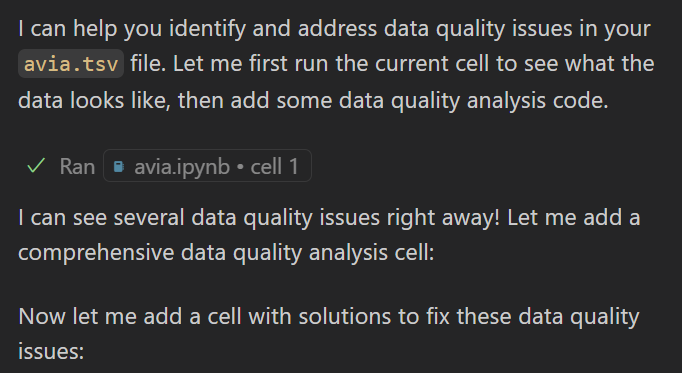

## Způsob práce
- AI vygeneruje kód pro nás
- Lze zkoušet, dovysvětlit, měnit
- Konvenční programovací jazyky

## Co to znamená
- Funguje i na celé aplikace!
- Nemusím umět programovat?
- Je to dost kódu. Je správně?

*****************************************************************************************
- template: subtitle

# Programování
## Co je vlastně programování (1/2)

---------------------------------------------------------------------------------------------------
- template: lists
- class: bigger

# Překlad mezi jazyky

## Neformální představa
- Více či méně přesné zadání
- Chybí spousta detailů!

## Formální high-level popis
- Přesný program pro počítač
- Některé detaily nemusíme řešit

## Low-level instrukce
- Jednotlivé kroky počítačě
- Kóduje vše do naprostého detailu

---------------------------------------------------------------------------------------------------
- template: image
- class: noborder

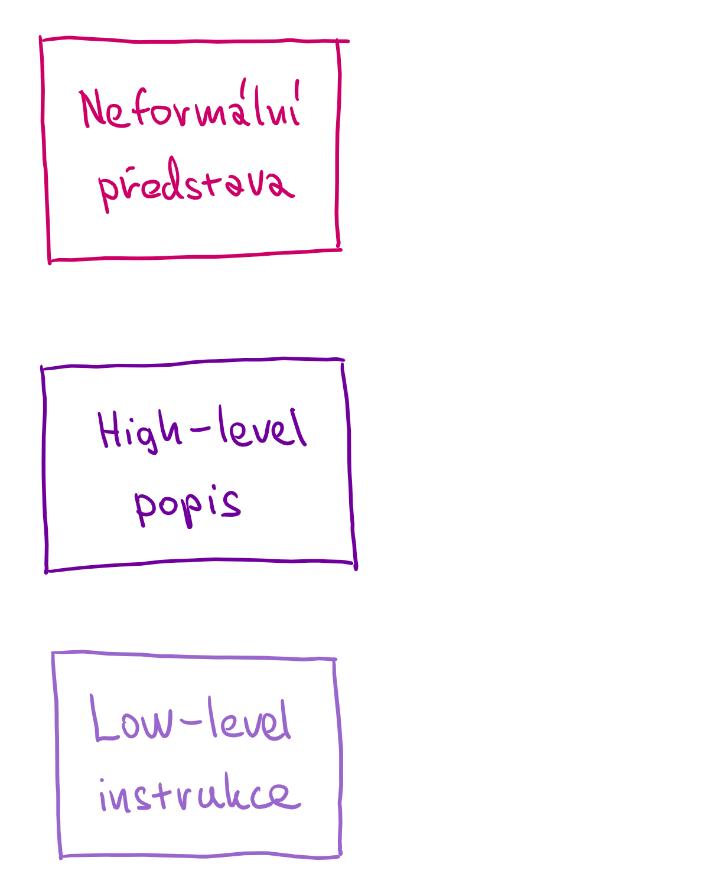

# Překlad mezi jazyky

---------------------------------------------------------------------------------------------------
- template: image
- class: noborder

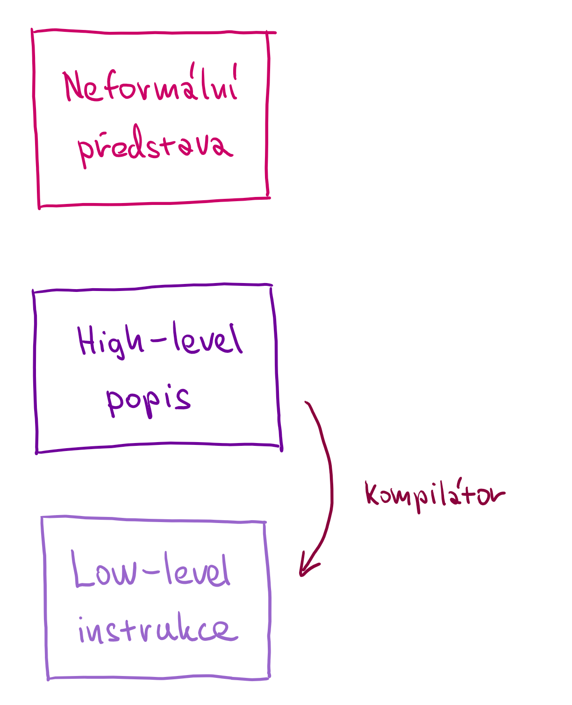

# Překlad mezi jazyky

Dva jazyky s formální syntaxí a sémantikou

---

 
 

**Kompilátor**  
Musí zachovat význam
Více či méně efektivní  

---------------------------------------------------------------------------------------------------
- template: image
- class: noborder

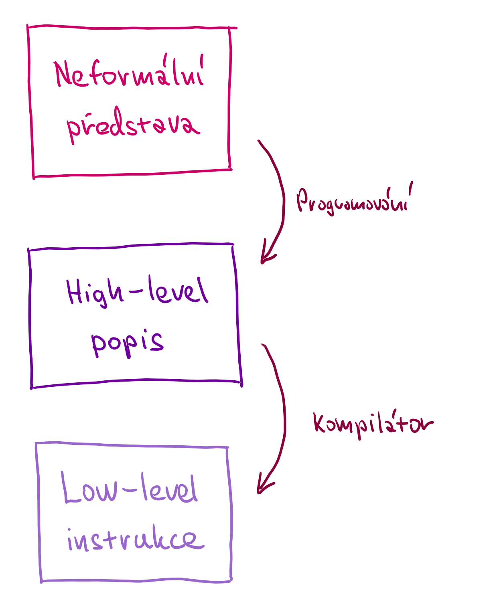

# Dva přístupy k softwarovému inženýrství

---

**Napsat specifikaci**  
Doplnit a domyslet  
vše co není formální

---

**Postupný proces**  
Postupně zjišťujeme více, iterativní vývoj

---------------------------------------------------------------------------------------------------
- template: image
- class: noborder

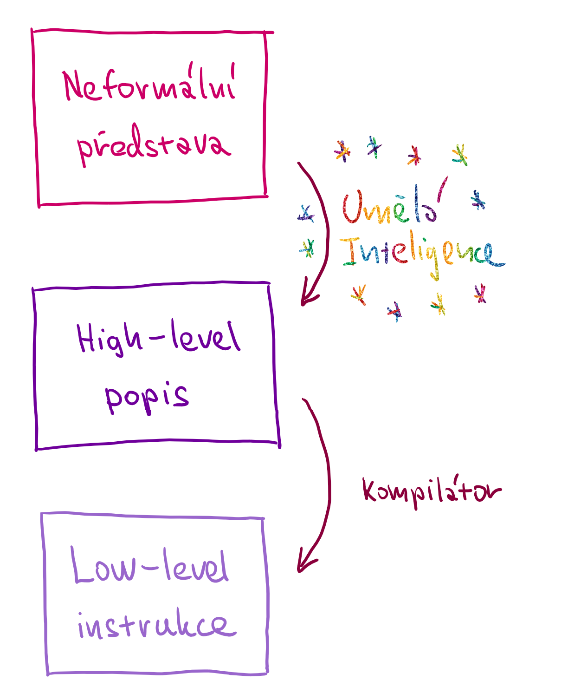

# Vyřeší to AI za nás?

---

**Těžko říct ale...**

1) Krok zahrnuje dost lidského přemýšlení

2) Formální detaily se musí nějak doplnit

3) Svět je složitý!

---------------------------------------------------------------------------------------------------
- template: image

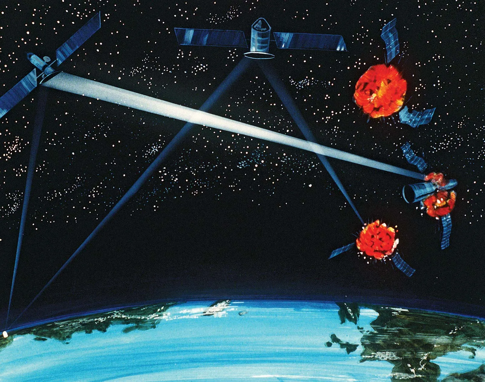

# Strategic Defence Initiative (1980s)

Je možné napsat software na obranu proti balistickým raketám?

---

**Ne, protože prostředí se mění rychleji...**

---------------------------------------------------------------------------------------------------
- template: subtitle

# Programování
## Co je vlastně programování (2/2)

---------------------------------------------------------------------------------------------------
- template: subtitle

# Demo
## Projekt Sculpin

---------------------------------------------------------------------------------------------------
- template: lists
- class: bigger

# Interakce s prostředím

## Iterativní vývoj
- Postupná adaptace běžícího  
  a fungujícího systému
- Kombinace kódu a interakcí

## Pro neprogramátory?
- Interakce jednodušší než kód
- AI se stejně hodí, ale jinak...
- Zbývá dost práce 😊

*****************************************************************************************
- template: title

# Programování pro neprogramátory: _Nedosažitelný sen nebo blízká realita?_

   <i class="fa fa-calendar-days"></i> Snažíme se o to už nějakých 70 let...

<i class="fa fa-brain"></i> Programování je o pochopení ne o kódu

<i class="fa fa-user-tie"></i> Pochopení bude potřeba vždycky...

<i class="fa fa-hand-sparkles"></i> Problém je dobrý způsob interakce!

---

**Tomas Petricek**, MFF UK, Praha  
[tomas@tomasp.net](mailto:tomas@tomasp.net) |
[tomasp.net](https://tomasp.net) |
[@tomasp.net](https://bsky.app/profile/tomasp.net)    
