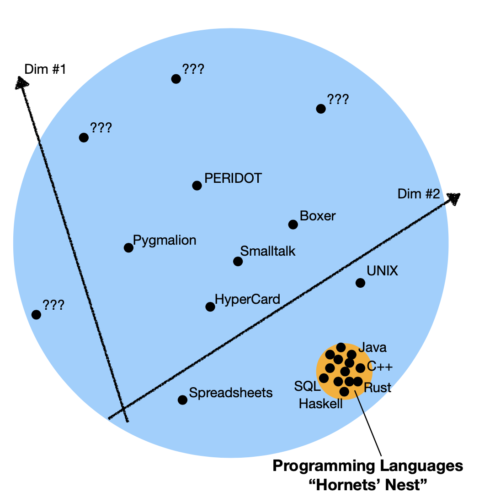

- title: Programming systems deserve a theory too!

*****************************************************************************************
- template: title

# Programming systems<br>_deserve a theory too!_

---

**Tomas Petricek**, Charles University, Prague

_<i class="fa fa-envelope"></i>_ [tomas@tomasp.net](mailto:tomas@tomasp.net)  
_<i class="fa fa-globe"></i>_ [https://tomasp.net](https://tomasp.net)  
_<i class="fa-brands fa-bluesky"></i>_ [@tomasp.net](https://bsky.app/profile/tomasp.net)    

-----------------------------------------------------------------------------------------
- template: image
- class: noborder larger


# The name of this summer school<br> is so 1990s!

-----------------------------------------------------------------------------------------
- template: image
- class: noborder larger


# The name of this summer school<br> is so 1990s!

**The browser makes this easy to fix.**

-----------------------------------------------------------------------------------------
- template: lists

# Silly joke?


## 1990s not arbitrary!

- Systems to languages paradigm shift
- The Structure of a Programming Language Revolution (Gabriel, 2012)

## Browser not arbitrary!

- Good programming system to learn from
- Empowering users & malleability (almost)

*****************************************************************************************
- template: subtitle

# Programming systems
## Scientific paradigm shift

-----------------------------------------------------------------------------------------
- template: image
- class: twolineh


# _Programming_ Languages

Programming is  
writing code

Formal semantics, implementation, paradigms, types

------

**We know how   
to study this!**

<style>.twolineh h1 em { font-style:normal; font-weight:100; color:black; }</style>

-----------------------------------------------------------------------------------------
- template: image
- class: noborder twolineh


# _Programming_ Systems

Interacting with a stateful system

Feedback, liveness, interactive user interfaces

------

**But how do we  
study this?**

-----------------------------------------------------------------------------------------
- template: lists
- class: border

# Paradigm shift in the 1990s


## Scientific paradigm shifts

- Described by Thomas Kuhn in 1962
- Paradigms are incommensurable
- Old concepts stop making any sense

## From systems to languages

- Described by Richard Gabriel in 2012
- From CLOS and Flavors to mixins
- From running system to code
- From state & interaction to semantics

-----------------------------------------------------------------------------------------
- template: subtitle

# Demo
## Not what you'd expect at PLISS

-----------------------------------------------------------------------------------------
- template: image


# History of programming

**What we see depends  
on how we look!**

Poorly language?
Interesting system?

*****************************************************************************************
- template: subtitle

# Technical dimensions
## Qualitative systems analysis

---------------------------------------------------------------------------------------------------
- template: lists

# Technical dimensions



## What is a dimension

- Captures a property of a system
- Covers old and new systems
- Defines a range of values

## Using the framework

- Identify gaps in design space
- Characterise new and old systems
- Qualitative comparison of systems

---------------------------------------------------------------------------------------------------
- template: image
- class: larger


# Technical dimensions catalogue

**Analysis of:**

LISP machines, UNIX, Web, Hypercard, Spreadsheets, Haskell, Boxer, Dark, etc.

*****************************************************************************************
- template: subtitle

# Good old programming systems
## Technical dimensions analysis

---------------------------------------------------------------------------------------------------
- template: lists
- class: noborder

# Commodore 64 BASIC


## Modes of interaction

Terminal works as both REPL  
and structure code editor

## Factoring of complexity

Simple but experts can use POKE and SYS

## Learnability

Simple unstructured language  
Demos distributed as source in magazines

---------------------------------------------------------------------------------------------------
- template: image
- class: noborder smaller2x


# Boxer: A reconstructible computational medium

**Explicit structure**  
Code represented as boxes  
User interface is boxes

**Abstraction construction**
Start concrete & generalize

**Naive realism (extra)**  
What you see is what there is

-----------------------------------------------------------------------------------------
- template: subtitle

# Demo
## Boxer Sunrise by Steven Githens

---------------------------------------------------------------------------------------------------
- template: content


---------------------------------------------------------------------------------------------------
- template: image
- class: noborder smaller2x


# Pygmalion: a creative pro&shy;gramming environment

**Feedback loops**  
See result of interacting  
with icons immediately

**Abstraction construction**  
Directly manipulate concrete values to define computation

-----------------------------------------------------------------------------------------
- template: subtitle

# Demo
## Pygmalion-like by Adrian Habusta

*****************************************************************************************
- template: subtitle

# Methodology
## Programming systems research

-----------------------------------------------------------------------------------------
- template: lists
- class: border

# Learning from past systems


## What's cool about C64 BASIC?

- Oriented around code interactions
- Simple with options for experts (POKE)
- Poor engineering in a poor language!

## Complementary science

- Advocated by Hasok Chang
- Do (serious) history to recover ideas
- Lost due paradigm shifts in science
- Even more powerful for computing!

-----------------------------------------------------------------------------------------
- template: lists

# Making scientific claims


## Programming language theory
Formal proofs, about tiny models

## Empirical evaluation
Performance, in controlled environment

## User studies and case studies
Usability or flexibility, in specific scenarios

-----------------------------------------------------------------------------------------
- template: image


# Tiny systems

**Experience of using and building a system, on a tiny scale**

Conceptual structure?  
Potential of the design?  
Technical dimensions?  

*****************************************************************************************
- template: subtitle

# Denicek
## Exploring the design space

-----------------------------------------------------------------------------------------
- template: icons

# User experiences
## Difficult to implement in existing systems!

- *fa-users* Local-first collaborative editing
- *fa-hands* Programming by demonstration
- *fa-refresh* Incremental recomputation
- *fa-database* Schema change control

-----------------------------------------------------------------------------------------
- template: lists
- class: noborder

# Denicek design ideas


## Document representation

* Data are just document nodes
* Formulas are just document nodes

## Edit operations

* Editing data - modify the document
* Adding formulas - modify the document!
* User interaction - edits behind the scene
* Code evaluation - edits behind the scene!

-----------------------------------------------------------------------------------------
- template: subtitle

# Demo
## Implementing counter using Denicek

-----------------------------------------------------------------------------------------
- template: image
- class: noborder smaller


# Merging edits

**Collaborative editing**  
Two users edit document   
Try to reconcile edits!

**Operational transform**  
Given concurrent $e_1$ and $e_2$, compute $e_2'$ respecting $e_1$,
producing sequence $e_1, e_2'$.

-----------------------------------------------------------------------------------------
- template: subtitle

# Demo
## Collaborative document editing

<style>.abitsmallerh1 h1 { font-size:42pt; } </style>
<style>.abitsmallerh2 h1 { font-size:42pt; margin-bottom:0px } </style>

-----------------------------------------------------------------------------------------
- template: largeicons
- class: abitsmallerh1

# Unreasonable effectiveness of merging

- *fa-users* **Local-first collaborative editing**  
   Merging edits from concurrent users
- *fa-hands* **Programming by demonstration**  
   Replay recorded edits using merging
- *fa-refresh* **Incremental recomputation**  
   Invalidate conflicting evaluated edits
- *fa-database* **Schema change control**  
   Keeping formulas in sync with schema

-----------------------------------------------------------------------------------------
- template: lists
- class: noborder

# Denicek computational substrate


## Computational substrate

- Documents + edits
- Good basis for interesting programming systems

## Evaluation

- A range of technical dimension values
- Case study notebook system

-----------------------------------------------------------------------------------------
- template: content
- class: noborder abitsmallerh2

# Case study: Data science notebook


*****************************************************************************************
- template: subtitle

# Tiny Boxer
## Fun project for PLISS

-----------------------------------------------------------------------------------------
- template: subtitle

# Demo
## Turtle graphics in Tiny Boxer

-----------------------------------------------------------------------------------------
- template: lists
- class: noborder smallcode

# Explicit structure + naive realism


```html
<div class="box">  
  <span>
    <i>repeat</i> <b>36</b>
    <div class="box">
      <span><i>forward</i> <b>100</b></span>
      <span><i>left</i> <b>170</b></span>
    </div>
  </span>
</div>
```

Boxes `<div>` contain series of commands `<span>`  
Commands start with an identifier `<i>` followed by  
idents `<i>`, numbers `<b>`, strings `<s>` and nested boxes

-----------------------------------------------------------------------------------------
- template: image
- class: noborder smaller


# Evaluation

**Copy and replace**

Mutate the document!  
All state is visible

-----------------------------------------------------------------------------------------
- template: image
- class: noborder smaller


# Evaluation

**Copy and replace**

Mutate the document!  
All state is visible

-----------------------------------------------------------------------------------------
- template: code
- class: smallcode smaller

```ocaml
type Commands = Command[]

type Command =
  { operation: string,
    element: Element,
    parameters: Parameter[] }

type Parameter =
  | { kind: "identifier",
      name: string,
      element: Element }
  | { kind: "symbol",
      name:string,
      element: Element }
  | { kind: "primitive",
      value: string,
      element: Element }
  | { kind: "box",
      element: Element }
```

# Implementation structure

Parse parameter  
`(Element) -> Parameter`

Parse box  
`(Element) -> Commands`

Evaluate command  
`(Command) -> void`

Evaluate step  
`() -> void`

-----------------------------------------------------------------------------------------
- template: lists
- class: noborder smallcode

# Variables as named boxes


## Named boxes

```html
<div class="name">
  <span>who1</span>
  <div class="box">
    <span><s>PLISS</s></span>
  </div>
</div>
```

## Variable lookup
- Look in the current box (scope)
- Look in the document root

-----------------------------------------------------------------------------------------
- template: content

# Tiny Boxer step-by-step

- **Step 1** - Parsing DOM into commands and parameters
- **Step 2** - Evaluation of simple built-in commands
- **Step 3** - Turtle graphics and repeat command for looping
- **Step 4** - Box lookup and built-ins that introduce boxes
- **Step 5** - Calling other boxes and input command

*****************************************************************************************
- template: subtitle

# Conclusions
## Programming systems

-----------------------------------------------------------------------------------------
- template: image


# Programming research in Prague

Interactive systems, types and languages, tools for data science

- [prgprg.org](https://prgprg.org)
- [d3s.mff.cuni.cz/plas](https://d3s.mff.cuni.cz/plas)

**Looking for post-docs and PhD students!**

---------------------------------------------------------------------------------------------------
- template: title
- class: conclusion

# Programming systems deserve a theory too!

- **Scientific paradigm shift** - We know a lot  
  about languages, but little about systems!

- **Technical dimensions** - Interaction, notation  
  adaptability, conceptual structure & more...

- **Research methods** - Take history seriously  
  and have fun writing tiny systems!

---

**Tomas Petricek**, Charles University, Prague

_<i class="fa fa-envelope"></i>_ [tomas@tomasp.net](mailto:tomas@tomasp.net)  
_<i class="fa fa-globe"></i>_ [https://tomasp.net](https://tomasp.net)  
_<i class="fa-brands fa-bluesky"></i>_ [@tomasp.net](https://bsky.app/profile/tomasp.net)    

<style>.conclusion h1 { font-size:38pt; } .conclusion li p { font-size:26pt; }</style>

---------------------------------------------------------------------------------------------------
- template: content

# References

* [Technical dimensions of programming systems](https://tomasp.net/techdims/)
* [The Lost Ways of Programming: Commodore 64 BASIC](https://tomasp.net/commodore64/)
* [Write your own tiny programming system(s)!](https://d3s.mff.cuni.cz/teaching/nprg077/)
* [Denicek: Computational Substrate for Document-Oriented End-User Programming](https://github.com/tpetricek/denicek-paper/blob/master/paper.pdf)
