- title: Simple programming tools for data exploration

*****************************************************************************************
- template: title

# Simple programming tools _for data exploration_

---

**Tomas Petricek**  
Department of Distributed and Dependable Systems

_<i class="fa fa-envelope"></i>_ [petricek@d3s.mff.cuni.cz](mailto:petricek@d3s.mff.cuni.cz)  
_<i class="fa fa-globe"></i>_ [https://d3s.mff.cuni.cz/~petricek](https://d3s.mff.cuni.cz/~petricek)  
_<i class="fa-brands fa-bluesky"></i>_ [@tomasp.net](https://bsky.app/profile/tomasp.net)    

*****************************************************************************************
- template: icons

# Part 1
## Making programming with data easier

- *fa-school* PhD, University of Cambridge  
- *fa-industry* Microsoft Research Cambridge  
- *fa-city* The Alan Turing Institute, London  
- *fa-church* University of Kent, Canterbury  
- *fa-institution* Charles University, Prague  

*****************************************************************************************
- template: icons
- class: red234

# Part 1
## Making programming with data easier

- *fa-school* PhD, University of Cambridge  
- *fa-industry* **Microsoft Research Cambridge**  
- *fa-city* **The Alan Turing Institute, London**  
- *fa-church* **University of Kent, Canterbury**  
- *fa-institution* Charles University, Prague  

*****************************************************************************************
- template: image
- class: larger

# Data journalism

**Restoring trust in data in society?**

---

Correctness  
Understandability  
Reproducibility  

---

**Source code should give us all of these!**

*****************************************************************************************
- template: subtitle

# Use an AI to write the code for us?
## Analysing Olympic medalists

*****************************************************************************************
- template: image
- class: vibecode

# Understandability and correctness

*****************************************************************************************
- template: image
- class: vibecode

# Understandability and correctness

**Invalid columns?**  
Language does not understand the data

*****************************************************************************************
- template: image
- class: vibecode

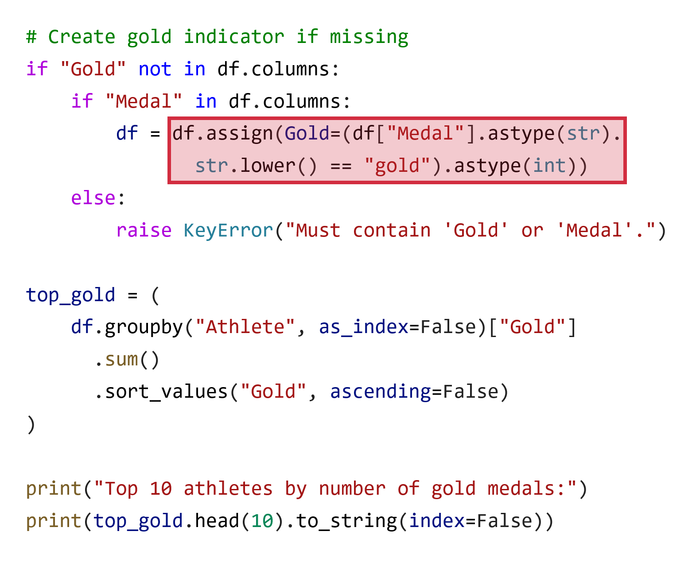

# Understandability and correctness

**Invalid columns?**  
Language does not understand the data

**Complex abstractions**  
Designed for experts

*****************************************************************************************
- template: image
- class: vibecode

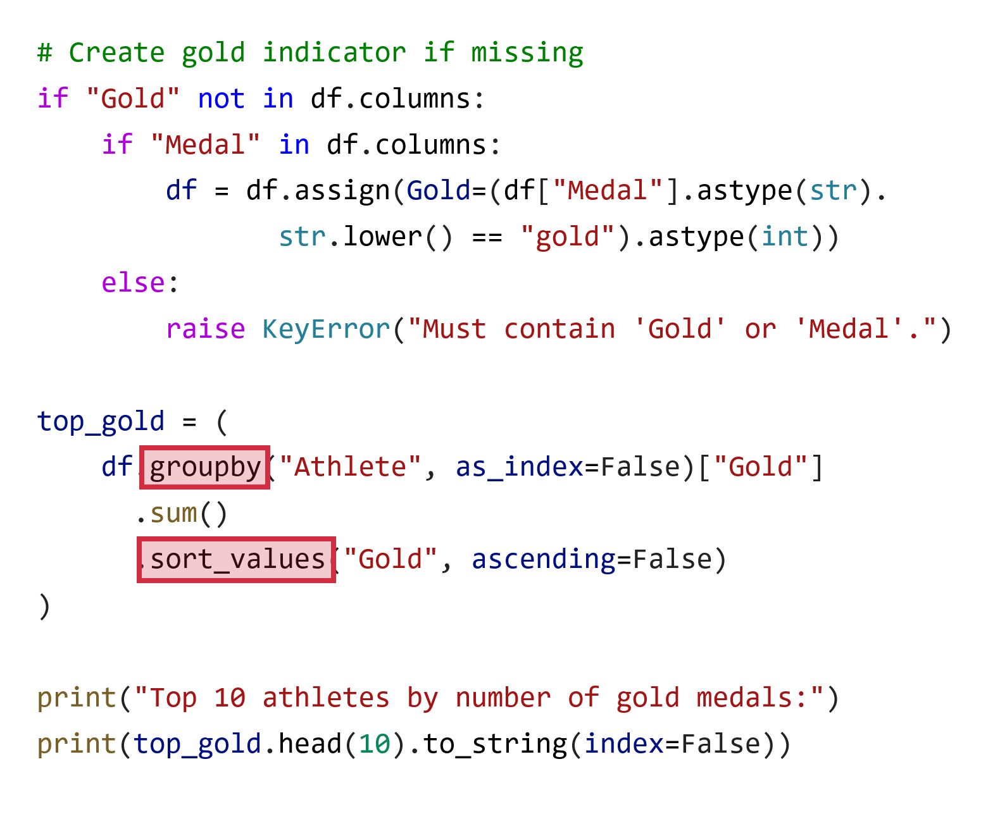

# Understandability and correctness

**Invalid columns?**  
Language does not understand the data

**Complex abstractions**  
Designed for experts

**Inconsistencies**  
Are we sure it is right?

*****************************************************************************************
- template: subtitle

# Demo
## Olympic medals in The Gamma

*****************************************************************************************
- template: content
- class: ccslide

# Completion based on a formal model

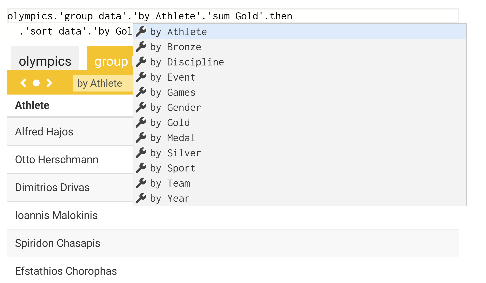

---

<strong>Correctness</strong> meaning all  recommendations valid

---

<strong>Completeness</strong> meaning  all valid options listed

*****************************************************************************************
- template: lists
- class: condensedlists

# Research behind The Gamma

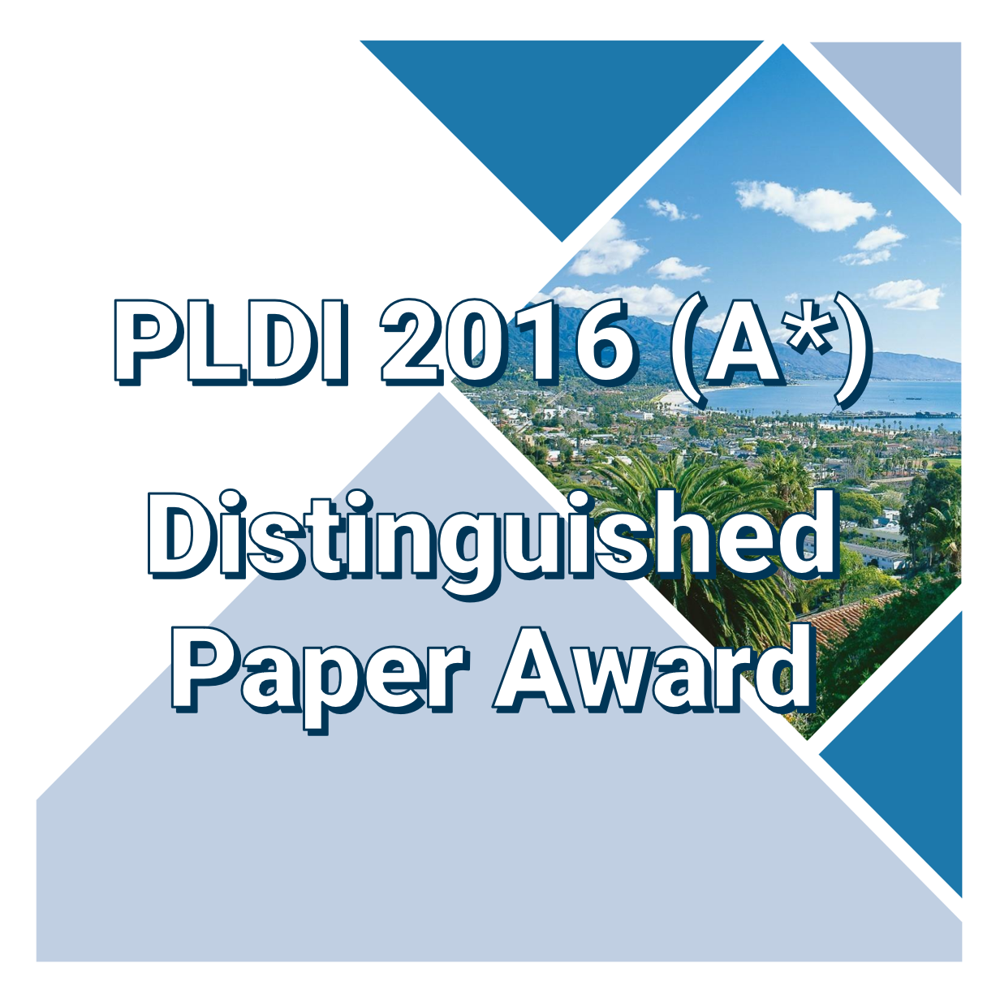

## Language theory
Dot-driven development ECOOP '17 (A)  
Relative type safety PLDI '16 (A*)  

## User-centric design
Iterative prompting VL/HCC '22

## Data visualization
Composable library design J. Funct. Program '21

*****************************************************************************************
- template:content
- class:blueh3 three-column

# Type checking and type safety

### Expressions

Minimal formal language model

$e\,:=\,x\,|\,v\,|\,e.N$

---

### Type system

Types in program are used correctly

$~~~~~~~\Gamma \vdash e : \tau$

---

### Evaluation

Formal model of how programs run

$~~~~~~~e\mapsto v$

*****************************************************************************************
- template:content
- class:nologo rulezz

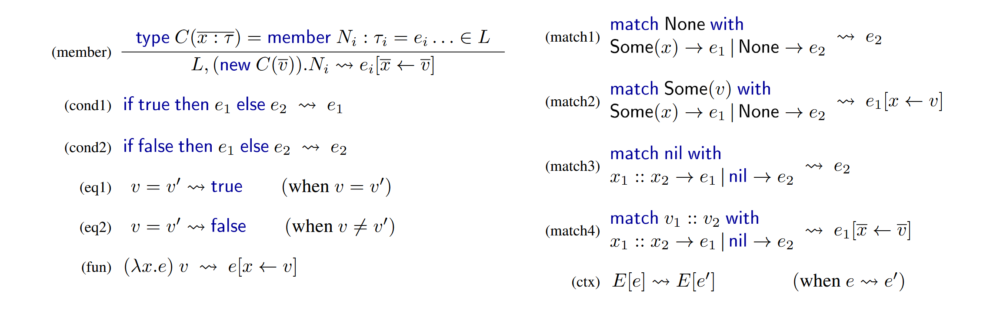

*****************************************************************************************
- template:content
- class:blueh3

# Type safety

### Well-typed programs do not go wrong

For any $e$ such that $\emptyset \vdash e : \tau$, the program evaluates to a value $e \mapsto v$
and the result has the right type $v \in \tau$

---

### But the initial environment is not empty!

It contains things from the real world! i.e. $\Gamma_0 \neq \emptyset$  
For some data $d$ and type provider $\pi$, let $\Gamma_0 = \pi(d)$

*****************************************************************************************
- template:content
- class:blueh3

# Relative type safety

### Well-typed programs do not go wrong

For any $e$ such that $\emptyset \vdash e : \tau$, the program evaluates to a value $e \mapsto v$
and the result has the right type $v \in \tau$

---

### As long as the world is well-behaved

Given a data sample $d$, type provider $\pi$ and an actual input  $d'$ such that
$\pi(d') \sqsubseteq \pi(d)$ then for any program $e$ such that $x:\pi(d) \vdash e : \tau$,
it evaluates $e[d'/x]\mapsto v$ and $v \in \tau$.

*****************************************************************************************
- template: content

# But does it make programming easier?

<h2 style="margin:-35px 0px 30px 0px;font-size:32pt;">Gap between spreadsheets and Python...</h2>
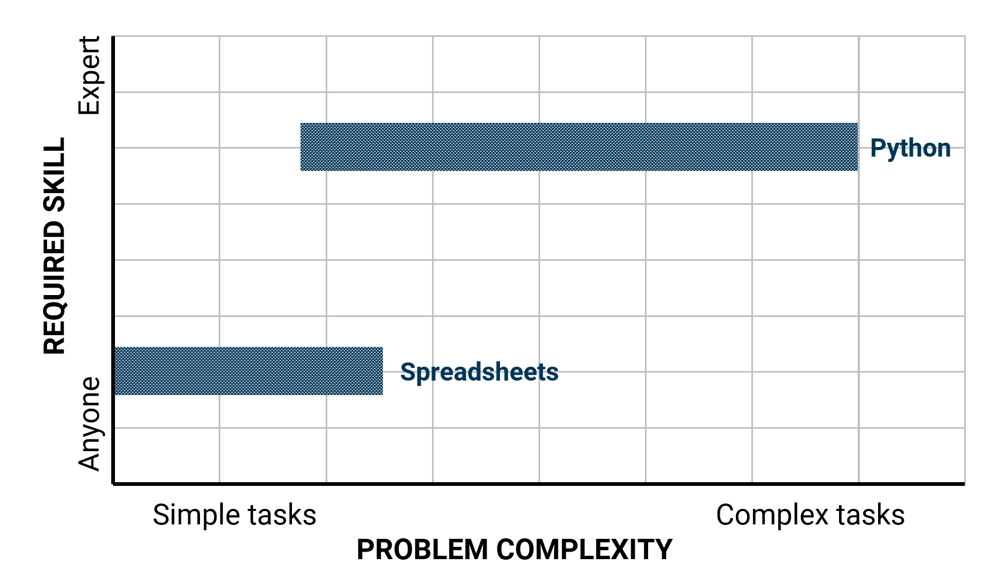

*****************************************************************************************
- template: content

# Spreadsheets get many things right

<h2 style="margin:-35px 0px 30px 0px;font-size:32pt;">Uniformity of grid, transparency of formulas</h2>

*****************************************************************************************
- template: lists
- class: h2red

# Keeping spreadsheet qualities?

## User-centric evaluation
- Three different data sources  
- Research lab business team  

## Research questions
- **RQ #1:** Can non-programmers use The Gamma?
- **RQ #2:** Can they learn from just code samples?  
- **RQ #3:** Can knowledge transfer between sources?

*****************************************************************************************
- template: content
- class: noborder bigloop

# Simple programming tools for data exploration

*****************************************************************************************
- template: content
- class: noborder bigloop

# Simple programming tools for data exploration

Two __Core A*__ conferences (POPL, PLDI) and   
one __D1__ (98 percentile) journal (IEEE TKDE)

*****************************************************************************************
- template: image

# Follow-up work  Institute of Computing for Climate Science

**Make the IPCC  
reports more understandable, transparent and reproducible?**

*****************************************************************************************
- template: icons
- class: red5

# Part 2
## From programming languages to systems

- *fa-school* PhD, University of Cambridge  
- *fa-industry* Microsoft Research Cambridge  
- *fa-city* The Alan Turing Institute, London  
- *fa-church* University of Kent, Canterbury  
- *fa-institution* **Charles University, Prague**  

*****************************************************************************************
- template: lists
- class: h2red bigger smallerfnt

# Research group @ D3S MFF

## Programming system thinking
- Visual programming languages
- Interactive proof assistants

PRIMUS (2024-2027)

## Team funded through PRIMUS
- **Jan Verter** - Ing from FIT CTU
- **Joel Jakubovic** - PhD from University of Kent
- **Pablo Donato** - PhD from École Polytechnique

## Related student theses
- **2 Masters,** 2 finished
- **4 Bachelor,** 13 finished

*****************************************************************************************
- template: lists
- class: idp

# Interdisciplinary programming research

## Programming language theory
- Powerful and general methodology
- Types for data science PRIMUS 2024  

## Human-computer interaction
- Programming substrates UIST '25 (A*)  

## History and philosophy
- Cultures of Programming CUP 2025  
- Donatio Chair application

*****************************************************************************************
- template: title
- class: conclusion

# Thank you
## Programming is still very far  from being a solved problem!

---

**Tomas Petricek**  
Department of Distributed and Dependable Systems

_<i class="fa fa-envelope"></i>_ [petricek@d3s.mff.cuni.cz](mailto:petricek@d3s.mff.cuni.cz)  
_<i class="fa fa-globe"></i>_ [https://d3s.mff.cuni.cz/~petricek](https://d3s.mff.cuni.cz/~petricek)  
_<i class="fa-brands fa-bluesky"></i>_ [@tomasp.net](https://bsky.app/profile/tomasp.net)    

*****************************************************************************************
- template: content

v1

*****************************************************************************************
- template: largeicons

# Before returning to Matfyz

- *fa-school* **PhD, University of Cambridge**  
  Formal models of programming languages

- *fa-industry* **Microsoft Research Cambridge**  
  Applied functional programming and tools

- *fa-city* **The Alan Turing Institute, London**  
  Expert and non-expert tools for data science

- *fa-church* **University of Kent, Canterbury**  
  Principles of rich programming systems

*****************************************************************************************
- template: largeicons
- class: red234

# Before returning to Matfyz

- *fa-school* **PhD, University of Cambridge**  
  Formal models of programming languages

- *fa-industry* **Microsoft Research Cambridge**  
  Applied functional programming and tools

- *fa-city* **The Alan Turing Institute, London**  
  Expert and non-expert tools for data science

- *fa-church* **University of Kent, Canterbury**  
  Principles of rich programming systems

*****************************************************************************************
- template: image
- class: noborder movedown

# Data exploration is a half of the work!

Spreadsheets, data science notebooks, business intelligence

---

**I propose to view systems & tools for data exploration as programming tools**

*****************************************************************************************
- template: imageanim
- class: image noborder movedown

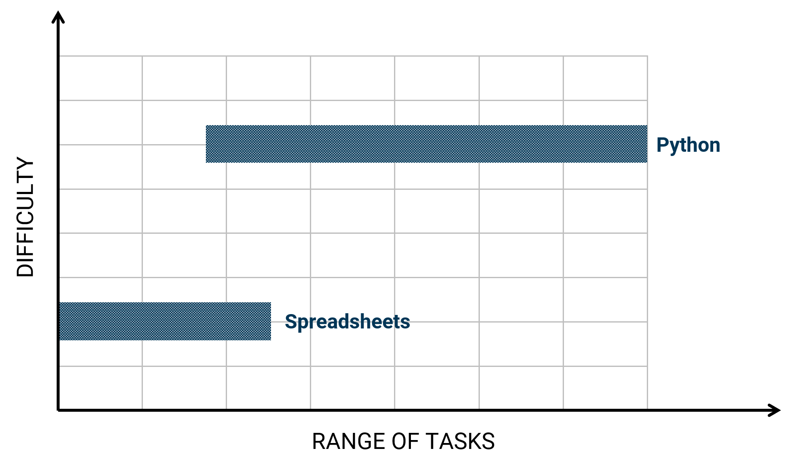

# What is simple?

**Major gap in tooling  for data science!**

---

### Programming theory
A small number of composable primitives

---

### User-centric view
Non-programmers can complete more tasks

*****************************************************************************************
- template: subtitle

# Demo
## Weather info with F# Data

*****************************************************************************************
- template: image
- class: noborder

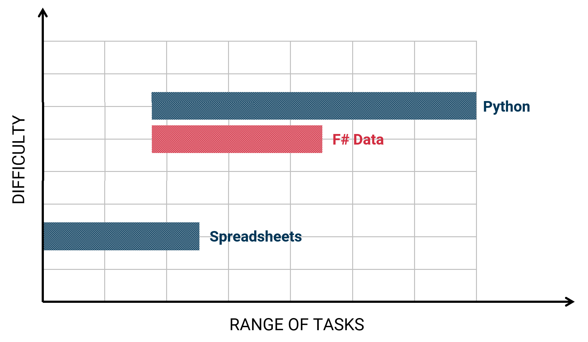

# F# Data

**Makes accessing and exploring data easier for programmers**

*****************************************************************************************
- template: lists
- class: smallerh1 smaller

# Data as a programming language problem

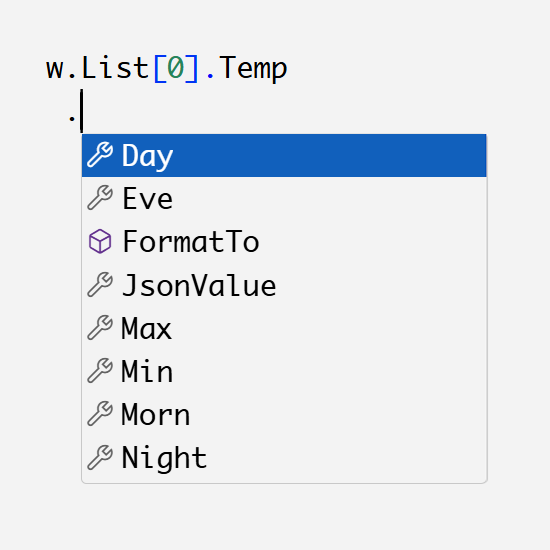

## Application of PL ideas

- Type systems for tooling and safety
- Composable libraries of primitives

## Rethink PL assumptions

- What types do we need for rich data?
- What does type safety guarantee?

*****************************************************************************************
- template:content

$\emptyset \vdash e : \tau$

*****************************************************************************************
- template:content

$\pi(~~~~~~) \vdash e : \tau$

*****************************************************************************************
- template:content
- class:blueh3

# Relative type safety property

### Well-typed programs do not go wrong

For any $e$ such that $\emptyset \vdash e : \tau$, the program evaluates to a value $e \mapsto v$
and the result has the right type $v \in \tau$

---

### As long as the environment is well-behaved

Given sample inputs $d_1, \ldots, d_n$ and an actual input $d$ such that
$S(d) \sqsubseteq S(d1, \ldots, d_n)$ then for any program $e$ such that $x:S(d_1, \ldots, d_n) \vdash e : \tau$,
it evaluates $e[d/x]\mapsto v$ and $v \in \tau$.

*****************************************************************************************
- template: subtitle

# Demo
## Olympic medals in The Gamma

*****************************************************************************************
- template: image
- class: noborder movedown

# The Gamma

**Lets non-programmers complete simple data programming tasks**

*****************************************************************************************
- template: lists
- class: smallerh1 noborder

# Programming tools for non-programmers

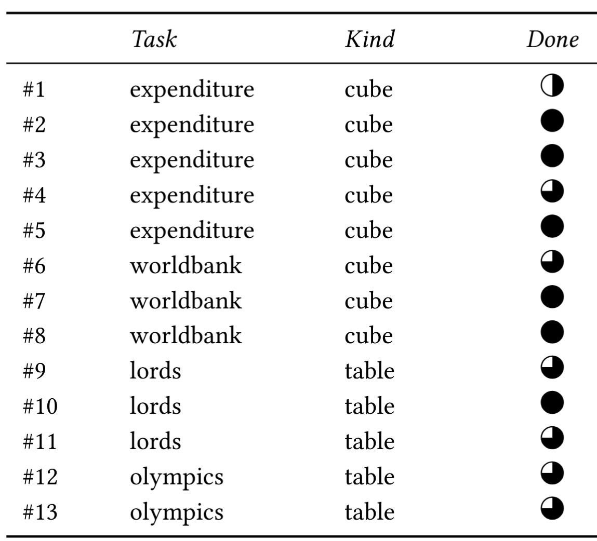

## Design principles

- Work with code for transparency
- Same interface for many sources

## Usability evaluation

- 13 participants from a business  
  team in non-technical roles
- "This is actually pretty simple to use"

*****************************************************************************************
- template: content
- class: noborder bigloop

# Simple programming tools for data exploration

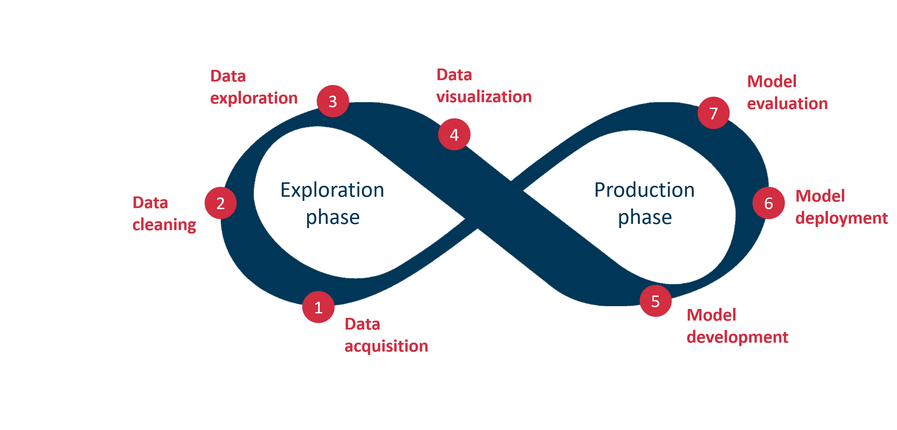

*****************************************************************************************
- template: content
- class: noborder bigloop

# Simple programming tools for data exploration

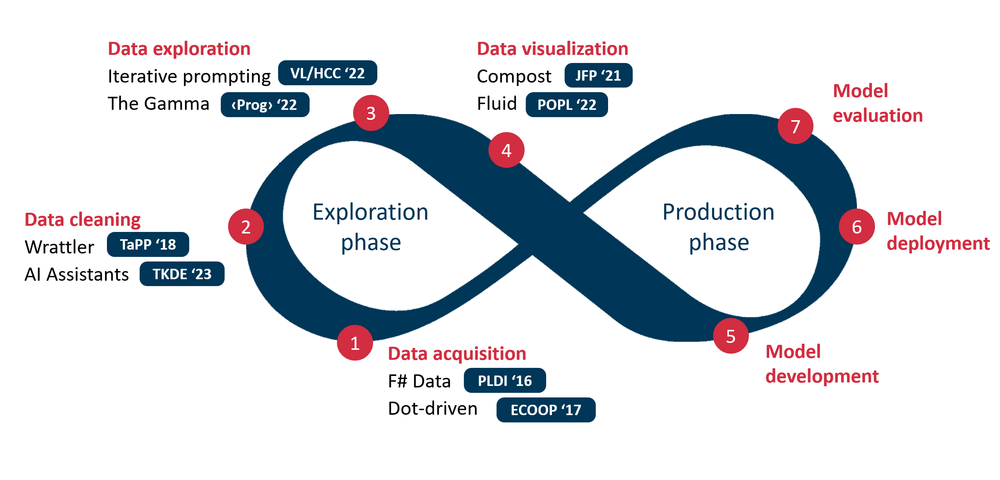

---

__Core A*__ (POPL, PLDI) and **Core A** (ECOOP)  
conferences and __journals__ (JFP, IEEE TKDE)

*****************************************************************************************
- template: largeicons
- class: red5

# After returning to Matfyz

- *fa-school* **PhD, University of Cambridge**  
  Formal models of programming languages

- *fa-industry* **Microsoft Research Cambridge**  
  Applied functional programming and tools

- *fa-city* **The Alan Turing Institute, London**  
  Expert and non-expert tools for data science

- *fa-church* **University of Kent, Canterbury**  
  Principles of rich programming systems

- *fa-institution* **Charles University, Prague**  
  Principles of rich programming systems

*****************************************************************************************
- template: image
- class: smaller2x

# Research group @ D3S

<h3 style="line-height:1em;margin-bottom:10px">From programming languages to systems</h3>

Programming systems  
with **Joel Jakubovic**

User experience of proof assistants
with **Jan Verter**

Logics for visual program&shy;ming with **Pablo Donato**

PRIMUS (2024-2027) and collaboration  with prof. Jan Vitek and FIT CTU

*****************************************************************************************
- template: lists
- class: idp

# Interdisciplinary programming research

## Programming language theory
- Applied to programming systems
- Rethink via programming systems

## Human-computer interaction
- Programming substrates 

## History and philosophy
- Cultures of Programming 
- Donatio Chair application

*****************************************************************************************
- template: title
- class: conclusion

# Thank you
## Simple programming  tools for data exploration

---

**Tomas Petricek**   
Department of Distributed and Dependable Systems

_<i class="fa fa-envelope"></i>_ [petricek@d3s.mff.cuni.cz](mailto:petricek@d3s.mff.cuni.cz)  
_<i class="fa fa-globe"></i>_ [https://d3s.mff.cuni.cz/~petricek](https://d3s.mff.cuni.cz/~petricek)  
_<i class="fa-brands fa-bluesky"></i>_ [@tomasp.net](https://bsky.app/profile/tomasp.net)    
