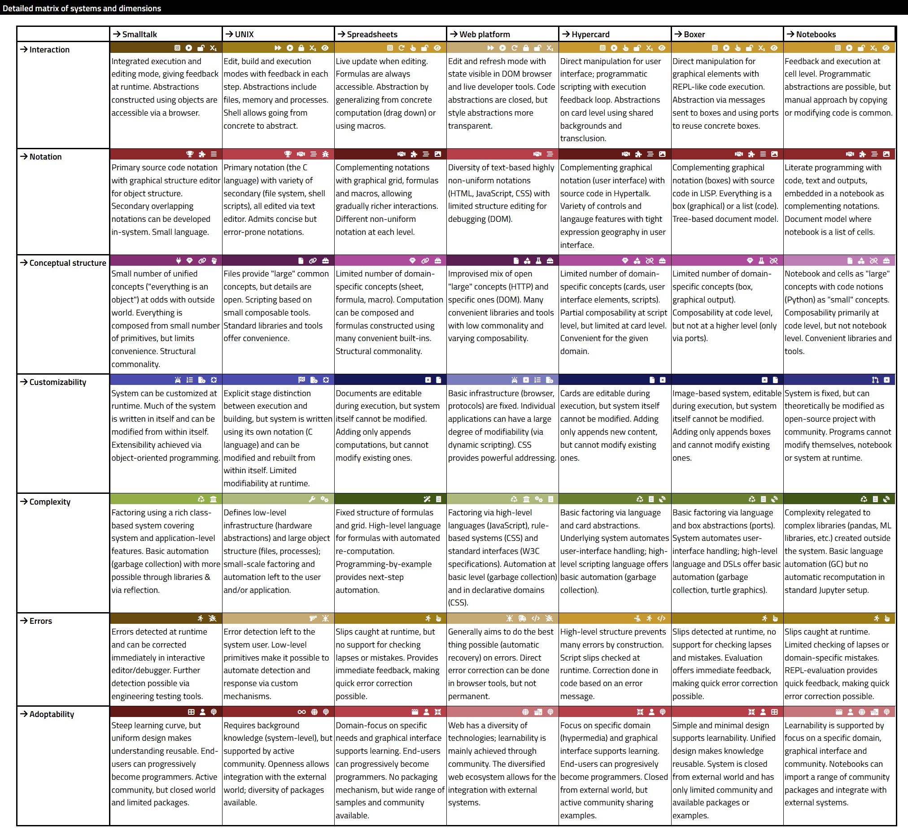

- title: Writing Tiny Programming Systems in F#

*****************************************************************************************
- template: title

# **Writing** Tiny Programming<br> Systems **in F#**

---

**Tomas Petricek**, Charles University, Prague

_<i class="fa fa-envelope"></i>_ [tomas@tomasp.net](mailto:tomas@tomasp.net)  
_<i class="fa fa-globe"></i>_ [https://tomasp.net](https://tomasp.net)  
_<i class="fa-brands fa-bluesky"></i>_ [@tomasp.net](https://bsky.app/profile/tomasp.net)    

*****************************************************************************************
- template: subtitle

# Demo
## Not what you'd expect<br> at the Lambda meetup

-----------------------------------------------------------------------------------------
- template: subtitle

# History of programming
## What we see depends on how we look

-----------------------------------------------------------------------------------------
- template: image
- class: twolineh


# _Programming_ Languages

Programming is  
writing code

Formal semantics, implementation, paradigms, types

------

**We know how   
to study this!**

<style>.twolineh h1 em { font-style:normal; font-weight:100; color:black; }</style>

-----------------------------------------------------------------------------------------
- template: image
- class: noborder twolineh


# _Programming_ Systems

Interacting with a stateful system

Feedback, liveness, interactive user interfaces

------

**But how do we  
study this?**

---------------------------------------------------------------------------------------------------
- template: lists

# Technical dimensions


## Capture system properties

- Look at past systems afresh
- Allow comparison of systems
- Stand on the shoulders of giants!

## What is a technical dimension

- Self-sustainability
- Modes of interaction
- Conceptual structure

---------------------------------------------------------------------------------------------------
- template: image
- class: larger techdims



# Technical dimensions catalogue

**Analysis of**

LISP machines,  
UNIX, Hypercard, Spreadsheets,  
Haskell, Web, etc.

[tomasp.net/techdims](https://tomasp.net/techdims)

<style>.techdims img { margin-top:-40px }</style>

*****************************************************************************************
- template: subtitle

# Demo
## Another thing you'd expect<br> at the Lambda meetup

---------------------------------------------------------------------------------------------------
- template: image
- class: larger


# Why is BASIC cool

**Factoring complexity**  
Simple with escape hatches for experts

**Modes of interaction**
Interactive editor that's also an interpreter

**Learnability**   
Magazines and games

*****************************************************************************************
- template: subtitle

# Complementary science
## Recreating BASIC in F#

---------------------------------------------------------------------------------------------------
- template: code

```fsharp
type Expression =
  | Variable of string
  | Const of Value
  | Binary of Op * Expr * Expr
  | Func of string * Expr list

type Command =
  // Program commands
  | Print of Expr * bool
  | Goto of int
  | Poke of Expr * Expr
  | Assign of string * Expr
  | If of Expr * Command
  | Get of string

  // Editor and interactive
  | List of int option * int option
  | Delete of int option * int option
  | Run
```

# Algebraic data types for the win!

**Simple model to understand what  
is going on**

---

Everything else  
built around this

**Parse** input  
**Evaluate** command

---------------------------------------------------------------------------------------------------
- template: code

```fsharp
/// Succeeds if the string 's'
/// starts with the prefix 'p'
let (|Prefix|_|) p s =
  if s.StartsWith p then
    Some(s.[p.Length..].Trim())
  else None

/// Succeeds if the string 's'
/// starts with a number; returns
/// the number & the remainder
let (|Number|_|) s =
  (...)

/// Parse command like '10 GOTO 20'
match input with
| Number(line, Prefix "GOTO" (Number(target, _))) ->

```

# Active patterns

**Adding super-powers to pattern matching!**

Quick and dirty parsing, but great for demos...

---------------------------------------------------------------------------------------------------
- template: subtitle

# Demo
## Reconstructing BASIC in F#

*****************************************************************************************
- template: subtitle

# Programming systems
## Learning from the past

---------------------------------------------------------------------------------------------------
- template: subtitle

# Demo
## Programming by demonstration

-----------------------------------------------------------------------------------------
- template: largeicons

# Programming experiences

- *fa-users* **Collaborative programming**  
  Resolve (some) merge conflicts
- *fa-pen* **Programming by demonstration**  
  Turn interactions into programs
- *fa-coins* **Schema change control**  
  Adapt program when data schema changes
- *fa-cogs* **Incremental recomputation**  
  Invalidate only what is necessary

---------------------------------------------------------------------------------------------------
- template: content
- class: two-column doced

# Two ideas

### Document

Contains code & data

Easy to navigate

Keeps evaluation trace


---

### Edits

Replay gives document

Easier to merge

Capture edits as action


<style>.two-column.doced h3 { margin-bottom:5px;}
 .two-column.doced p { margin-bottom:5px;}
 .doced img { max-height:180px; margin-top:20px; margin-left:40px; }</style>

---------------------------------------------------------------------------------------------------
- template: content
- class: nologo

# Demo: Conference planning


---------------------------------------------------------------------------------------------------
- template: subtitle

# Demo
## Add speaker & refactor list

---------------------------------------------------------------------------------------------------
- template: image


# Sample edits

**Shared baseline** with multiple sequences of edits added

**Typical local-first** workflow, with independent edits

---------------------------------------------------------------------------------------------------
- template: image


# Two ways<br /> of merging

Do they result  
in **equivalent**  
documents?

---------------------------------------------------------------------------------------------------
- template: icons

# Formulas
## Code as document elements

- *fa-tree* Store formulas as trees (AST) in document
- *fa-calculator* Render in a (somewhat) nicer way
- *fa-file-circle-plus* Evaluation adds edits to the log!
- *fa-heart-circle-xmark* Beware interactions with edit merging

---------------------------------------------------------------------------------------------------
- template: image


# Code is data

**Absolute selectors** only for now

**A selector**  
is a sequence of:

- Field name
- Index specifier
- All selector

---------------------------------------------------------------------------------------------------
- template: subtitle

# Demo
## Budget calculation & refactor list

---------------------------------------------------------------------------------------------------
- template: icons

# Evaluation
## How it interacts with editing

- *fa-file-circle-plus* Evaluation just adds edits!
- *fa-filter-circle-xmark* Same edit merging as before
- *fa-trash* Conflicting edits remove evaluated edits
- *fa-cogs* Incremental recomputation "for free"

---------------------------------------------------------------------------------------------------
- template: subtitle

# Demo
## Adding a speaker and evaluation

*****************************************************************************************
- template: subtitle

# Denicek
## Writing document-based system in F#

---------------------------------------------------------------------------------------------------
- template: code

```fsharp
// Specify path(s) in a document
type Selector =
  | All
  | Index of string
  | Field of string
  | DotDot

// Two kinds of references
type RefKind =
  | Absolute
  | Relative

// Represents document structure
type Node =
  | Primitive of Primitive
  | Record of string * OrdList<string, Node>
  | List of string * OrdList<string, Node>
  | Reference of RefKind * Selector list
```

# Modelling documents

**Algebraic data  
types again!**

Homogeneous lists  
Heterogeneous objects

Keeping nodes in the correct order is tricky...

---------------------------------------------------------------------------------------------------
- template: image
- class: noborder


# Modelling edits

**Actually, just algebraic data types again...**

Great way to communicate with your customer  
(or fellow academic)

---------------------------------------------------------------------------------------------------
- template: content

# Powerful functional patterns

---

Folding and transforming document nodes

```fsharp
val fold : (Node -> 'a -> 'a) -> 'a -> Node -> 'a
val replace : (Node -> Node option) -> Node -> Node
```

---

Replaying history to get a document

```fsharp
val apply : Node -> Edit -> Node
let doc = List.fold apply initial
```

---

Elm-based user-interface using Fable

```fsharp
val render : (Event -> unit) -> State -> Dom
val update : State -> Event -> State
let app = runApp initial render update
```

*****************************************************************************************
- template: subtitle

# Teaching
## Write your own tiny system(s)

---------------------------------------------------------------------------------------------------
- template: image


# Write your own tiny programming system(s)!

TinyML  
TinyHM  
TinyBASIC  
TinyProlog  
TinySelf  
TinyExcel  

---------------------------------------------------------------------------------------------------
- template: code

```fsharp
type Expr =
  // Lambda calculus
  | Application of Expr * Expr
  | Lambda of string * Expr
  | Variable of string
  // Numbers and functions
  | Constant of int
  | Binary of string * Expr * Expr
  | Unary of string * Expr
  // Data types
  | Tuple of Expr * Expr
  | TupleGet of bool * Expr
  | Case of bool * Expr
  | Match of Expr * string * Expr * Expr
  // Programming
  | Recursive of string * Expr * Expr
  | Let of string * Expr * Expr
  | If of Expr * Expr * Expr
```

# Functional language

Evaluation turns  
an `Expr` into value

Type inference infers   
a `Type` for `Expr`

---------------------------------------------------------------------------------------------------
- template: code

```fsharp
// Example terms
// * 'human(socrates)' is a
//   predicate applied to atom
// * 'human(X)' is a predicate
//   applied to variable
type Term =
  | Atom of string
  | Variable of string
  | Predicate of string * Term list

// Clause with head and empty
// body represents a fact
type Clause =
  { Head : Term
    Body : Term list }
```

# Logic programming

Automatic resolution via unification

```prolog
human(socrates).
mortal(X) :- human(X).
```

Unification of `human(socrates)` and `human(X)` produces
mapping `X -> human`

*****************************************************************************************
- template: subtitle

# Conclusions
## Tiny programming systems

---------------------------------------------------------------------------------------------------
- template: image


# PRG • PRG

**More programming languages work happening in Prague!**

MFF + FIT + you :-)

Research projects with funding for PhD students & post-docs...

---------------------------------------------------------------------------------------------------
- template: image


# ‹Programming› 25

**Programming research community meeting coming to Prague**

18 paper talks  
6 co-located workshops  
Effekt tutorial  

---------------------------------------------------------------------------------------------------
- template: title

# Writing tiny systems in F#

- **Programming systems are more than languages!**  
  Interaction, live state, interfaces, new models
- **Algebraic data types is all you ever need?**  
  The most basic, but the most powerful feature!

---

**Tomas Petricek**, Charles University, Prague

_<i class="fa fa-envelope"></i>_ [tomas@tomasp.net](mailto:tomas@tomasp.net)  
_<i class="fa fa-globe"></i>_ [https://tomasp.net](https://tomasp.net)  
_<i class="fa-brands fa-bluesky"></i>_ [@tomasp.net](https://bsky.app/profile/tomasp.net)    

---------------------------------------------------------------------------------------------------
- template: content

# References

Technical dimensions of programming systems
https://tomasp.net/techdims/

The Lost Ways of Programming: Commodore 64 BASIC
https://tomasp.net/commodore64/

Write your own tiny programming system(s)!
https://d3s.mff.cuni.cz/teaching/nprg077/

‹Programming› 2025
https://2025.programming-conference.org/


PRG • PRG: Prague Programming Languages and Systems Research Network
https://prgprg.org/
