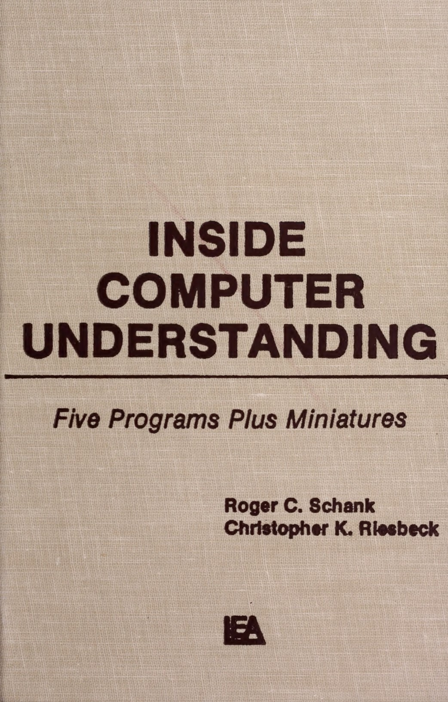

- title: Writing Tiny Programming Systems

*****************************************************************************************
- template: title

# Writing Tiny Programming Systems

---

**Tomas Petricek**, Charles University, Prague

_<i class="fa fa-envelope"></i>_ [tomas@tomasp.net](mailto:tomas@tomasp.net)  
_<i class="fa fa-globe"></i>_ [https://tomasp.net](https://tomasp.net)  
_<i class="fa-brands fa-bluesky"></i>_ [@tomasp.net](https://bsky.app/profile/tomasp.net)    

*****************************************************************************************
- template: content
- class: three-column

# What I'm Interested In

**Languages and  
Type systems**

Worked on F# and coeffect systems


---

**Programming Systems**

Think about state and interaction!


---

**History of Programming**

Recovering  
lost ideas


-----------------------------------------------------------------------------------------
- template: subtitle

# Demo
## TinyBoxer from PLISS

-----------------------------------------------------------------------------------------
- template: lists
- class: bigger

# Tiny systems


## Research device

* You can actually poke things!
* Interactive system concepts
* Reconstruct past ideas

## Teaching device

* Explaining core algorithms
* Learning by writing code
* Teach more than just language theory!

-----------------------------------------------------------------------------------------
- template: image
- class: larger


# Charles University

We have pretty  
smart students!

Lots of freedom in  
how & what to teach

----

**How can I teach all  
the things that I like?**

-----------------------------------------------------------------------------------------
- template: lists
- class: bigger

# Write your own tiny system(s)!


## Course idea

* Implement key parts of language and system algorithms (in F#)
* Focused on hands-on coding
* Guided step-by-step templates

## Course structure

* Pre-recorded video with background & F# basics
* 3 hour session every other week
* Complete basic tasks later for credits

-----------------------------------------------------------------------------------------
- template: largeicons

# Tiny systems covered

* *fa-not-equal* **TinyML**: Tiny functional language interpreter
* *fa-terminal* **TinyBASIC**: Tiny interactive imperative system
* *fa-square-check* **TinyHM**: Tiny Hindley-Milner type inference
* *fa-arrow-right* **TinyProlog**: Tiny declarative logic language
* *fa-shapes* **TinySelf**: Tiny prototype-based OO language
* *fa-table* **TinyExcel**: Tiny incremental spreadsheet system

-----------------------------------------------------------------------------------------
- template: code
- class: smallcode

```fsharp
// A term  can be either atom (...),
// variable (...), or predicate (...).
type Term =
  | Atom of string
  | Variable of string
  | Predicate of string * Term list

// A clause is for example:
// 'mortal(X) :- human(X)'
// It consists of 'head :- body'
type Clause =
  { Head : Term
    Body : Term list }

// A program is a list of clauses
type Program = Clause list
```

# Typical code sample

**TinyProlog definitions**  
Comments shortened

**Given to the students**  
Great starting point!

-----------------------------------------------------------------------------------------
- template: code
- class: smallcode

```fsharp
let rec unifyLists l1 l2 =
  match l1, l2 with
  | [], [] ->
      // Succeeds, but returns
      // an empty substitution
      failwith "not implemented"
  | h1::t1, h2::t2 ->
      // Unify h1 with h2 using unify
      // and t1 with t2 using unifyLists
      failwith "not implemented"
  | _ ->
    // Lists cannot be unified
    failwith "not implemented"

and unify t1 t2 =
  match t1, t2 with
  | _ ->
      // Add all the necessary
      // cases here! (...)
      failwith "not implemented"
```

# Typical code sample

**Function signatures**  
Often empty, with detailed comments and some hints or code structure

**Step-by-step structure**
Copy implementation from previous step

-----------------------------------------------------------------------------------------
- template: lists
- class: smallcode selfslide

# Limitations of the stack


## Mutable dynamic systems
Type system not much help!

```fsharp
type Objekt =
  { mutable Slots: Slot list
    mutable Code: Objekt option }
and type Slot =
  { Name: string
    Contents: Objekt }
```

## Graphical interfaces

- More difficult to implement
- Challenging setup in F#
- Missing in TinySelf, TinyExcel
- Using JavaScript/TypeScript for TinyBoxer

<style>.selfslide pre { margin-top:-20px } .selfslide h1 { margin-bottom:10px; }</style>

*****************************************************************************************
- template: subtitle

# Research
## Talking about system design

-----------------------------------------------------------------------------------------
- template: image


# Demo
## C64 BASIC

**Why study universally disliked programming language?**

Somehow allowed everyone to program!

Interesting mode of interaction!

-----------------------------------------------------------------------------------------
- template: lists
- class: border

# Learning from past systems


## What's cool about C64 BASIC?

- Oriented around code interactions
- Simple with options for experts (POKE)
- Poor engineering in a poor language!

## Complementary science

- Advocated by Hasok Chang
- Do (serious) history to recover ideas
- Lost due paradigm shifts in science
- Even more powerful for computing!

-----------------------------------------------------------------------------------------
- template: lists

# Making scientific claims


## Programming language theory
Formal proofs, about tiny models

## Empirical evaluation
Performance, in controlled environment

## User studies and case studies
Usability or flexibility, in specific scenarios

-----------------------------------------------------------------------------------------
- template: image
- class: smaller


# Tiny systems

Experience of working with a system on a tiny scale

**Conceptual structure?**  
**Potential of the design?**  
**Technical dimensions?**  

[Methodology of Prog&shy;ramming Systems Research](https://tomasp.net/academic/papers/evaluating-systems/ppig19.pdf) (PPIG'19)

*****************************************************************************************
- template: subtitle

# Context
## Other tiny implementations

-----------------------------------------------------------------------------------------

- template: image
- class: smaller


# Teaching tiny systems
(Kamin, 1990)

**Used in multiple  
courses worldwide**

Examples in Pascal

Languages covered are APL, Clu, LISP, Prolog, Smalltalk, Scheme, SASL

**Not always focused  
on the key aspect**

-----------------------------------------------------------------------------------------
- template: image
- class: smaller



# Tiny systems and AI
(Schank, Riesbeck, 1981)

**Miniature implementations of 5 Yale AI lab programs**

Faster, more efficient, easier to understand, modify and extend

"Miniatures, demos and artworks" by Warren Sack

-----------------------------------------------------------------------------------------
- template: image
- class: smaller


# Tiny systems and ML
(Distill, 2016-2021)

---

**Five affordances of interactive articles**

Connecting people & data  
Making systems playful  
Prompting self-reflection  
Personalizing reading  
Reducing cognitive load  

*****************************************************************************************
- template: subtitle

# Reflections & Conclusions
## What can we teach this way?

-----------------------------------------------------------------------------------------
- template: icons

# Teaching tiny systems

- *fa-earth-europe* **Scaling to real-world systems**  
  Choice to ignore practical engineering

- *fa-computer* **Is this not the real thing?**    
  A piece of a larger curriculum...

- *fa-triangle-exclamation* **Pitfalls and over-generalizations**  
  Shows what could in theory work

-----------------------------------------------------------------------------------------
- template: icons

# Where it works well

- *fa-flask*  **Testbed for emerging ideas**  
  Interactive programming systems research

- *fa-person-digging* **Recovering lost ideas**  
  Ideas from the "golden" era of 1970s

- *fa-gears*  **Virtual machine implementations?**  
  Futamura projections, copy-and-patch


-----------------------------------------------------------------------------------------
- template: lists
- class: bigger

# Programming research in Prague


## What's going on here
- Interactive systems, types and languages,   tools for data science
- [https://prgprg.org](https://prgprg.org)
- [https://d3s.mff.cuni.cz/plas](https://d3s.mff.cuni.cz/plas)

## Working with us
- Ask me about comparisons over a beer...
- Looking for **post-docs and PhD students**!

-----------------------------------------------------------------------------------------
- template: title

# Writing tiny programming systems

<p><i class="fa fa-award"></i> Fun course to teach & fun format!</p>
<p><i class="fa fa-person-chalkboard"></i> Good way to explain basic concepts</p>
<p><i class="fa fa-trowel-bricks"></i> Concepts over formalism or engineering</p>
<p><i class="fa fa-landmark"></i> Past, present & future of programming</p>

---

**Tomas Petricek**, Charles University, Prague

_<i class="fa fa-envelope"></i>_ [tomas@tomasp.net](mailto:tomas@tomasp.net)  
_<i class="fa fa-globe"></i>_ [https://tomasp.net](https://tomasp.net)  
_<i class="fa-brands fa-bluesky"></i>_ [@tomasp.net](https://bsky.app/profile/tomasp.net)    
