- title: Choose-

****************************************************************************************************
- template: title
- style: h1 { letter-spacing:-1px; font-weight:100; }

# The **Choose-Your-Own-Adventure** Calculus


---

**Tomas Petricek, Jan Liam Verter & Mikolas Fromm**    
Charles University, Prague  

_<i class="fa fa-envelope"></i>_ [tomas@tomasp.net](mailto:tomas@tomasp.net)  
_<i class="fa fa-globe"></i>_ [https://tomasp.net](https://tomasp.net)  
_<i class="fa-brands fa-bluesky"></i>_ [@tomasp.net](https://bsky.app/profile/tomasp.net)    

****************************************************************************************************
- template: subtitle

# Demo
## F# type providers

----------------------------------------------------------------------------------------------------
- template: image

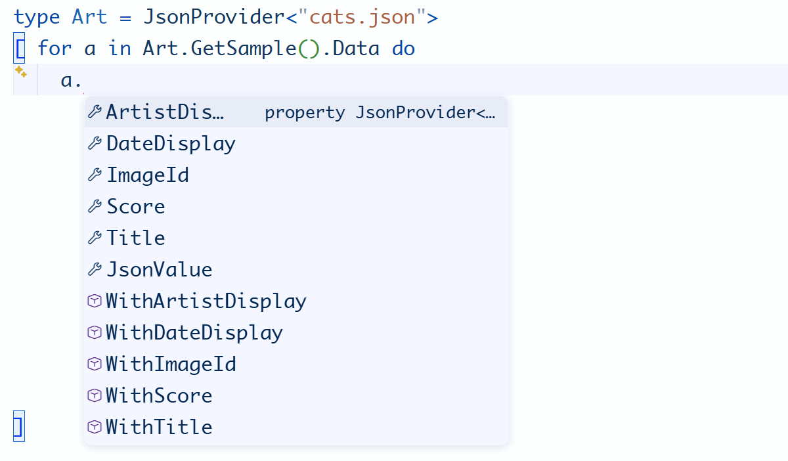

# Type providers

**Not just a  
language feature**

---

Dot-driven development  
(Phil Trelford)

Type dot and choose from auto-complete!

----------------------------------------------------------------------------------------------------
- template: image

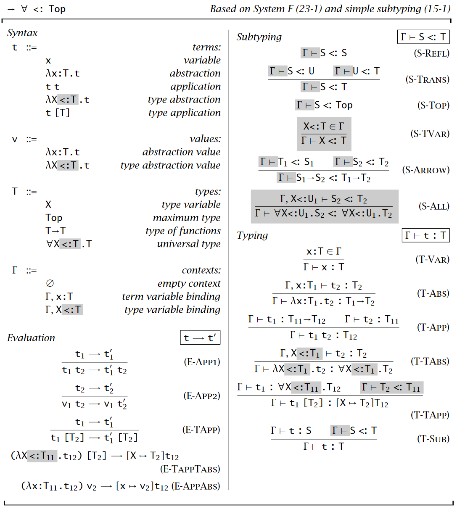

# _Programming_ Languages

Programming is  
writing code

Formal semantics, implementation, paradigms, types

------

**We know how   
to study this!**

----------------------------------------------------------------------------------------------------
- template: image
- class: noborder

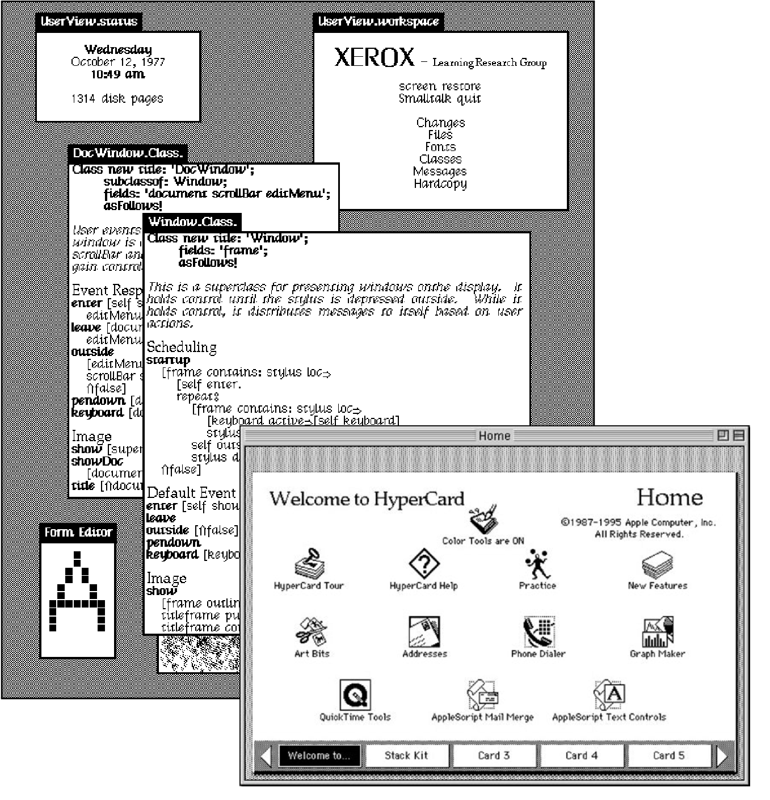

# _Programming_ Systems

Interacting with a stateful system

Feedback, liveness, interactive user interfaces

------

**But how do we  
study this?**

****************************************************************************************************
- template: subtitle

# Problem
## Theory of programming systems

----------------------------------------------------------------------------------------------------
- template: content
- class: two-column
- style: h3 { color:#003657;}

# Theory of programming systems

### Design space

Technical dimensions

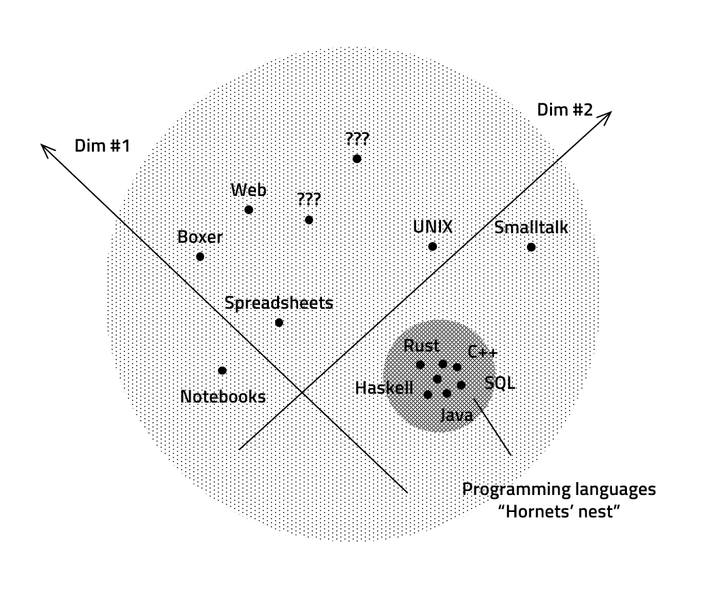

---

### Formal models

Like this work

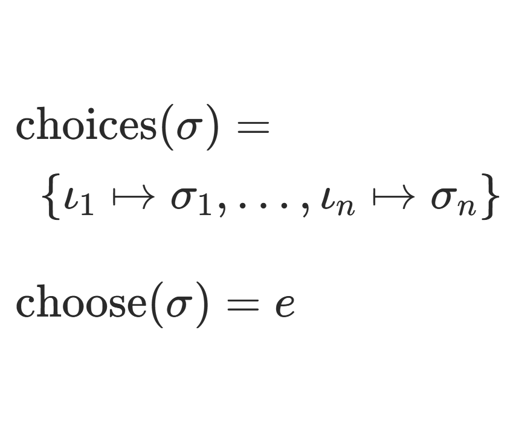

----------------------------------------------------------------------------------------------------
- template: subtitle

# Demo
## Data exploration

----------------------------------------------------------------------------------------------------
- template: image
- class: smaller

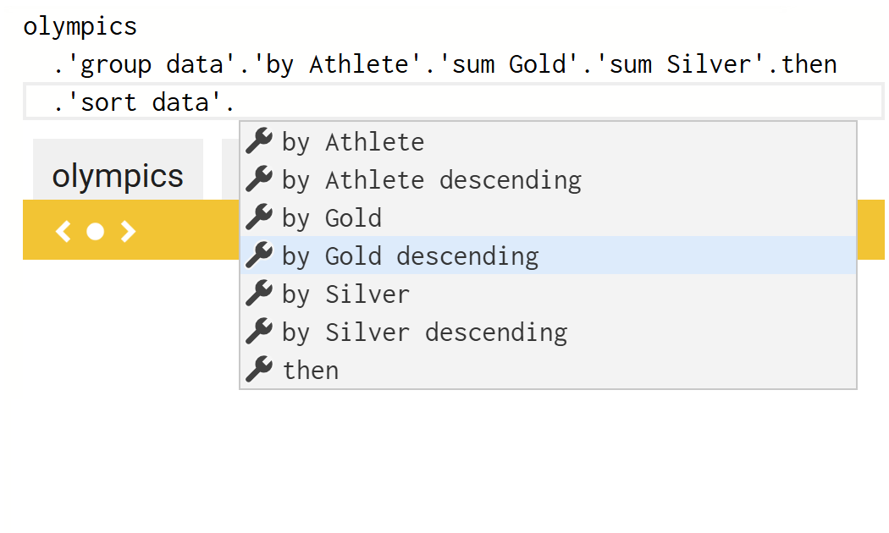

# Data exploration<br> in The Gamma

**Correct and complete**

Can construct all  
possible programs

All constructed  
programs are correct

----------------------------------------------------------------------------------------------------
- template: content
- style: h1 { font-size:38pt;  } strong { font-weight:600; }

# The choose-your-own-adventure calculus

**Given expressions $e\in \mathbb{E}$ and states $\sigma \in \Sigma$**

*Choices* returns choices for a given state  

- $\text{choices}(\sigma) = \{\iota_1\mapsto\sigma_1, \ldots, \iota_n\mapsto\sigma_n\}$

*Choose* returns a program for a given state  

- $\text{choose}(\sigma) = e$   

****************************************************************************************************
- template: subtitle

# Examples
## What fits the formalism

----------------------------------------------------------------------------------------------------
- template: image
- class: smaller

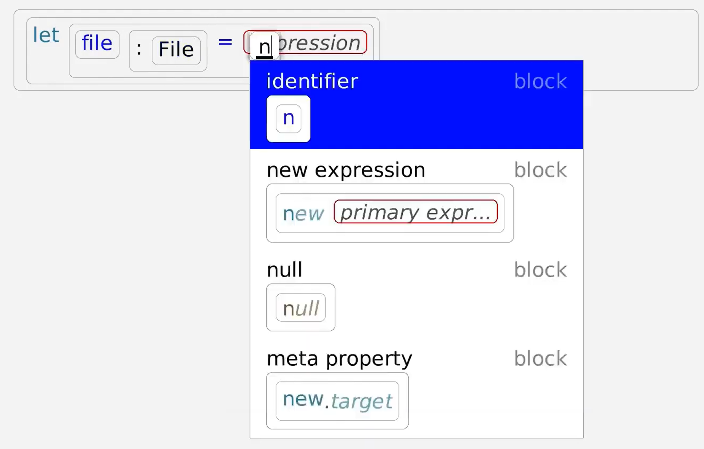

# Structure editors

String of terminals $t$  
and non-terminals $n$

---

**Grammar defines  
possible completions**

$$$
\begin{array}{l}
\text{choices}(\boldsymbol{t}\, n\, \boldsymbol{s}) =\\
\quad \{\; \iota_i \mapsto \boldsymbol{t}\,\boldsymbol{s_i}\,\boldsymbol{s}
    ~|~ \forall (n\mapsto\boldsymbol{s_i})\in \mathcal{P} ~\}\\[0.5em]
\text{choose}(\boldsymbol{s}) = \boldsymbol{s}
\end{array}

----------------------------------------------------------------------------------------------------
- template: image
- class: noborder

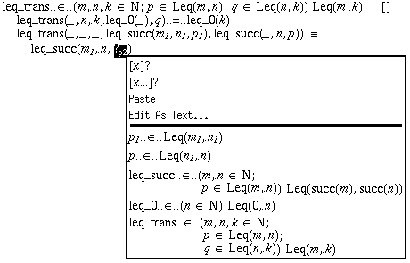

# Interactive theorem provers

**State is a proof term with holes**

Completions offer tactics applicable to the first hole

----------------------------------------------------------------------------------------------------
- template: subtitle

# Demo
## AI assistants

----------------------------------------------------------------------------------------------------
- template: lists
- class: bigger

# AI assistants

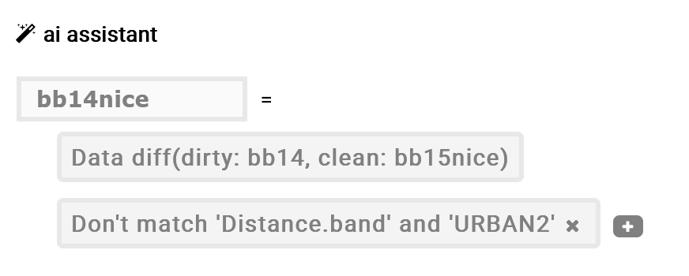

## What defines an AI assistant
- Set of constraints $\boldsymbol{C}$
- Scoring function $Q_{\boldsymbol{C}}$
- Set of matching expressions $E_{\boldsymbol{C}}$

## Choose-your-own-adventure system

- $\text{choose}_X(\boldsymbol{C}) = \argmax_{e \in E_{\boldsymbol{C}}} Q_{\boldsymbol{C}}(X, e)$
- $\text{choices}_X(\boldsymbol{C}) = \{\iota_1 \mapsto \boldsymbol{C}\cup\{ c_1 \}, \iota_2\mapsto\boldsymbol{C}\cup\{ c_2 \}, \ldots\}$

****************************************************************************************************
- template: subtitle

# Understanding
## Formal properties

----------------------------------------------------------------------------------------------------
- template: content
- style: strong { font-weight:600}

# Correctness

**Subset of correct expressions $\mathcal{E}\subseteq E$**

System is _correct_ with respect to $\mathcal{E}$ if and only if:

- $\forall \sigma_1,..,\sigma_n$ and $\iota_1,..,\iota_n$ such that
  $\iota_i\mapsto\sigma_i \in \text{choices}(\sigma_{i-1})$ it is the case
that $\text{choose}(\sigma_i) \in \mathcal{E}$.

----------------------------------------------------------------------------------------------------
- template: content
- style: strong { font-weight:600}

# Completeness

**Subset of correct expressions $\mathcal{E}\subseteq E$**

System is _complete_ with respect to $\mathcal{E}$ if and only if:

- $\forall e \in \mathcal{E}\,.\,\exists \sigma_1, \ldots ,\sigma_n$ and $\iota_1, \ldots,\iota_n$ such that  $\iota_i\mapsto\sigma_i \in \text{choices}(\sigma_{i-1})$ and $e=\text{choose}(\sigma_n)$.

----------------------------------------------------------------------------------------------------
- template: icons

# Properties
## Interesting lessons learned

- *fa-shoe-prints* Correctness fails for multi-step construction
- *fa-clock* Weaker eventual correctness property
- *fa-wand-sparkles* Useful heuristic systems may lack both
- *fa-dice-one* More properties like uniqueness

****************************************************************************************************
- template: subtitle

# Applications
## AI integration

----------------------------------------------------------------------------------------------------
- template: icons

# AI integration
## Guide, not automate

- *fa-quote-left* User writes what they need
- *fa-arrow-up-wide-short* AI makes or recommends choices
- *fa-magnifying-glass* User reviews what's happening
- *fa-vest* Can this work in practice?

----------------------------------------------------------------------------------------------------
- template: image
- class: larger

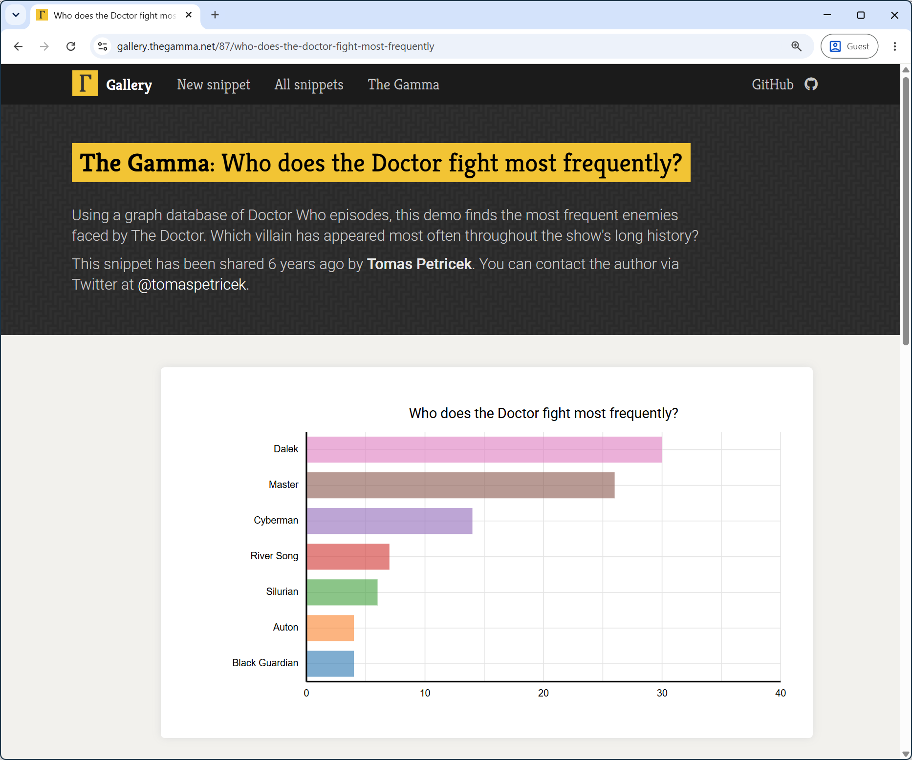

# The Gamma

**Data cube navigation,
database aggregation, querying**

~75 snippets with English summary

From before AI era!

----------------------------------------------------------------------------------------------------
- template: code
- style: .hljs-string { color:inherit; } .body2 code { color:#d22d40; }

```javascript
// Most frequently fought
// enemeies of Dr Who
let topEnemies =

  // Graph database query
  drWho.Character.Doctor
    .'ENEMY_OF'.'[any]'
    .'APPEARED_IN'.'[any]'
  .'explore_properties'.explore

  // SQL-like aggregation
  .'group data'.'by 1-name'
      .'count distinct 2-name'.then
  .'sort data'
      .'by 2-name descending'.then
  .paging.take(7).'get series'.
      'with key 1-name'.'and value 2-name'
```

# Dr Who analysis

**Specific patterns for each data source**

`[any]` for graph query  
`then` for aggregation  

**Names can get ugly and complex**

----------------------------------------------------------------------------------------------------
- template: lists
- style: .body img { max-width:400px !important; position:relative; top:-20px; } blockquote { margin-left:10px; }

# Choose-your-own-adventure with AI

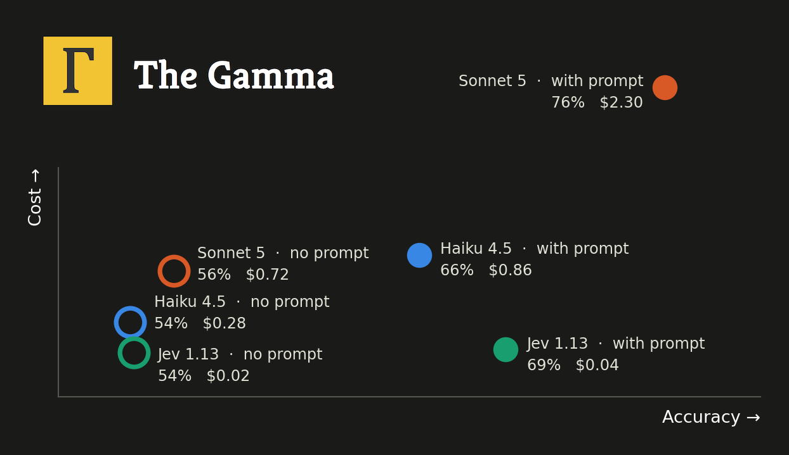

## Prompting chat-based LLM

> The user wants to ... they selected ... next options are ...
> What should they choose next?

## TypeSafe "System One" Jev

- Stealth start-up builds AI for my theory!
- Ranks given answers to an English prompt
- Cheaper and faster than general LLMs

----------------------------------------------------------------------------------------------------
- template: content
- style: img { max-width:850px; margin-top:-20px }

# AI as a transparent guide

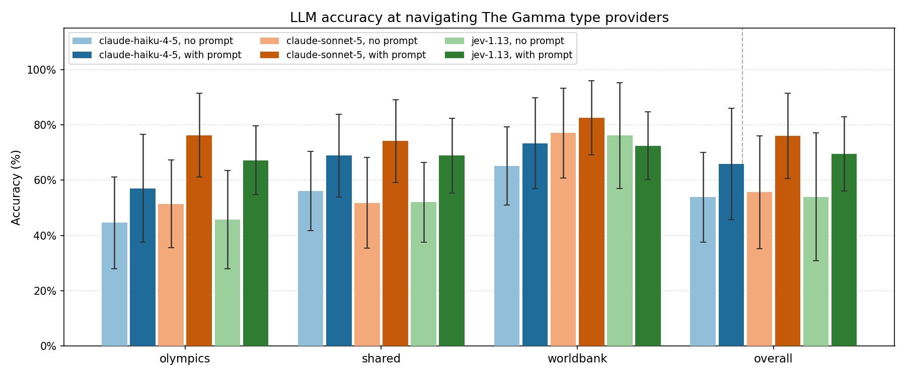

**Useful but expensive and unreliable!**  
Not enough to "take back control"

----------------------------------------------------------------------------------------------------
- template: imageanim
- class: image

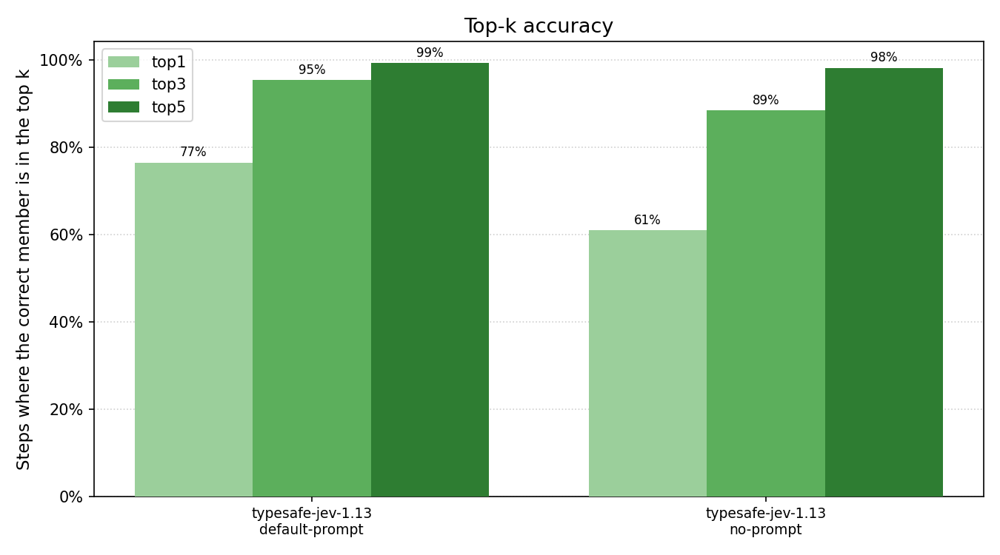

# Jev's ranking

**Assigns probability  
to given options**

---

How often is the answer in top 3?

Auto-select if the system is certain?

----------------------------------------------------------------------------------------------------
- template: lists
- class: larger bigger noborder

# More interaction patterns

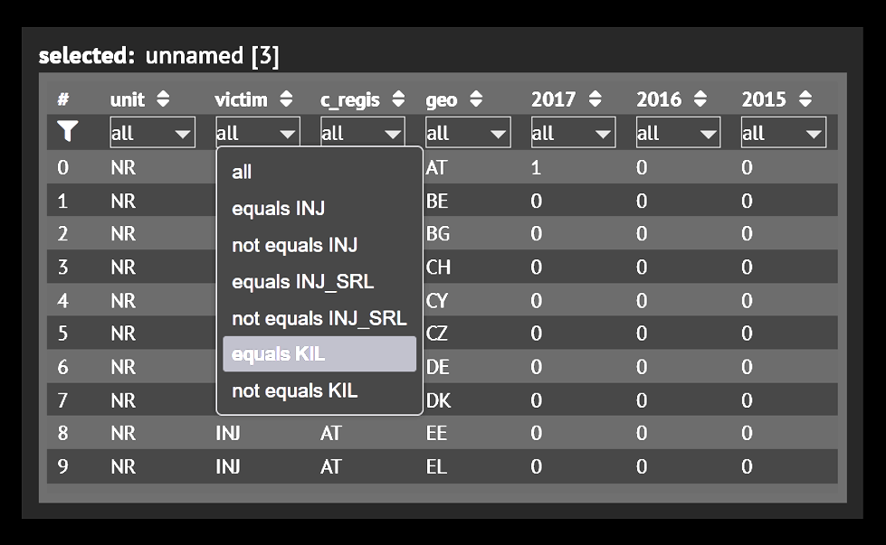

## Direct manipulation

- Render preview of the state
- Map choices to UI elements
- Can they all be present?

## Mixed-initiative interaction
- Search through choices
- Using heuristic or correctness
- Until $\text{choose}(\sigma) \in \mathcal{E}$

****************************************************************************************************
- template: title
- style: .items p { margin-top:0px; margin-bottom:8px; font-size:28pt; color:#d22d40; }
   i { margin-right:15px; } h1 { margin-bottom:60px; font-weight:200; font-size:40pt; letter-spacing:-2px;  }

# The **Choose-Your-Own-Adventure** Calculus

<div class="items">

_<i class="fa fa-computer-mouse"></i>_ We need more theories of programming systems

_<i class="fa fa-dna"></i>_ Program synthesis, data wrangling and more!

_<i class="fa fa-person-chalkboard"></i>_ AI as more than just magical black box?

</div>

---

**Tomas Petricek**, Jan Liam Verter & Mikolas Fromm    

_<i class="fa fa-envelope"></i>_ [tomas@tomasp.net](mailto:tomas@tomasp.net)  
_<i class="fa fa-globe"></i>_ [https://tomasp.net](https://tomasp.net)  
_<i class="fa-brands fa-bluesky"></i>_ [@tomasp.net](https://bsky.app/profile/tomasp.net)    
