- title: Computational Substrates for Document-Oriented Programming

****************************************************************************************************
- template: title

# Cultures of Programming
## Undone Ideas on Programming:<br />When Cultures Fail to Meet


---

**Tomas Petricek**, Charles University, Prague  

_<i class="fa fa-envelope"></i>_ [tomas@tomasp.net](mailto:tomas@tomasp.net)  
_<i class="fa fa-globe"></i>_ [https:/<span style="margin:0px 0px 0px -12px">/</span>tomasp.net](https://tomasp.net)  
_<i class="fa-brands fa-bluesky"></i>_ [@tomasp.net](https://bsky.app/profile/tomasp.net)    

----------------------------------------------------------------------------------------------------
- template: image
- class: nologo smaller
- background-color: #153374
- style: p { color:#F1DEC2; } p strong { color:#F1DEC2; } .body1 img { border-color:#F1DEC2; }


**The history of programming, told through the lens of interactions between five cultures of programming.**

Cultures cooperate, exchange ideas, disagree, struggle for control.

----------------------------------------------------------------------------------------------------
- template: image
- class: smaller

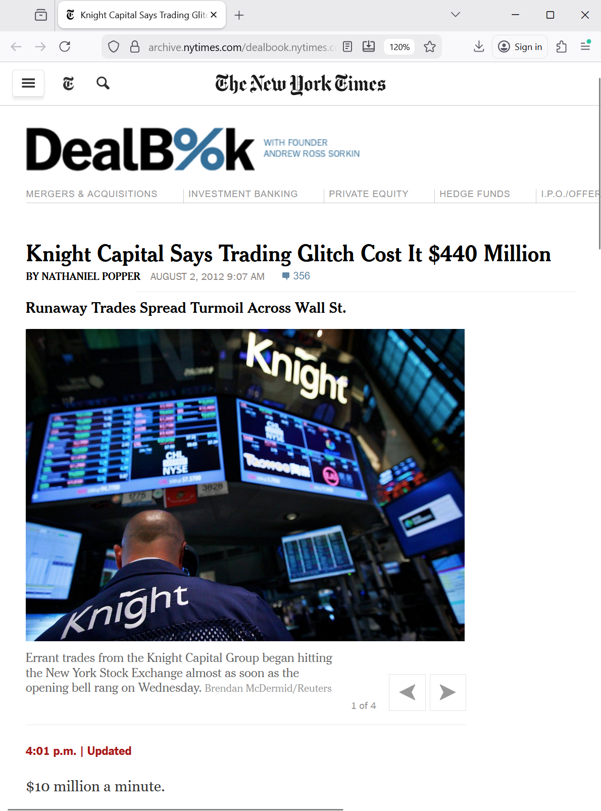

----------------------------------------------------------------------------------------------------
- template: image
- class: smaller


# What went wrong?

Software update activated unused and wrong code

---

**Reflections on the issue**

- Engineering blogs
- Formal verification talks
- SEC commission analysis

----------------------------------------------------------------------------------------------------
- template: lists
- style: p { margin:5px 0px 20px 0px; }

# Reflections on the Knight glitch


## Mathematical culture
Software not formally verified correct!

## Engineering culture
Poor testing and engineering practice

## Managerial culture
Incorrect implementation of oversight processes

----------------------------------------------------------------------------------------------------
- template: content
- background-color: #153374
- class: nologo
- style: .cult { margin-right:30px; text-align:center; padding:0px 10px 0px 10px;display:inline-block;
    background:#2C68AC;} strong { color:#F1DEC2; font-size:20pt; }
   img { max-height:250px; border-style:none; margin-top:5px; }

<p class="cult"><strong>Managerial</strong><br></p>
<p class="cult"><strong>Hacker</strong><br>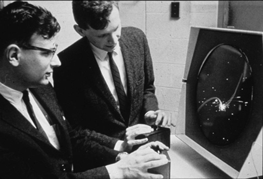</p>
<p class="cult"><strong>Humanistic</strong><br>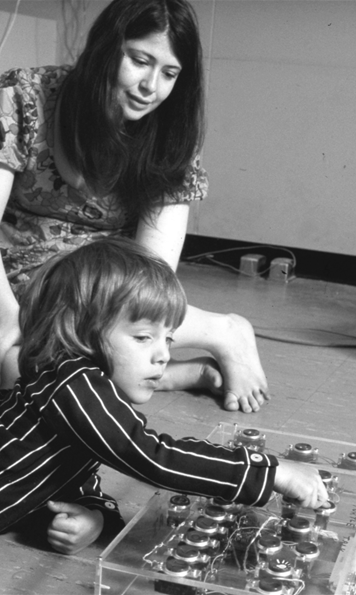</p>
<p class="cult"style="margin-right:75px"><strong>Mathematical</strong><br>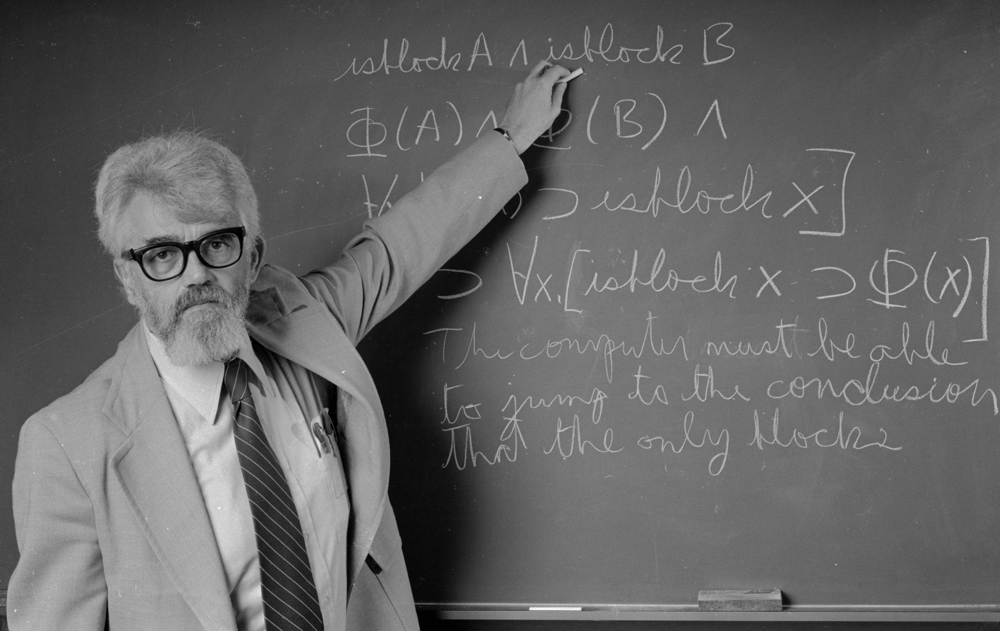</p>
<p class="cult"><strong>Engineering</strong><br>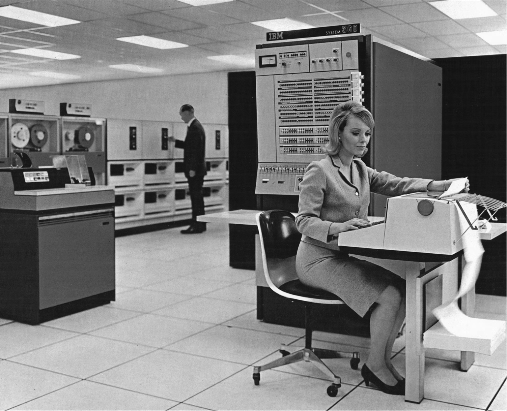</p>

****************************************************************************************************
- template: subtitle

# Collaborations
## The birth of programming languages

----------------------------------------------------------------------------------------------------
- template: lists
- class: nologo
- style: img { max-width:400px !important; max-height:400px !important; margin-top:-0px !important; }

# Programming language

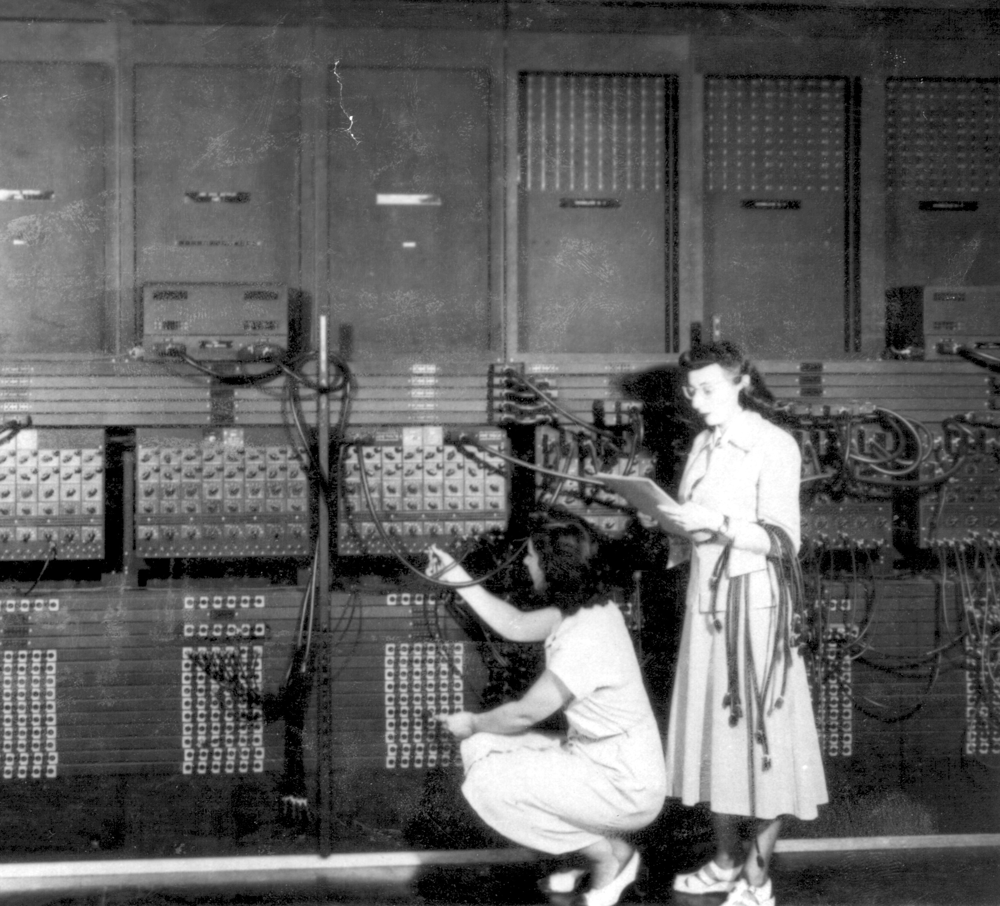

## Programming before

- Direct machine control
- Plugging cables in ENIAC
- Idiosyncratic machine codes

## Remarkable idea!

- New framing metaphor
- New formal models
- Implementation techniques

----------------------------------------------------------------------------------------------------
- template: image
- class: smaller

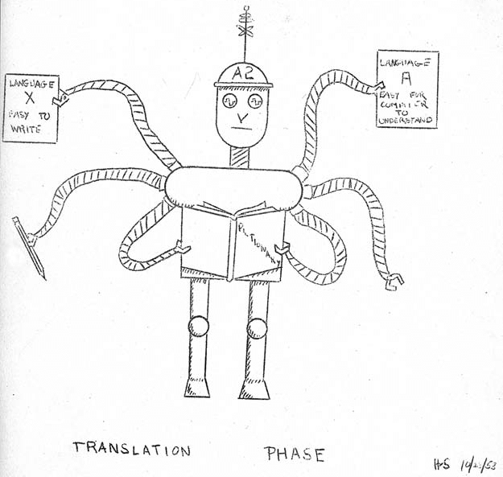

# Mathematical culture

**Translation metaphor for programming (1950s)**

From human language to formal logic and linguistics

Formal grammars for language description

----------------------------------------------------------------------------------------------------
- template: image

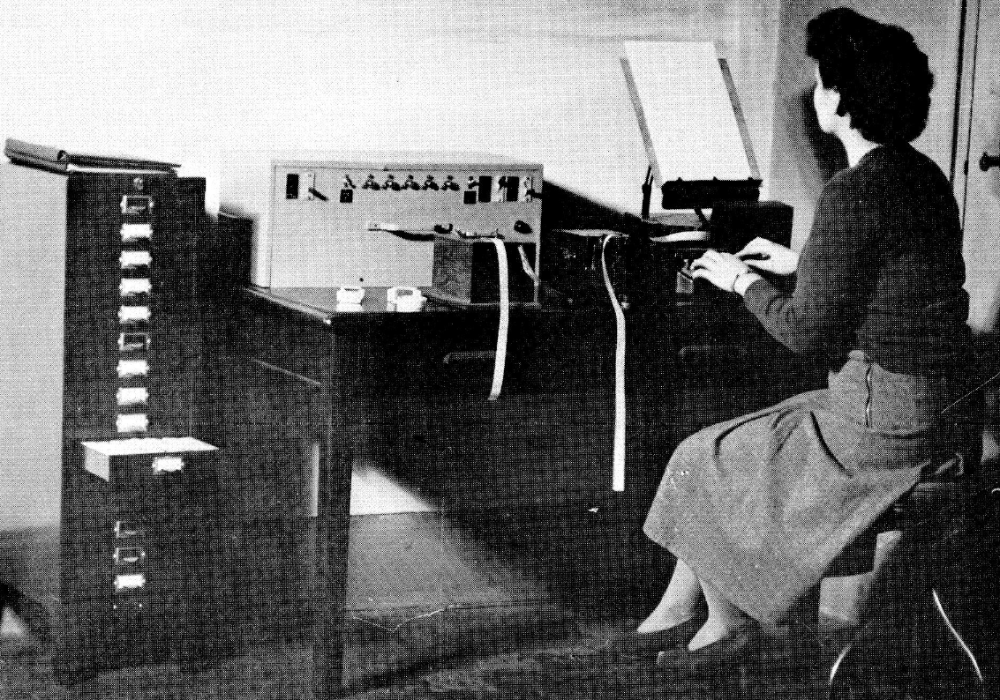

# Hacker culture

**Clever tricks (1950s)**

External form allows subroutine libraries

Interpretive routines for extra EDSAC codes

----------------------------------------------------------------------------------------------------
- template: image
- class: smaller

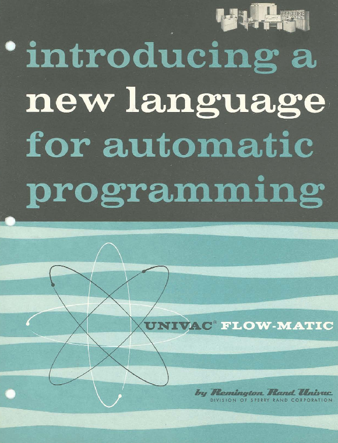

# Managerial need

**User groups and computer installation managers**

Common universal notations  

Cross-machine compatibility  
Allow program exchange  
Teaching at universities

----------------------------------------------------------------------------------------------------
- template: content

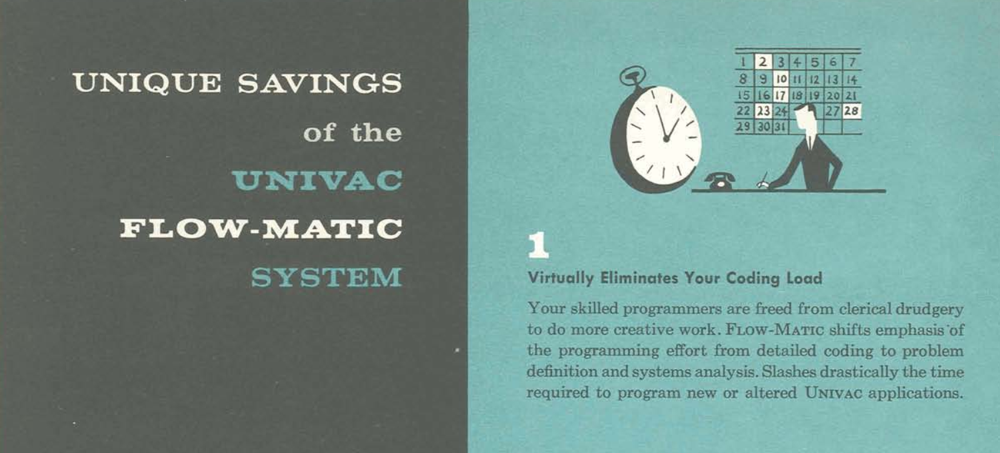

----------------------------------------------------------------------------------------------------
- template: lists
- class: noborder nologo
- style: .body img { margin:-50px -50px 0px 0px !important; max-width:1000px !important; max-height:500px !important; }

# Limits of collaboration


## No great unification!

- **COBOL** for managerial business use
- **Algol** for mathematical theory
- **LISP** for symbolic AI and hackers

## Boundary object

- Shared understanding, but not focus
- Exchange of ideas between cultures
- Failure of universal languages

----------------------------------------------------------------------------------------------------
- template: subtitle

# Undone
## The meaning of programs

----------------------------------------------------------------------------------------------------
- template: image
- class: smaller
- style: h1 em { font-weight:300; font-style:normal; }

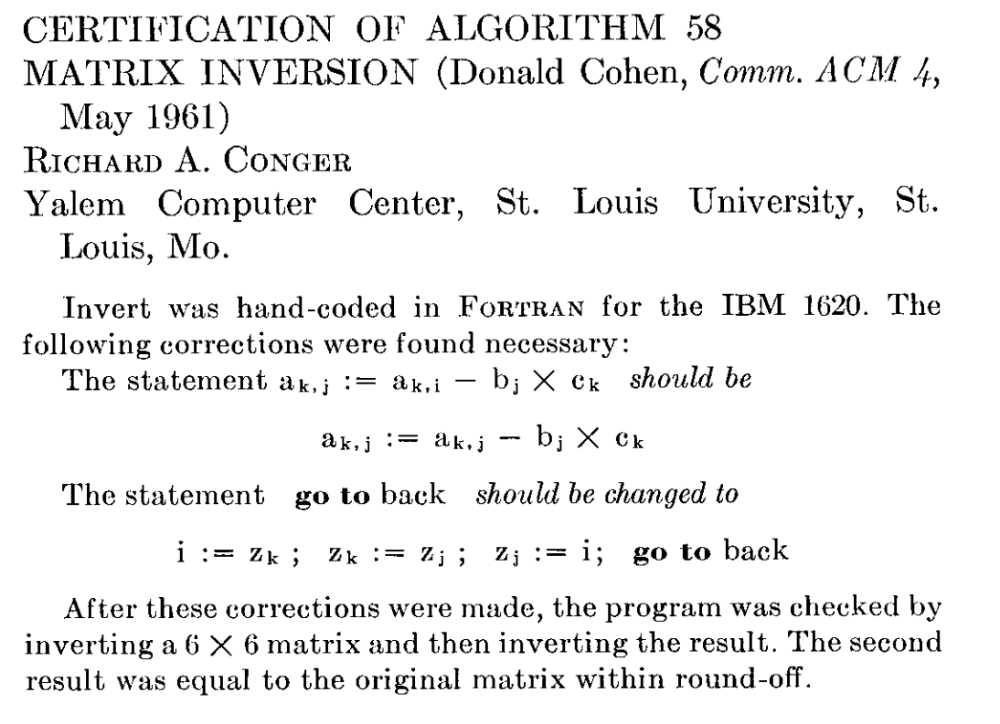

# Algorithm certification _(CACM 1961)_

Algol becomes the language of academic computer science

Algorithms in CACM  


---

**Formal proofs take  
time to appear!**

----------------------------------------------------------------------------------------------------
- template: image
- class: smaller
- style: h1 em { font-weight:300; font-style:normal; }

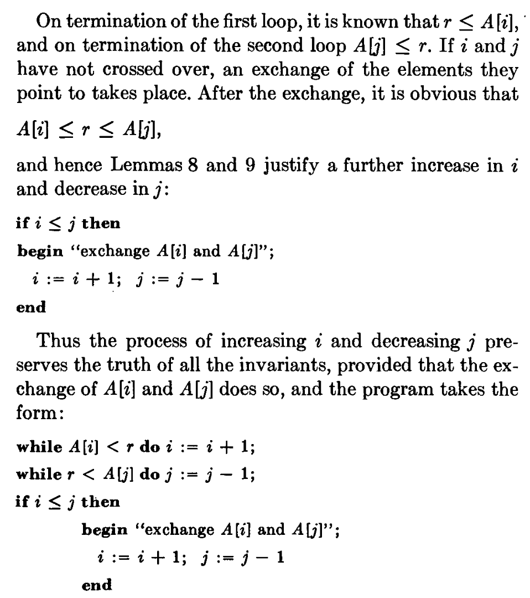

# Proof of a Program: FIND _(Hoare, 1971)_

Program as a formal mathematical object

Ensure correctness using mathematical methods!

----------------------------------------------------------------------------------------------------
- template: image
- class: smaller
- style: h1 em { font-weight:300; font-style:normal; }

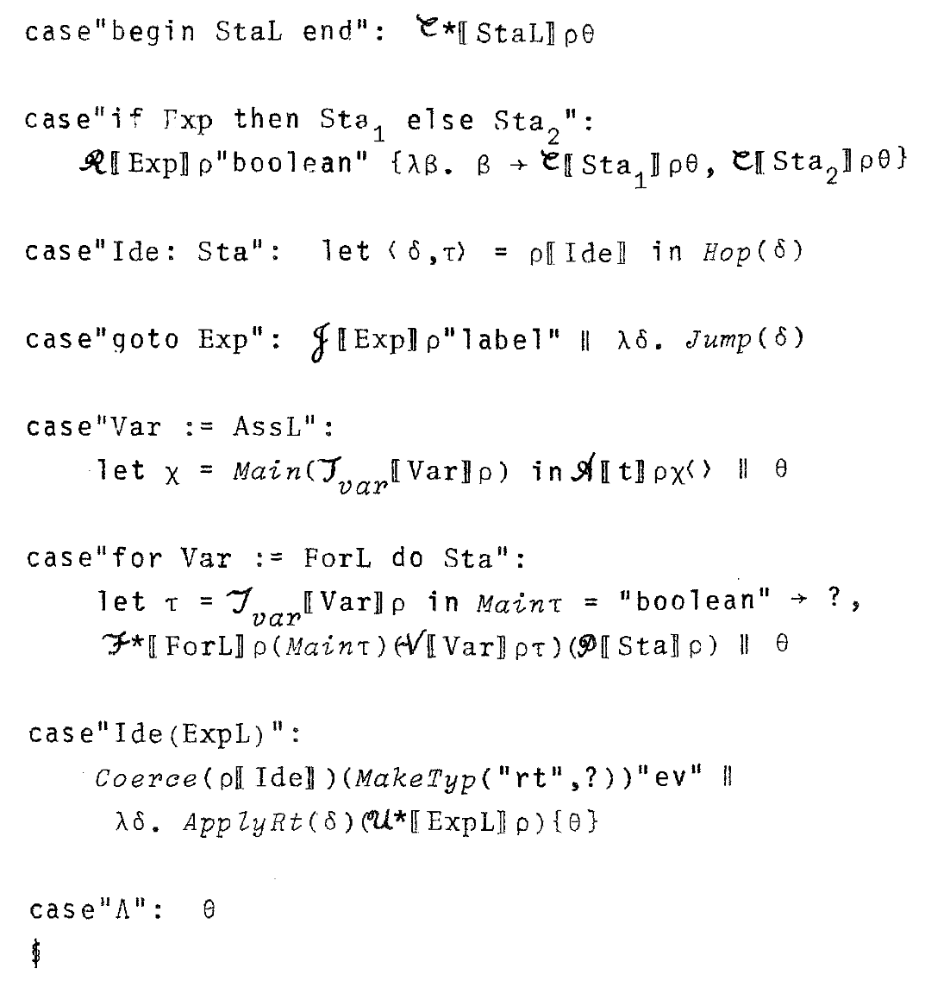

# The mathematical semantics of Algol 60 _(Mosses, 1974)_

"I must admit I still feel a little surprised it’s as long as it is - I guess Algol 60 is
just not nearly as 'well-behaved' as one tends to think it is."

See **Astarte (2019)**!

----------------------------------------------------------------------------------------------------
- template: content
- style: h1 { font-size:34pt; } h1 em { font-weight:300; font-style:normal; } pre { float:right; } h2 { margin:0px; padding:0px; font:300 30pt 'Roboto', sans-serif; }

# What does "Hello world" mean? _(Sack, 2025)_


```text
#include <stdio.h>
main()
{
  printf("hello, world\n");
}
```

---

## Mathematical culture

Program prints the specified sequence of characters

---

## Humanistic culture

Greeting! With social contact between the speaker and the hearer

## Semantics as speech acts!

----------------------------------------------------------------------------------------------------
- template: icons

# Semantics
## Undone interactions between cultures

- *fa-location-crosshairs* Languages born out of collaboration
- *fa-arrow-right-arrow-left* Enables exchange of language features
- *fa-not-equal* Semantics firmly in mathematical tradition
- *fa-x-twitter fa-brands* Missing the bigger picture...
- *fa-comment* Semantics as speech acts?

****************************************************************************************************
- template: subtitle

# Struggles & collaborations
## History of testing and debugging

----------------------------------------------------------------------------------------------------
- template: lists

# Debugging on the ENIAC

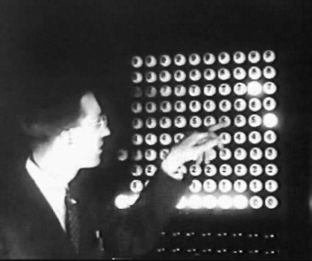

## Early testing technique

- One manually calculated trajectory
- Run pulse-by-pulse and verify
- Checks program & machine failures

## Simplifying programming

- Reprogramming the ENIAC
- Punched cards with 60 order code
- Machine helps with programming

----------------------------------------------------------------------------------------------------
- template: image
- style: p { letter-spacing:-1px; }

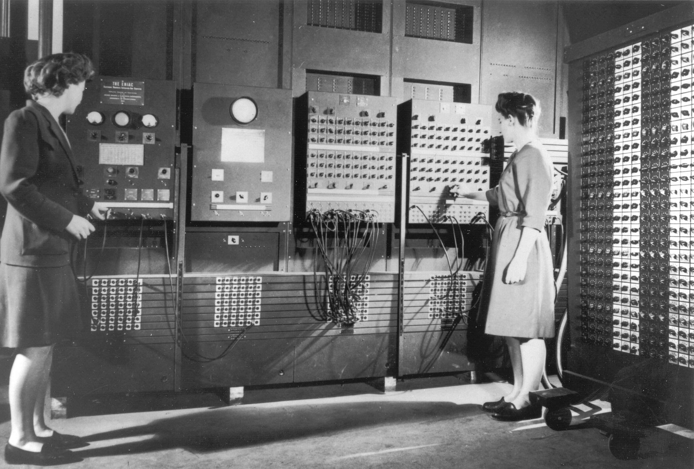

# Debugging ENIAC

"Adele was an active type of programmer, trying things very quickly.  
I was more laid back and given to attempting to figure out things logically before doing anything."

**Betty Jean Jennings**

----------------------------------------------------------------------------------------------------
- template: lists

# Extravagant use of computer time


## Instruction-by-instruction execution

- Tedious and wasteful practice!

## Post-mortem dump

- Prints specific memory region
- Look for errors offline

## Interpretive checking routine

- Print diagnostics while running
- Interpreter with 50x slowdown  

----------------------------------------------------------------------------------------------------
- template: image

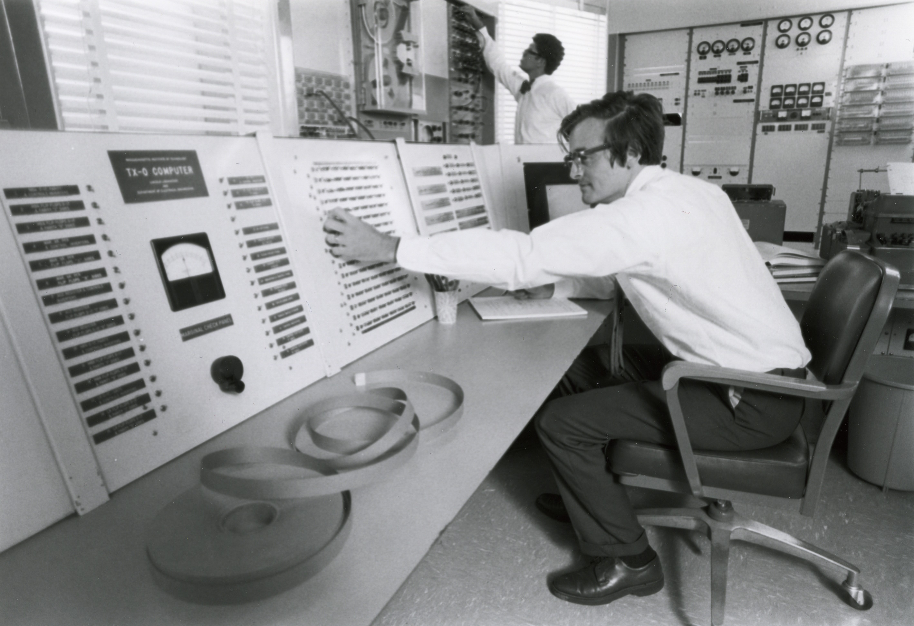

# MIT hacker culture

**TX-0 at MIT (1958)**

"Debugging at the console regarded as professional sin."

**FLIT, DDT, DEBUG**

Set breakpoints, interactively modify program & state.

----------------------------------------------------------------------------------------------------
- template: lists

# Debugging Epoch Opens (1965)

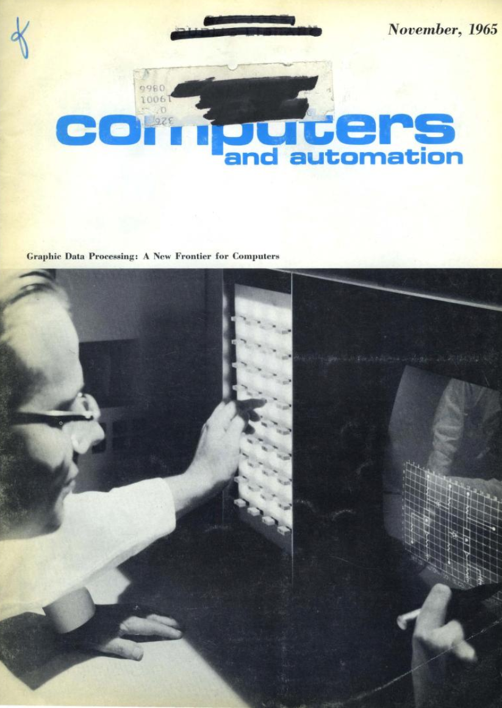

## Limiting factors for computing

- Hardware until mid-1950s
- Programming until mid-1960s
- What now? Now: debugging.

## Terminology in the 1960s

- Checking a program (Turing, 1949)
- Debugging and program checkout
- Testing and error handling

----------------------------------------------------------------------------------------------------
- template: image
- style: .body1 { width:400px; } h1 { font-size:28pt; } em { font-weight:400; font-style:normal; }

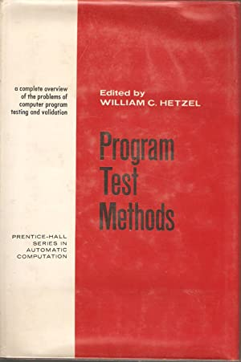

# Computer Program Test Methods Symposium (1972)

Testing distinguished  
from debugging

Companies hire _test managers_ and _test technicians_

Test automation establishes  
a _test_ as an artifact

---

**Engineering and mathematical takes on testing**

----------------------------------------------------------------------------------------------------
- template: lists
- class: bigger

# Growth of software testing (1988)

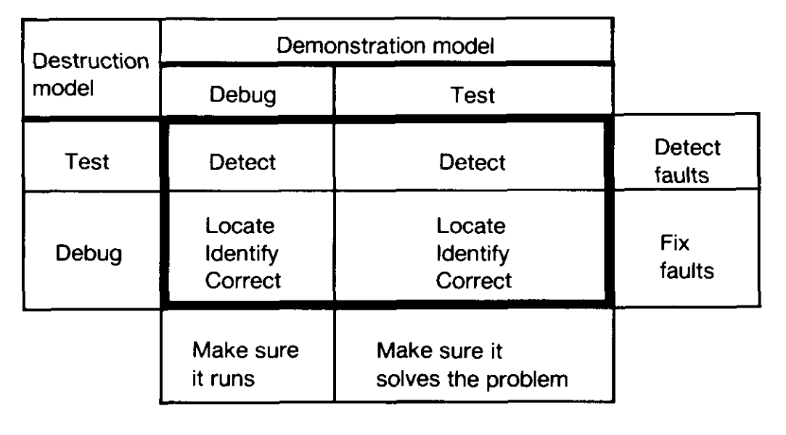

## Demonstration era (1957-78)

 - Test to show that programs  
   work as required
 - Alternative to proofs

## Destruction era (1978-82)

  - Test to find errors
  - Enables new tool developments
  - Mutation testing, random testing

----------------------------------------------------------------------------------------------------
- template: image
- style: h1 { font-size:28pt; } em { font-weight:400; font-style:normal; }

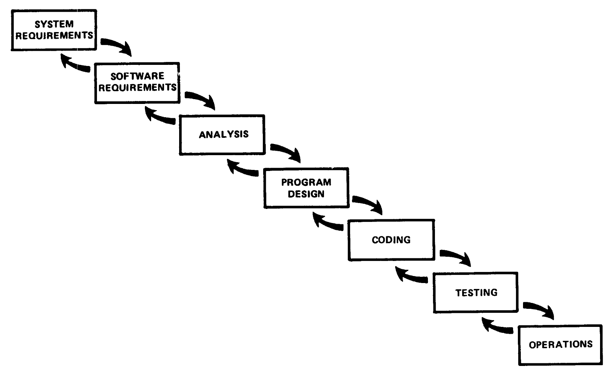

# Testing as part of the development process

Testing after coding in Waterfall (1970)

_Unit testing_ separate from _acceptance tests_

---

**Managerial take on software testing**

----------------------------------------------------------------------------------------------------
- template: lists

# Extreme programming

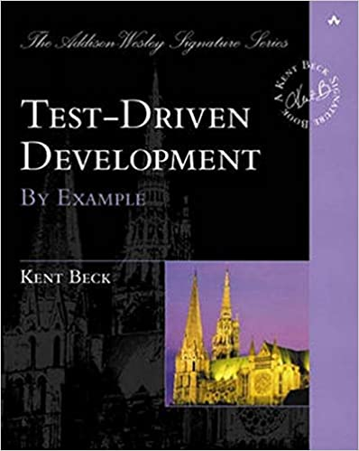

## Test-Driven Development

- Start by writing tests!
- Created with customers
- Then write code and improve

## Development methodology

- From black art to scientific method
- Engineers regain control of testing

----------------------------------------------------------------------------------------------------
- template: subtitle

# Undone
## Science of program debugging

----------------------------------------------------------------------------------------------------
- template: content
- style: p { letter-spacing:-1px; } .body img { margin-left:40px; float:right; width:300px; }

# On-line debugging (1966)


---

"It has been possible .. to find a bug while at a breakpoint in
running a test case, call the [structure] editor to make a correction,
run the program on a simpler test case to verify the correctness of the
change, then resume execution of the original test case from the breakpoint."

----------------------------------------------------------------------------------------------------
- template: image
- class: noborder
- style: .body1 { width:600px; } .body1 img { max-width:580px; } h1 { letter-spacing:-2px;}

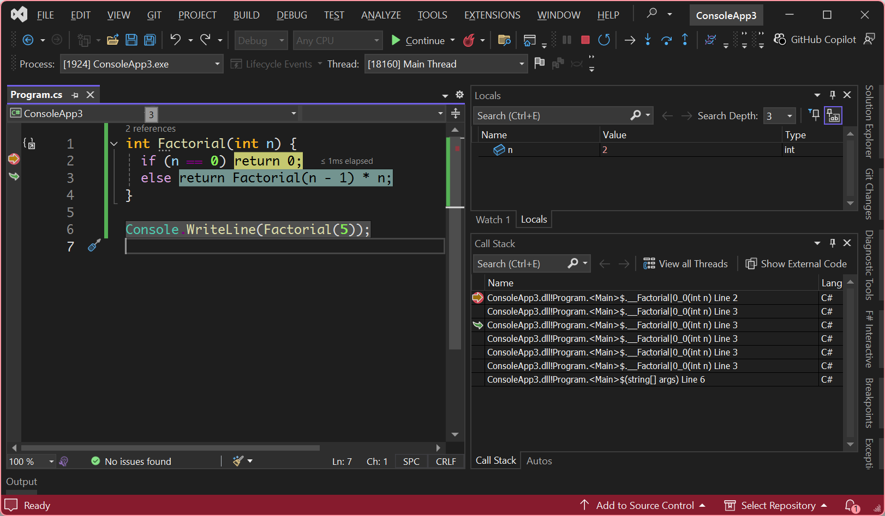

# Debugging now

Set breakpoint  
Make correction  
Resume execution  

---

**To be fair...**

Time-traveling debuggers, etc.

----------------------------------------------------------------------------------------------------
- template: icons
- style: li { font-size:30pt; }

# Debugging
## Undone interactions between cultures

- *fa-vial-circle-check* Test becomes a stand-alone entity
- *fa-black-tie fa-brands* <span style="letter-spacing:-1px">Adopted by engineers, managers, mathematicians<span>
- *fa-brain* Different meaning, but allows idea exchange
- *fa-square-binary* Debugging remains a hacker practice
- *fa-handshake-simple* Undone interaction between cultures?

****************************************************************************************************
- template: subtitle

# Clashes
## Struggle for control over a concept

----------------------------------------------------------------------------------------------------
- template: icons

# Object-orientation
## Struggle for control over a concept

- *fa-cart-flatbed-suitcase* **1960s** - Mathematical simulations in **Simula**
- *fa-tablet-screen-button* **1970s** - Personal dynamic media in **Smalltalk**
- *fa-computer* **1980s** - From **Smalltalk** to **C++** and **Java**
- *fa-industry* **1990s** - **UML** and new development processes

----------------------------------------------------------------------------------------------------
- template: image
- style: h2 { margin:30px 0px 0px 0px; font-size:28pt; font-weight:500; } p { margin:15px 0px 0px 0px; line-height:1.1em; }

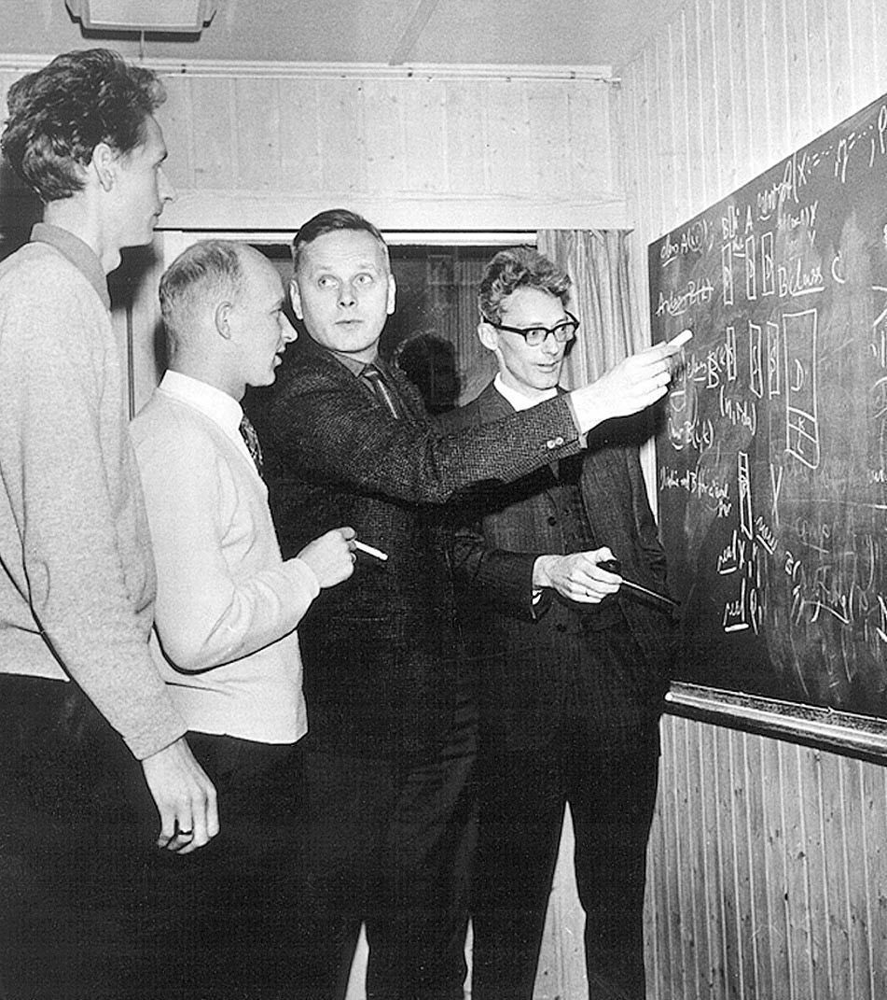

## SIMULA "1"

Activity declarations  
and processes  

Remote accessing

---

## SIMULA 67

Classes and objects  

Record handling inspired by Hoare

----------------------------------------------------------------------------------------------------
- template: lists

# Three cultures of Smalltalk

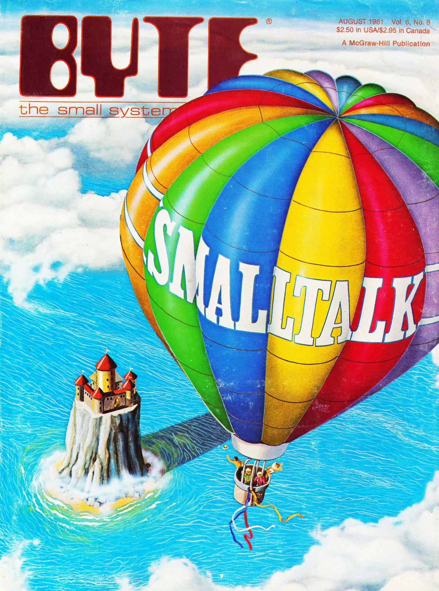

## Humanistic (early 70s)
"Computer for Children of All Ages"  
Learning and educational focus

## Hacker (late 70s)
Experimentation tool at Xerox PARC

## Engineering (80s-90s)
From Tektronix to IBM Visual Age  
Test-driven development, design patterns

----------------------------------------------------------------------------------------------------
- template: content
- class: two-column nologo
- style: .body img { max-width:180px; margin-left:30px; }

# Object-oriented methodology

**How do you design   
software using objects?**

Objects as active actors   
Responsibilities of objects

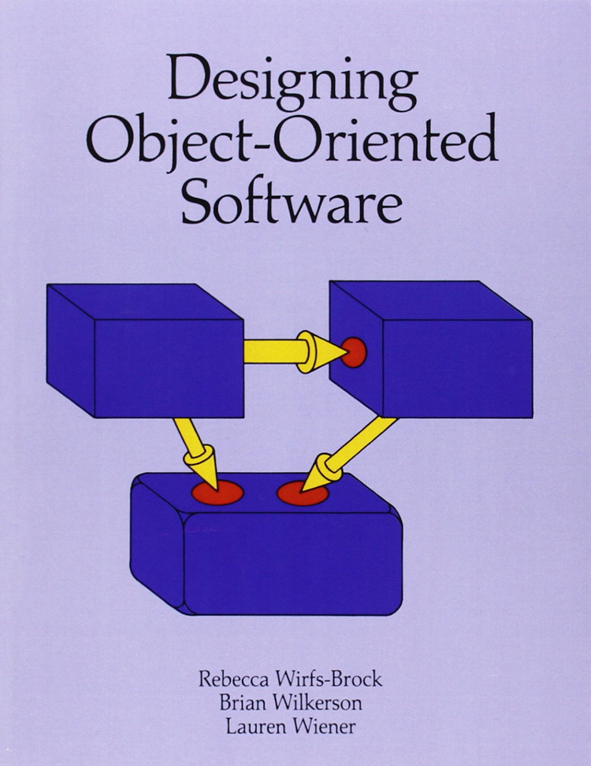

---

**From objects to software development processes**

Objects support requirements analysis, team structuring

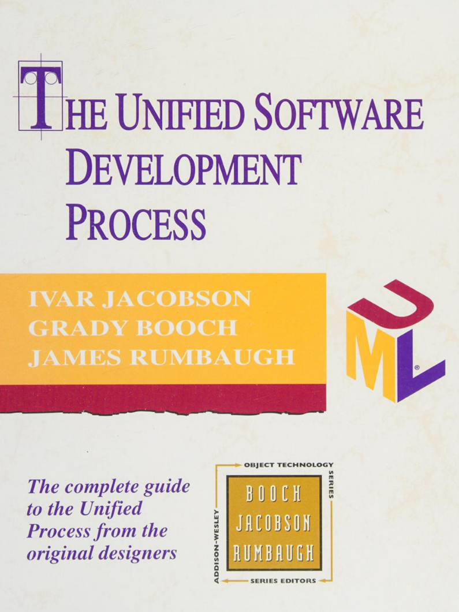

----------------------------------------------------------------------------------------------------
- template: subtitle

# Undone
## Open programming systems

----------------------------------------------------------------------------------------------------
- template: image

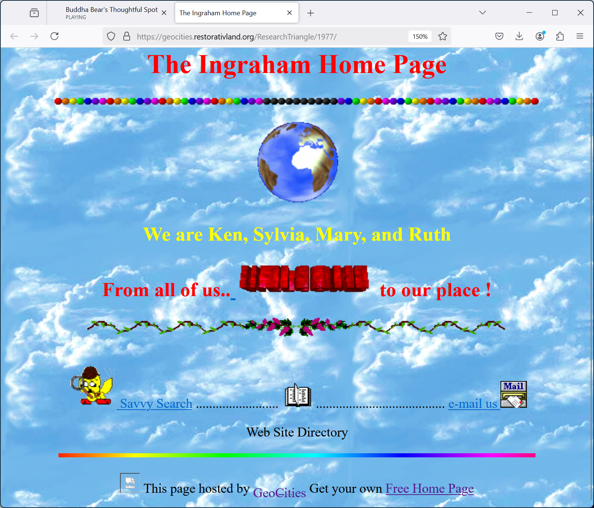

# Open Web (90s)

Learn and reuse compo&shy;nents using view source

----------------------------------------------------------------------------------------------------
- template: image

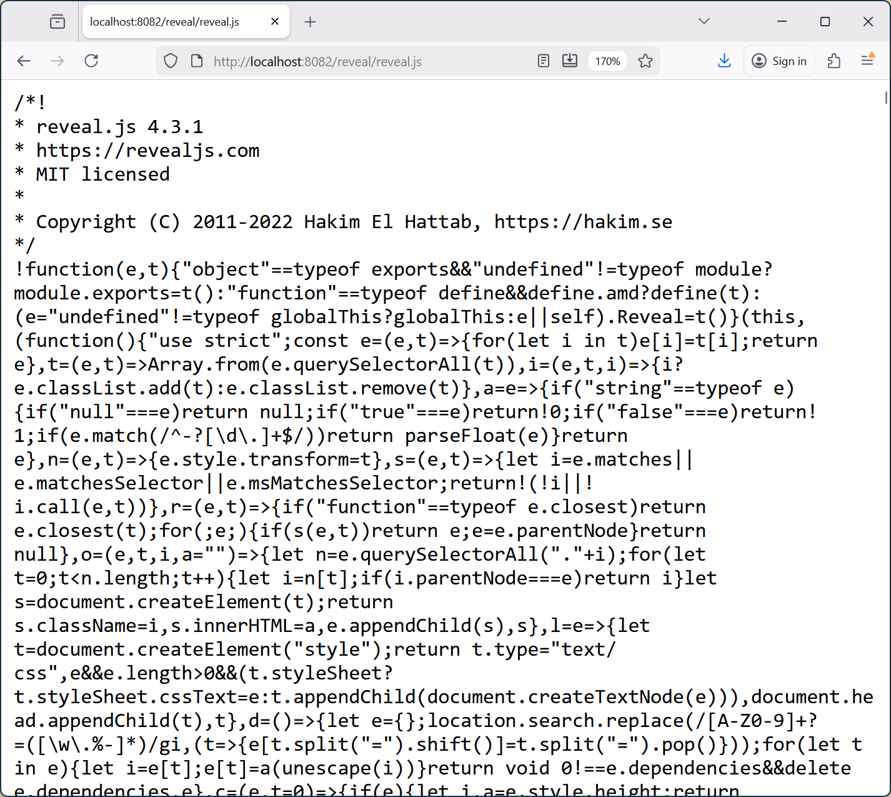

# Closing of the Web

**Engineering reasons**

Delivering large files over slow network...

Large software requires proper languages!

----------------------------------------------------------------------------------------------------
- template: icons

# Open systems
## Undone interactions between cultures

- *fa-shapes* Object-orientation becomes engineering tool
- *fa-globe* Engineers decide on web technologies
- *fa-folder-open* Malleability and openness gets lost!
- *fa-heart* Humanistic programming systems?
- *fa-crown* Democratic "openness" of public services?

****************************************************************************************************
- template: subtitle

# Conclusions
## Undone ideas on programming

----------------------------------------------------------------------------------------------------
- template: title
- class: nologo
- style: .qr { position:absolute; right:0px; bottom:30px; width:220px; border:solid 6px black; } .body p { margin-bottom:40px;}

# Undone ideas on programming

Cultures of programming map the space of ideas    
Avoid narrow engineering or mathematical views  
Call for more pluralism in computing!   

---

**Tomas Petricek**, Charles University, Prague  
[tomas@tomasp.net](mailto:tomas@tomasp.net)  |
[tomasp.net](https://tomasp.net)

**Open-access book and exhibition**    
Available at [tomasp.net/cultures](https://tomasp.net/cultures)


****************************************************************************************************
- template: subtitle

# Bonus slides

****************************************************************************************************
- template: subtitle

# Clashes
## What is the problem of programming

----------------------------------------------------------------------------------------------------
- template: image
- class: smaller


# Hacker origins

“Programming in the early 1950s was a black art,  
a private arcane matter involving only a program&shy;mer,
a problem, a computer, ... and a primitive assembly program.”

**John Backus (1976)**

----------------------------------------------------------------------------------------------------
- template: image
- class: smaller

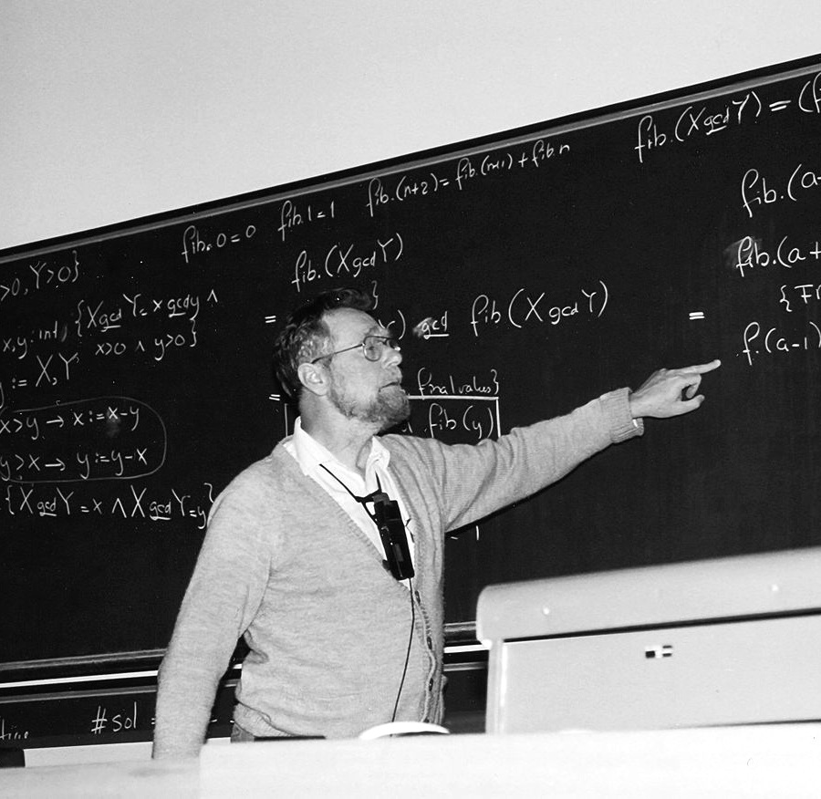

# Mathematical science

“Program testing can be used to show the presence of bugs, but never to show their absence!” Rather than verifying programs through their testing, we should prove them correct.

**Edsger Dijkstra (1969)**

----------------------------------------------------------------------------------------------------
- template: image
- style: .body1 { width:400px; } .body1 img { max-width:360px; }
- class: nologo

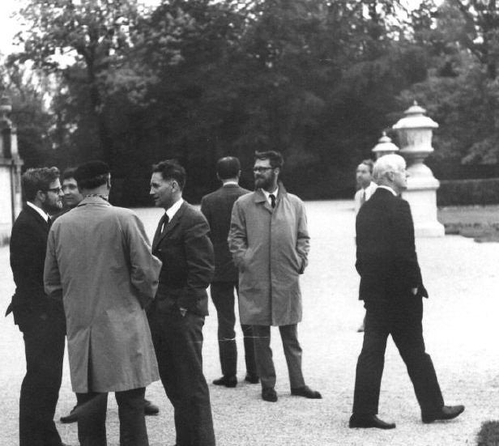

# Software engineering

“The phrase software engineering was deliberately chosen as provocative... We undoubtedly produce software by backward techniques.”

The black art of programming has to make way for the science of software engineering!

**NATO Conference on
Software Engineering (1968)**

----------------------------------------------------------------------------------------------------
- template: image
- style: .body1 { width:400px; } .body1 img { max-width:360px; }

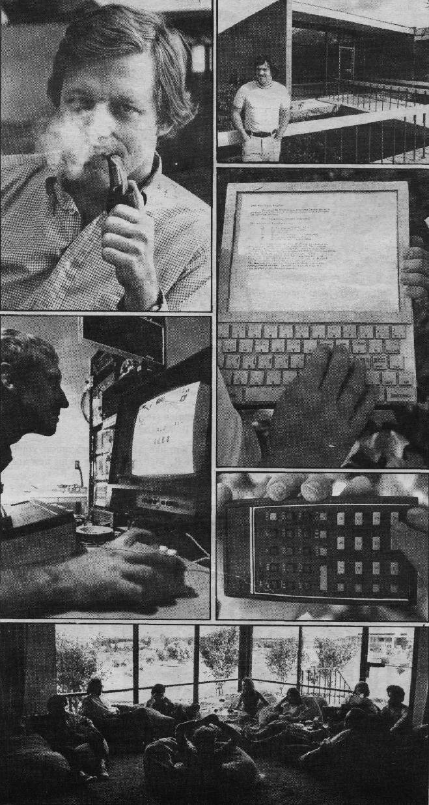

# Humanistic problem

“Alan Kay is more interested in us kids. He repudiates the manipulative arrogance .. and serves the dictum of Seymour Papert, Should the computer program the kid or should the kid program the computer?”

**Brand, Rolling Stone (1972)**

----------------------------------------------------------------------------------------------------
- template: image
- style: .body1 { width:400px; } .body1 img { max-width:360px; }

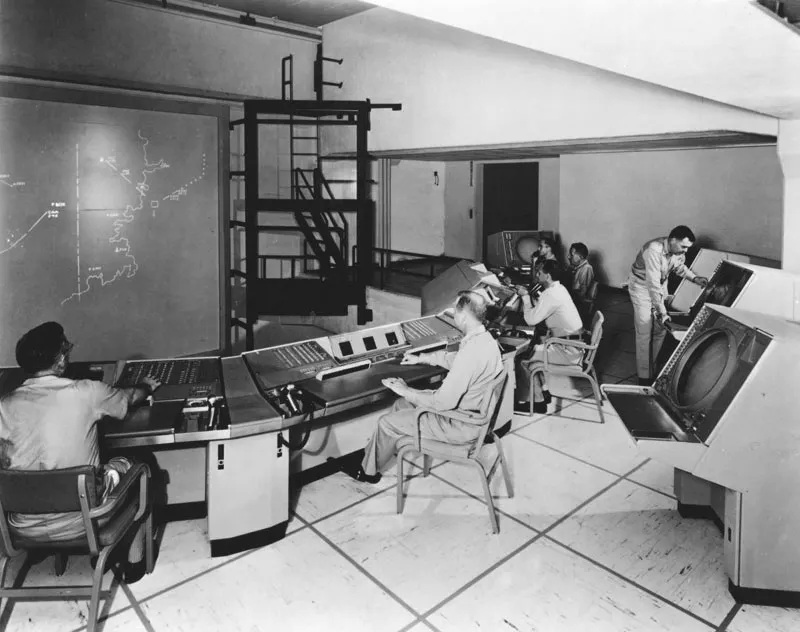

# Managerial problem

“With SAGE, we were faced with programs too large for one person to grasp entirely and also with the need to hire and train large numbers of people to become programmers... We were faced with organizing and managing a whole new art.”

**Herbert Benington (1956)**

----------------------------------------------------------------------------------------------------
- template: icons

# History
## Cultures of programming view

- *fa-landmark-dome* Cultures emerge early in the history
- *fa-image* Unique values, views, methods, aesthetics
- *fa-chess-rook* Stable over history of programming
- *fa-comments* Not always shared communities
- *fa-people-line* Inherently pluralistic discipline?

****************************************************************************************************
- template: subtitle

# Aesthetics
## Disagreements on values

----------------------------------------------------------------------------------------------------
- template: codeanim
- class: code
- style: h1 { font-family:Felipa; } pre { margin-right:20px; } pre code { font-size:12pt; }

```text
float Q_rsqrt( float number )
{
  long i;
  float x2, y;
  const float threehalfs = 1.5F;

  x2 = number * 0.5F;
  y  = number;

  // evil floating point bit level hacking
  i  = * ( long * ) &y;             
  // what the fuck?
  i  = 0x5f3759df - ( i >> 1 );
  y  = * ( float * ) &i;

  // 1st iteration
  y  = y * ( threehalfs - ( x2 * y * y ) );
  // 2nd iteration, this can be removed
  // y  = y * ( threehalfs - ( x2 * y * y ) );
  return y;
}
```

# What code is beautiful?

---

<br>

**Hacker culture**

Values clever code that shows understanding of the machine operation

----------------------------------------------------------------------------------------------------
- template: code
- class: code larger
- style: h1 { font-family:Felipa; } pre { margin-right:20px; } pre code { font-size:10pt; }

```text
#define submerge const char*_=O%239?" ":"\t;\t";O*=2654435761;int
#define _cOb8(...) int s,on,__VA_ARGS__;int main(int O, char**Q)

  _cOb8(o_,     _oO8ocQOcOb,       _ocQbo8oo,      _oO8ocOb_
    ){ ;           { ;;;              ;;}             ;{
      ;;             ;{              ; }              {;;}
     }   float   the;;  static things ;; for (;;){ us :;;
    ; ;  break; the;  ;; long grass  ;unsigned squall  ; }
   { } ; while (1){soft:;  submerge us;;    in: sleep (0) ;
    ; ;  printf    (_);   quietly :on  ;;   the; soil:; };
   {{ };           ; ; ;;             ;{ ;            }; {
  {  ;   shake: time (1) ;register   *_, the =clock(s  );
    ;} ; volatile    *_,  winds     ; ;  double wills ;{
      ;  char the    ,*   fire     ;; short companion,*_;}
    ; {  union    {}*_,  together  ;; ;   void *warms  ;}
   } ;;            ;{;              ;} ;              ;;
    ; ;  if (1) wet  :;    raise    (1);  struct{}ure  ;; ;
   ; ;   free (0);for(;;){  newborn :; ;     daughter :; ;
   ;{ ;  extern al,  **     world   ,*re;const ructed  ;};
 ;  ; ;  continue;on:;;    floods   :; ;    of: water :;};}
; ;{ ; ;          ;; {  ;          ; }  ;             }  ; ;  }
```

# Beautiful code

---

<br>

**Humanistic culture**

Use double coding to speak to the human as well as  
to the machine

----------------------------------------------------------------------------------------------------
- template: image
- class: larger
- style: h1 { font-family:Felipa; } .body1 img { margin-top:60px; border:solid 10px #2C68AC; border-radius:20px; }

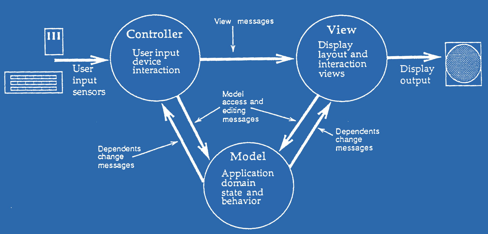

# What code is beautiful

---

<br>

**Engineering culture**

Simple, well-structured. Readability is valued more than cleverness.

----------------------------------------------------------------------------------------------------
- template: image
- class: larger
- style: h1 { font-family:Felipa; } .body1 img { margin-top:70px; border:solid 10px #2C68AC; border-radius:20px; background-color;red; }

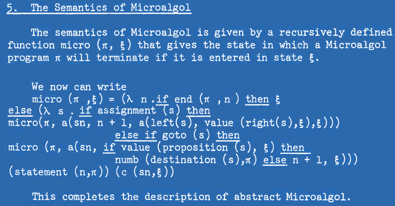

# What code is beautiful

---

<br>

**Mathematical culture**

Code achieves great expressivity using a combination of small number of orthogonal features.

----------------------------------------------------------------------------------------------------
- template: image
- class: larger
- style: h1 { font-family:Felipa; } .body1 img { margin-top:0px; border:solid 10px #2C68AC; border-radius:20px; background-color;red; }

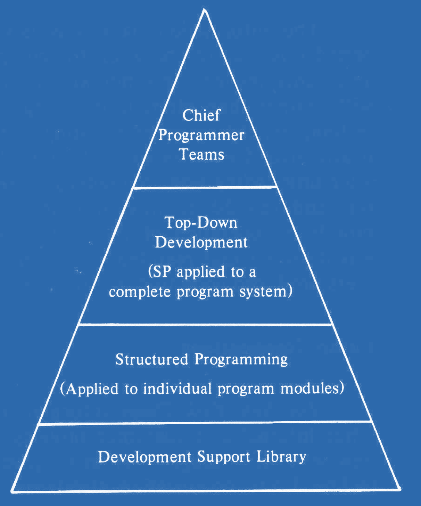

# What code is beautiful

---

<br>

**Managerial culture**

Structure of code enables appropriate organization of development teams and project management.

<!-- Chief programmer teams from: https://athena.ecs.csus.edu/~buckley/CSc191/Chief_Programmer_Teams-Baker-Mills.pdf -->

----------------------------------------------------------------------------------------------------
- template: icons

# Aesthetics
## Materiality of programming

- *fa-pen-nib* Code matters for hackers and humanists
- *fa-not-equal* For mathematicians code is just maths
- *fa-cog* Engineers value code quality and structure
- *fa-user-tie* Code is secondary for managerial culture

****************************************************************************************************
- template: subtitle

# Collaborations
## The history of programming with types

----------------------------------------------------------------------------------------------------
- template: largeicons

# History of types

- *fa-pen-nib* **1903** - Avoiding logical paradoxes (Russell)
- *fa-gears* **1956** - Numbers in two modes (FORTRAN)
- *fa-database* **1957** - Data description cards (FLOW-MATIC)
- *fa-clipboard* **1974** - Abstract data types (Clu)
- *fa-terminal* **1978** - Meta-language for a theorem prover (ML)
- *fa-not-equal* **1989** - Types in proof assistants (Alf and Rocq)
- *fa-hand-pointer* **2012** - Unsound type systems (TypeScript)

----------------------------------------------------------------------------------------------------
- template: content
- class: two-column nologo

# Types in programming

**FORmula TRANslator  
rather than a language**

Arguments in fixed or  
floating-point mode

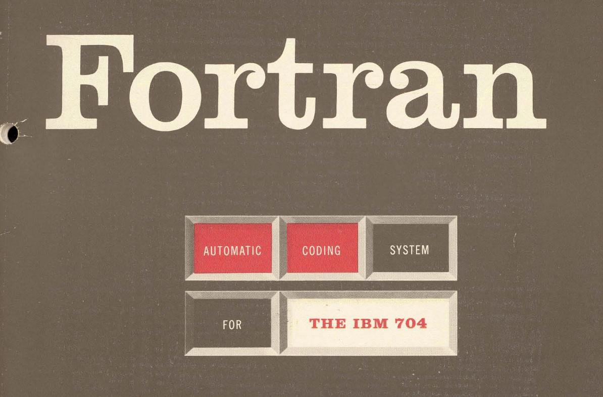

---

**Algorithmic Language**

Types (integer, real, Boolean) denote properties of values;  
Subscripts for arrays

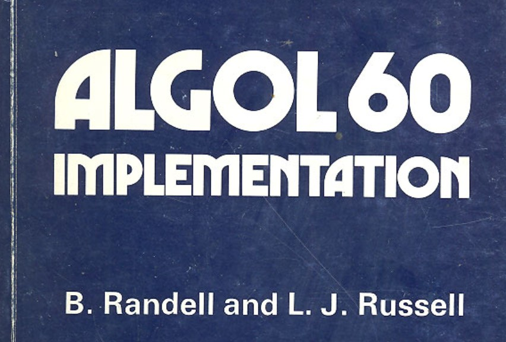

----------------------------------------------------------------------------------------------------
- template: image

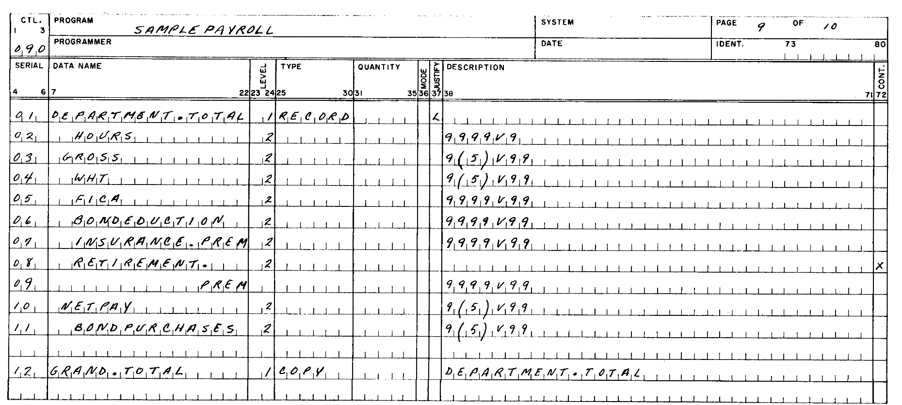

# IBM COMTRAN

**Electronic versions of paper-based records**

Data records with specific string formatting

----------------------------------------------------------------------------------------------------
- template: lists

# Towards a universal language

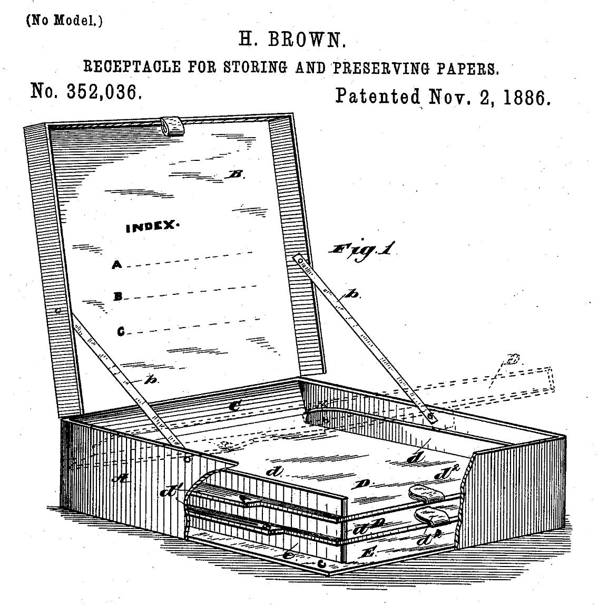

## Mathematical models
- Data spaces (McCarthy, '59)   
- Product $A \times B$, union $A \oplus B$
- Set-theoretical types (Hoare, '72)

## Types in Algol 68

* A long and difficult struggle
* Whereas ALGOL 60 has values of [three types],  
  ALGOL 68 features an infinity of “modes”.

----------------------------------------------------------------------------------------------------
- template: lists
- style: .body img { max-width:220px !important; }

# From mathematics to engineering

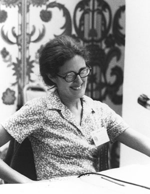

## Lambda-calculus models (Morris '69)
Models type checking via derivation rules

## Types are not sets (Morris '73)
Authentication and secrecy problems   
Now in Cedar system at Xerox PARC

## Abstract data types (Liskov '74)
Type checking done at runtime in Clu  
Cites Reynolds ("personal communication")

----------------------------------------------------------------------------------------------------
- template: image
- class: smaller
- style: .body1 img { margin-top:40px; border:solid 10px #2C68AC; border-radius:20px; }

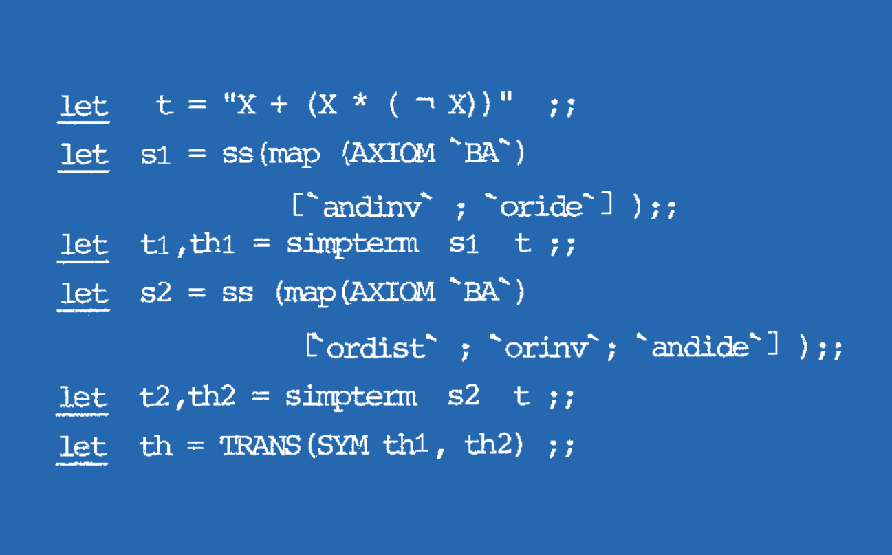

# LCF/ML (1978)

**Abstract data types**  
for proof terms

**Data types**  
for convenient programming

**Type checking**  
for proof correctness

----------------------------------------------------------------------------------------------------
- template: icons

# Types
## Cultural reconciliation at last...?

- *fa-not-equal* Proof assistants and dependent types
- *fa-globe* Type providers and data as types
- *fa-right-left* Modelling types as relations
- *fa-list* Unsound type systems for the real world
