- title: Programming Systems, or What Programming Language Research Cannot See

****************************************************************************************************
- template: title

# Programming systems, _or_
## what programming language  research cannot see

---

**Tomas Petricek**, Charles University, Prague  

_<i class="fa fa-envelope"></i>_ [tomas@tomasp.net](mailto:tomas@tomasp.net)  
_<i class="fa fa-globe"></i>_ [https://tomasp.net](https://tomasp.net)  
_<i class="fa-brands fa-bluesky"></i>_ [@tomasp.net](https://bsky.app/profile/tomasp.net)    

----------------------------------------------------------------------------------------------------
- template: content

1 INTRO
  - HyperCard demo
  -
2 TECH DIMS
  - Timeline
4 COMPLEMENTARY
  - C64
3 FORMAL
  - TheGamma
5 HCI
  - Denicek
6 CONCLUSIONS

****************************************************************************************************
- template: subtitle

# Intro
## Programming systems

----------------------------------------------------------------------------------------------------
- template: image

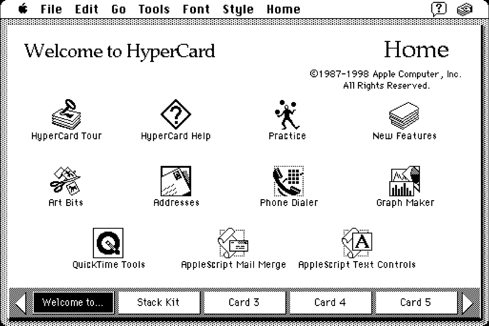

# Apple HyperCard

**Hypermedia system**

Help humankind  
share knowledge

Allowed lots of people to create small apps

---

_What does a PL researcher see?_

----------------------------------------------------------------------------------------------------
- template: content
- style: img { border-width:20px; max-width:200px; float:right; } a { font-weight:500; }
    ul { margin-top:-15px; } p { font-size:30pt; } li { font-size:30pt; }
    strong { color:#d22d40; }

# This is a 90-minute talk!

Let's make it a bit interactive!

- https://tinyurl.com/ecoop26

  

---

**What can a programming languages researcher say about HyperCard?**

----------------------------------------------------------------------------------------------------
- template: subtitle

# Demo
## HyperCard in action!

----------------------------------------------------------------------------------------------------
- template: lists
- class: smaller noborder
- style: ul { margin-bottom:15px; }

# Interesting HyperCard facts

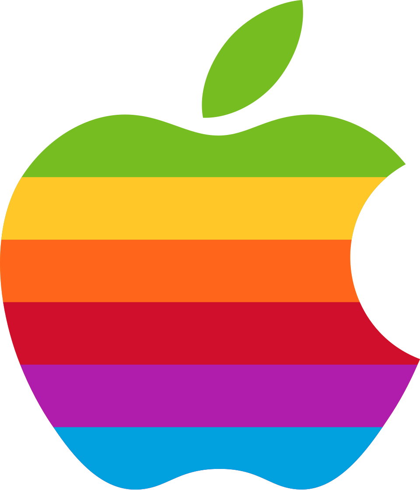

## Unprecedented usability
- Same environment for authoring & use
- Controlled via user levels

## Stateful interactive system
- Scripts live inside the stateful app
- Stacks are open to modification by default

## No modern equivalent
- Hypermedia evolved into the Web
- What got lost in the process?

----------------------------------------------------------------------------------------------------
- template: notes
- style: img { border-width:20px; max-width:200px; float:right; } a { font-weight:500; }
    ul { margin-top:-15px; } p { font-size:30pt; } li { font-size:30pt; }
    strong { color:#d22d40; }

# Audience participation :-)

**What can a programming languages researcher say about HyperCard?**

  

More opportunities for input to come!

- https://tinyurl.com/ecoop26

----------------------------------------------------------------------------------------------------
- template: content

# Programming systems
## Different ways of looking

----------------------------------------------------------------------------------------------------
- template: icons

# Programming systems
## Different ways of looking

- *fa-up-down-left-right* **Technical dimensions** - heuristic analysis
- *fa-microscope* **Complementary science** - past systems
- *fa-not-equal* **Formal models** - theory of systems
- *fa-comment-dots* **User centric** - talking to users

****************************************************************************************************
- template: subtitle

# Technical dimensions
## Qualitative systems analysis

----------------------------------------------------------------------------------------------------
- template: image
- class: larger

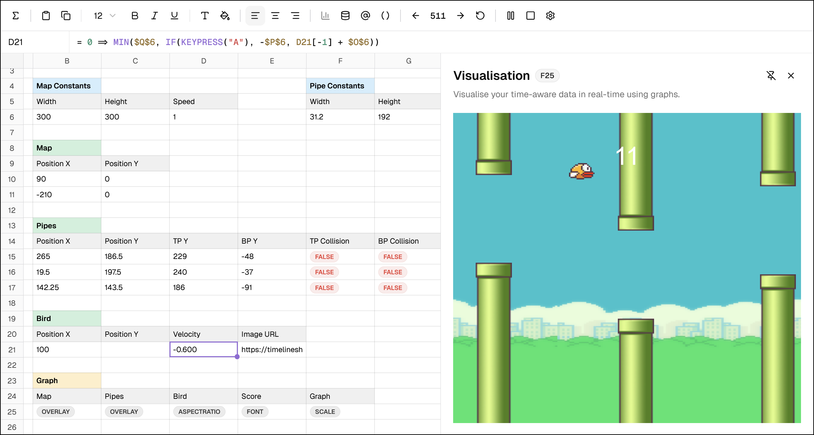

# Timeline

**Adding time to spreadsheets**

Most widely used programming sys!

Keep simplicity & add expressivity

---

_Comparison with using Python?_

----------------------------------------------------------------------------------------------------
- template: content
- style: img { border-width:20px; max-width:200px; float:right; } a { font-weight:500; }
    ul { margin-top:-15px; } p { font-size:26pt; } li { font-size:26pt; } h3 { margin-top:0px; }
    strong { color:#d22d40; }

### Experiment with Timeline!

Go to: https://timelinesheets.com  
Or try: https://tinyurl.com/ecoop26-bird

Create simple time-aware calculations

`A1 = 0 => A1[-1] + 1`  
`B1 = 0 => B1[-1] + RAND(1) - 0.5`  

---

 

### Audience participation :-)

**How does spreadsheet system  (with time) compare to Python?**

- https://tinyurl.com/ecoop26

---------------------------------------------------------------------------------------------------
- template: lists

# Technical dimensions

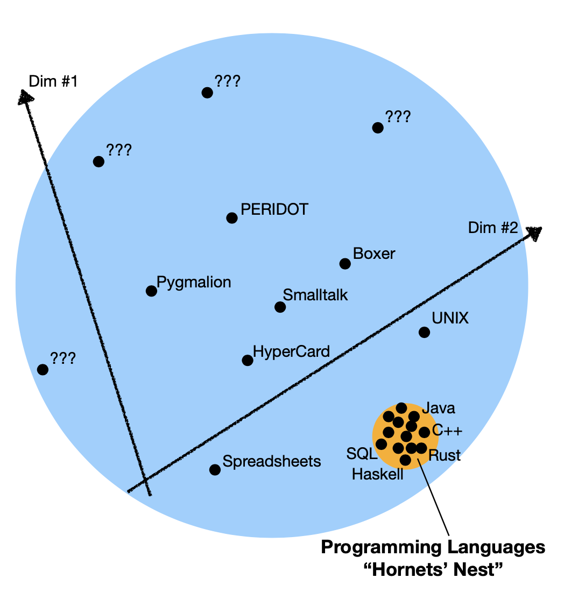

## What is a dimension

- Captures a property of a system
- Covers old and new systems
- Defines a range of values

## Using the framework

- Identify gaps in design space
- Characterise new and old systems
- Qualitative comparison of systems

---------------------------------------------------------------------------------------------------
- template: image
- class: larger
- style: a { font-weight:500; }

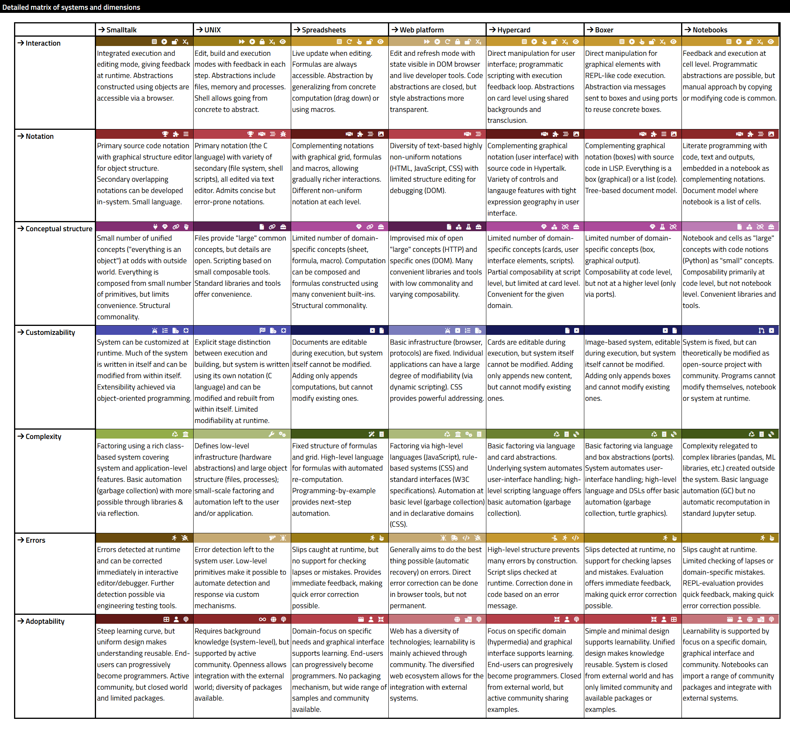

# Catalogue

**Analysed systems**

LISP machines, UNIX, Web, Hypercard, Spreadsheets, Haskell, Boxer, DarkLang, etc.

[tomasp.net/techdims](https://tomasp.net/techdims)

---------------------------------------------------------------------------------------------------
- template: lists
- class: bigger

# Analysis of HyperCard

## Modes of interaction
Programming happens in the  
same interface mode as using

## Primary & secondary notation
Graphics and basic interactions constructed graphically; script is secondary

## Self-sustainability
Clear separation between app itself and  
user code; cannot be modified from within

---------------------------------------------------------------------------------------------------
- template: content

# Analysis of Timeline

---------------------------------------------------------------------------------------------------
- template: lists
- class: bigger

# Analysis of Timeline

## Modes of interaction
Programming happens in the  
same interface mode as using

## Abstraction construction
Code reuse by creating formula and using "drag down"

## Composability vs. convenience
Timeline has composable charting primitives  
but no built-in high-level charts

****************************************************************************************************
- template: subtitle

# Complementary science
## Learning from the past

----------------------------------------------------------------------------------------------------
- template: image
- class: smaller

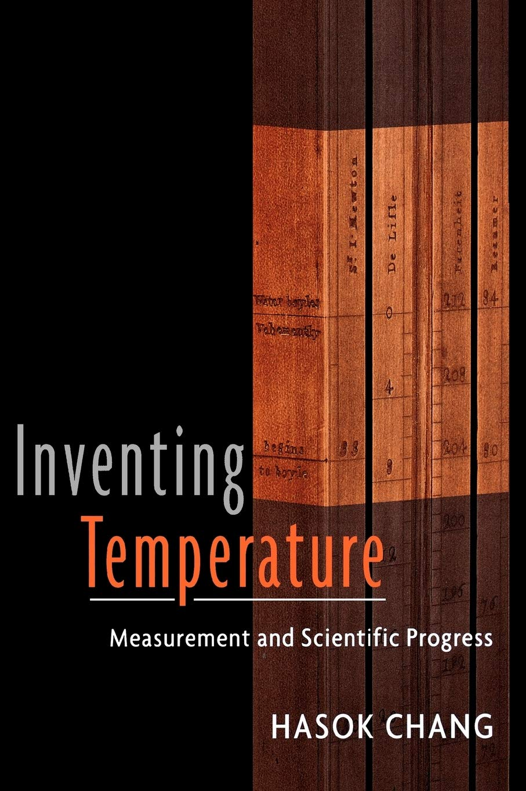

# Complementary science

**Scientific ideas get lost due to paradigm shifts**

There is often something valuable lost too.

Do serious historical research to recover them!

---

_Even more the case  
in programming!_

----------------------------------------------------------------------------------------------------
- template: image
- class: larger

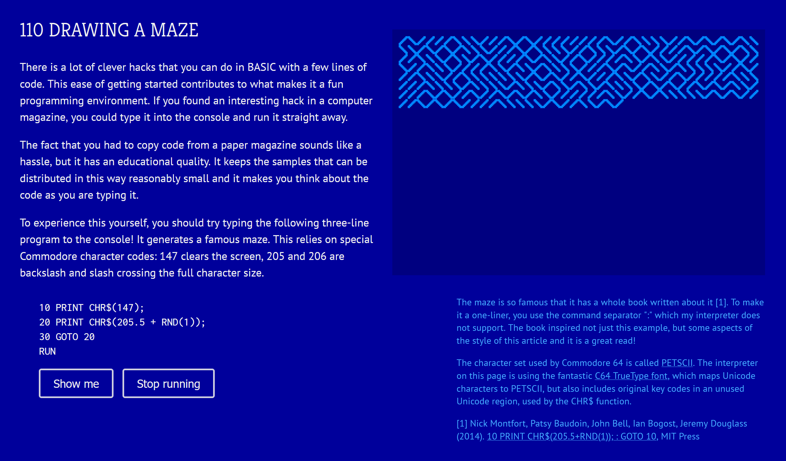

# Commodore 64

"It is impossible to teach good prog&shy;ramming to stu&shy;dents that have had a prior expo&shy;sure to BASIC" (Dijkstra)

---

_What can we learn from BASIC?_

----------------------------------------------------------------------------------------------------
- template: content
- style: img { border-width:20px; max-width:200px; float:right; } a { font-weight:500; }
    ul { margin-top:-15px; } p { font-size:26pt; } li { font-size:26pt; } h3 { margin-top:0px; }
    strong { color:#d22d40; }

### Experiment with C64 BASIC!

https://tomasp.net/commodore64

Try printing Hello world!  
`PRINT "HELLO WORLD"`  

Try writing an infinite loop!  
`10 PRINT "HELLO WORLD"`  
`20 GOTO 10`   

---

 

### Audience participation :-)

**Is there anything good about prefixing each  
line with a number? What is the point?**

- https://tinyurl.com/ecoop26

----------------------------------------------------------------------------------------------------
- template: image
- class: smaller
- style: a { font-weight:500; }

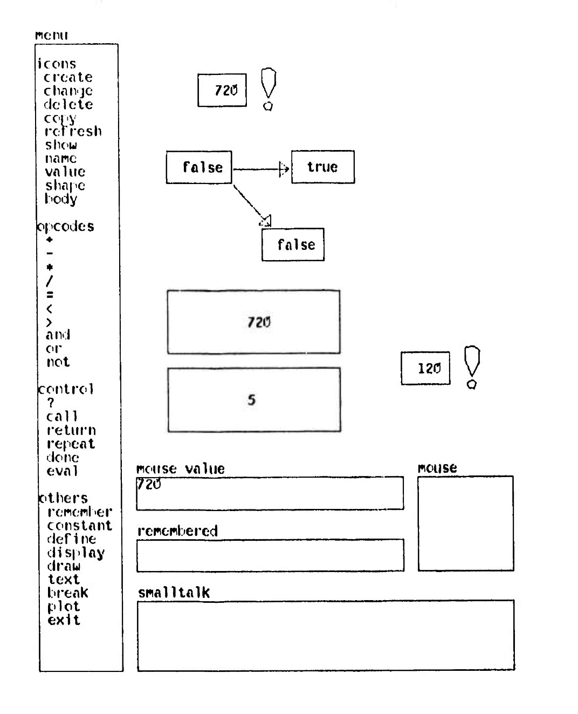

# Pygmalion

**Visual programming system based on demonstration**

Largest Smalltalk 74 program ever written

---

_What does using Pygmalion feel like?_

https://tinyurl.com/ecoop26-pygm

----------------------------------------------------------------------------------------------------
- template: lists

# Learning from Pygmalion

## Abstraction construction
- From concrete manipulation
- Programming by demonstration

## Visual programming
- Good iconic representations?
- Difficult in an abstract domain!

----------------------------------------------------------------------------------------------------
- template: content

# Learning from Commodore 64 BASIC

----------------------------------------------------------------------------------------------------
- template: lists
- class: noborder

# Learning from Commodore 64 BASIC

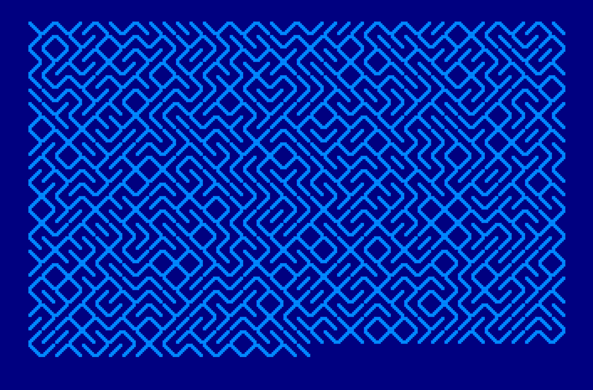

## Modes of interaction

Terminal works as both REPL  
and structure code editor

## Factoring of complexity

Simple but experts can use POKE and SYS

## Learnability

Simple unstructured language  
Demos distributed as source in magazines

****************************************************************************************************
- template: subtitle

# Formal models
## Modelling interactive systems

----------------------------------------------------------------------------------------------------
- template: image
- class: larger

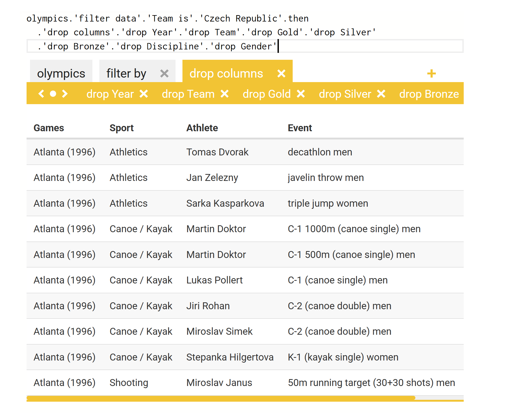

# The Gamma

**Programming for non-programmers**

Explore data by repeatedly choo&shy;sing from a list of offered options

---

_What is the underlying language?_

----------------------------------------------------------------------------------------------------
- template: content
- style: img { border-width:20px; max-width:200px; float:right; } a { font-weight:500; }
    ul { margin-top:-15px; } p { font-size:26pt; } li { font-size:26pt; } h3 { margin-top:0px; }
    strong { color:#d22d40; }

### Explore Olympic medals in The Gamma!

https://thegamma.net or directly   
https://tinyurl.com/ecoop26-olympics

Known issues in Firefox (sorry)   
Old and buggy data (also sorry)

Type `olympics.` and choose an operation. Get top medalists or top teams?

---

 

### Audience participation :-)

**What is the model of The Gamma language  
or system? Is there a formal grammar?**

- https://tinyurl.com/ecoop26

----------------------------------------------------------------------------------------------------
- template: image
- class: larger
- style: a { font-weight:500; }

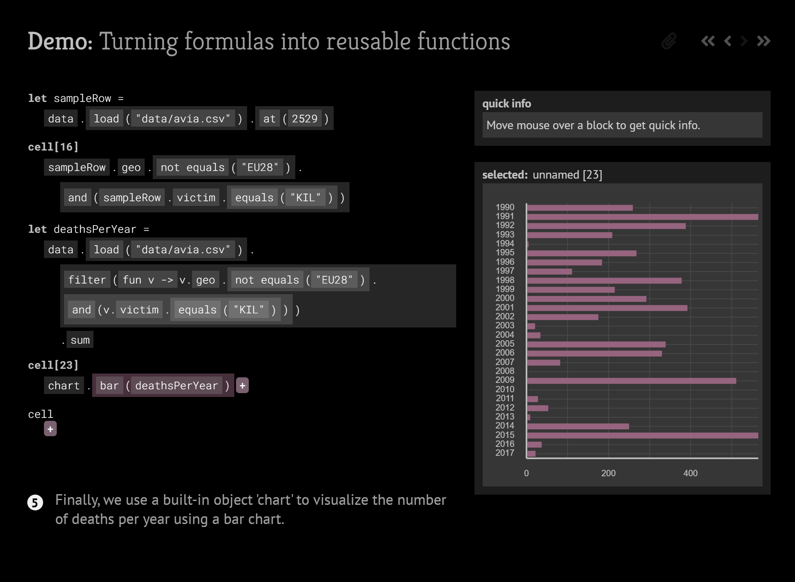

# Histogram

**Programs as lists of interactions**

Keep track of the process!

Running code, refactoring

[tomasp.net/histogram](https://tomasp.net/histogram)

---------------------------------------------------------------------------------------------------
- template: content
- style: h1 { font-size:40pt; }

# Formal models of programming systems

---------------------------------------------------------------------------------------------------
- template: content
- style: h1 { font-size:40pt; color:#003657; margin-bottom:20px; } h3 { margin:0px; }

# Formal models of programming systems

### Grammar of The Gamma language
Program is a sequence of let bindings or invocations  
Lambda only used as method parameter!

$$$
\newcommand{\lsep}{\;\;|\;\;}
\newcommand{\kvd}[1]{\textbf{#1}}
\newcommand{\narrow}[1]{\hspace{-0.6em}#1\hspace{-0.6em}}
\begin{array}{lcl}
p &\narrow{::=}& c_1; \ldots; c_n\\
c &\narrow{::=}& \kvd{let}~x = t \lsep t\\
\end{array}
\quad
\begin{array}{lccl}
t &\narrow{::=}& o &\hspace{-1em}\lsep x \lsep t.m(e, \ldots, e) \\
e &\narrow{::=}& t &\hspace{-1em}\lsep \lambda x\rightarrow e\\
\end{array}

---

**Reflects how data science scripting works!**  
We can get a preview for any sub-expression  

---------------------------------------------------------------------------------------------------
- template: content
- style: h1 { font-size:40pt; color:#003657; margin-bottom:20px; } h3 { margin:0px; }
    .smmath {  transform:scale(0.8); margin:-40px 0px -20px -20px; }

# Formal models of programming systems

### Programming as list of interactions
Record operations as performed by the user!

$$$
\newcommand{\narrow}[1]{\hspace{-0.6em}#1\hspace{-0.6em}}
\begin{array}{rcl}
p &\narrow{::=}& i_1, ~\ldots,~ i_k\\
r &\narrow{::=}& \textbf{named}~n~~|~~\textbf{indexed}~i\\
i &\narrow{::=}& \textbf{def}~\textit{value}\\
  &\narrow{|}& \mathbf{name}~\textit{ref}~\textbf{a}~\textit{name}\\
  &\narrow{|}& \textbf{dot}~\textit{name}~\textbf{on}~\textit{ref}\\
  &\narrow{|}& \textbf{apply}~\textbf{args}~\textit{ref}_1, \ldots, \textit{ref}_n~\textbf{to}~\textit{ref}\\
  &\narrow{|}& \mathbf{evaluate}~\textit{ref}\\
  &\narrow{|}& \mathbf{abstract}~\textbf{from}~\textit{ref}_1, \ldots, \textit{ref}_k~\textbf{to}~\textit{ref}
\end{array}

---

**We can talk about interesting things!**  
Render program as code or spreadsheet  
Refine type information after $\textbf{evaluate}$ interaction

****************************************************************************************************
- template: subtitle

# Methods & formats
## Explaining interactive systems

----------------------------------------------------------------------------------------------------
- template: content
- class: three-column nologo
- style: img { width:200px; border-style:none; }
    h3 { color:black; font-size:26pt }  p { font-size:24pt; }

# Programming experiences

### Collaboration

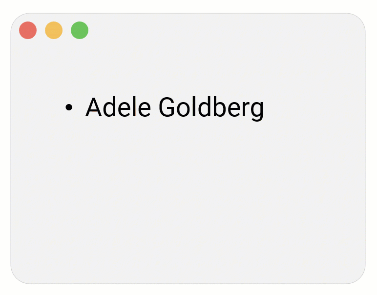

Merge edits made independently by different users

---

### Demonstration

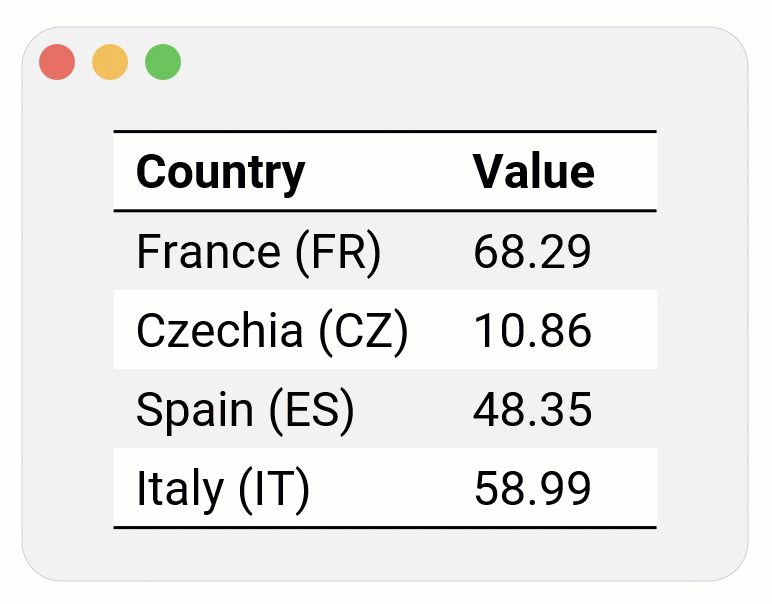

Specify program by showing concrete document action

---

### Schema change

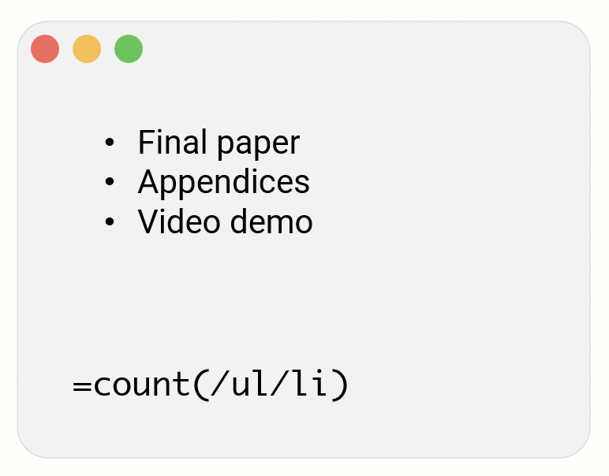

Adapt references when document structure changes

----------------------------------------------------------------------------------------------------
- template: image
- class: noborder smaller

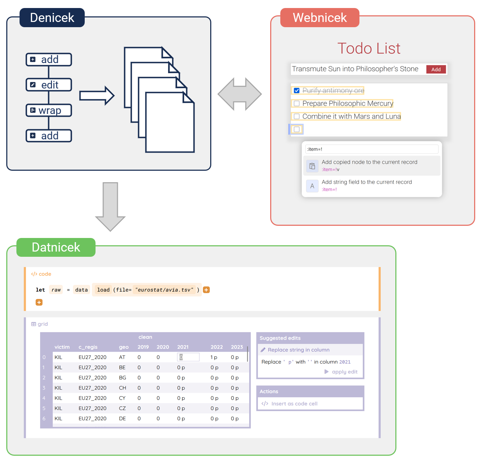

# Denicek

**Computational substrate for end-user document-oriented programming**

 

Makes implementing  
such systems easy!

----------------------------------------------------------------------------------------------------
- template: content
- style: img { border-width:20px; max-width:200px; float:right; } a { font-weight:500; }
    ul { margin-top:-15px; } p { font-size:26pt; } li { font-size:26pt; } h3 { margin-top:0px; }
    strong { color:#d22d40; } em { font-style:normal; font-weight:400; }

### Experiment with Denicek!

https://tinyurl.com/ecoop26-denicek

Replay the steps of _Chapter 1_ demo  
Invoke `@normalize!` in step 4 yourself

---

   

### Audience participation :-)

**Compare an interactive essay with a classic paper!  
Did you break it? Did you learn something extra?**

- https://tinyurl.com/ecoop26

----------------------------------------------------------------------------------------------------
- template: largeicons

# Medium is the message
## What do we choose to ignore?

- *fa-file-lines fa-regular* **Conventional academic papers**  
  Ignore complexity, capture essence as formulas

- *fa-film* **Video demos and webcasts**  
  Show interaction, but what are the limits?

- *fa-arrow-pointer* **Interactive essays**  
  Guided walkthrough based on system prototype

****************************************************************************************************
- template: subtitle

# Conclusions
## Programming systems research

----------------------------------------------------------------------------------------------------
- template: largeicons

# Research methods

- *fa-magnifying-glass* **Qualitative analysis**  
  Mapping the design space of systems
- *fa-not-equal* **Formal models**  
  Systems view breaks conventional wisdoms
- *fa-gamepad* **Human-computer interaction**  
  How are systems used, how could they be used
- *fa-scroll* **Complementary science**  
  Learning from interesting past systems

----------------------------------------------------------------------------------------------------
- template: title
- style: .items p { margin-top:0px; margin-bottom:8px; font-size:28pt; color:#d22d40; }
   i { margin-right:15px; } h2 { font-size:38pt; margin-bottom:60px; }

# Programming systems, _or what_
## programming language research cannot see

_<i class="fa fa-circle-question"></i>_ Systems view **opens new research questions**

_<i class="fa fa-flask"></i>_ We can use many different **research methods**

_<i class="fa fa-robot"></i>_ AI agents **interact** with programming systems too

---

**Tomas Petricek**, Charles University, Prague

_<i class="fa fa-envelope"></i>_ [tomas@tomasp.net](mailto:tomas@tomasp.net)  
_<i class="fa fa-globe"></i>_ [https://tomasp.net](https://tomasp.net)  
_<i class="fa-brands fa-bluesky"></i>_ [@tomasp.net](https://bsky.app/profile/tomasp.net)    
