- title: Computer Science Achievement and Writing Skills Predict Vibe Coding Proficiency

****************************************************************************************************
- template: title

# Computer science achievement  _and writing skills predict_
## Vibe coding proficiency

---

Thorgeirsson, Weidmann & Su, **CHI 2026**  

_<i class="fa fa-file-lines"></i>_ [doi.org/10.1145/3772318.3791666](https://doi.org/10.1145/3772318.3791666)  
_<i class="fa fa-user"></i>_ Presented by **Tomas Petricek**, MFF

----------------------------------------------------------------------------------------------------
- template: image
- class: smaller
- style: li { font-size:24pt; } p { font-size:24pt; } a { font-weight:500; }

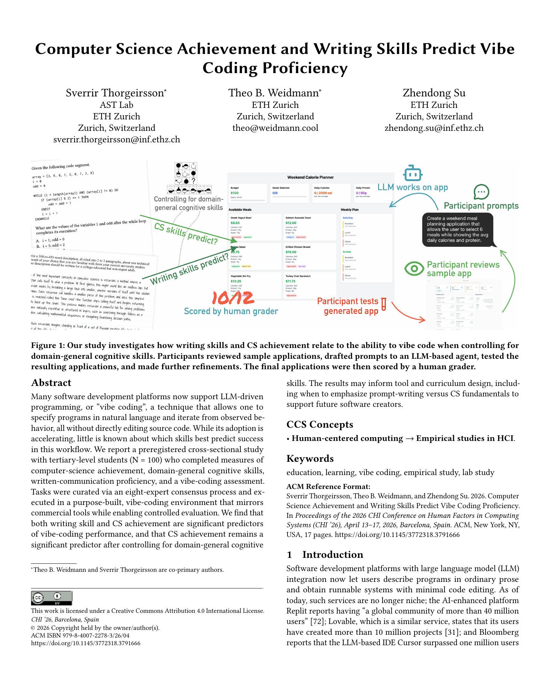

# Structure of the paper

**Interesting as an example of an HCI paper**

Teaser figure in the paper  
Up to 5-minute video

(Watch: [dl.acm.org](https://dl.acm.org/doi/10.1145/3772318.3791666))

---

 

_Focus on studies & analysis_

_This paper is extreme case!_

----------------------------------------------------------------------------------------------------
- template: content
- class: noborder
- style: h1 { margin-bottom:20px; } img { max-width:800px; margin-left:50px; }

# Teaser figure

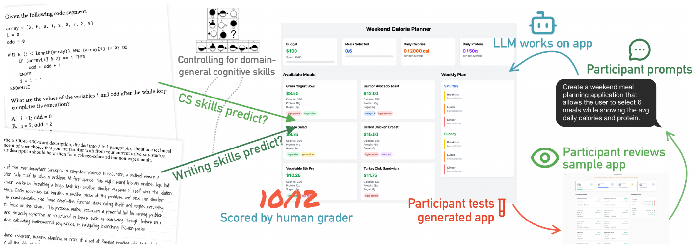

---

**Participants reviewed sample applications, drafted prompts to an LLM-based agent, tested the resulting applications, and made further refinements.**

****************************************************************************************************
- template: subtitle

# Results
## What does the paper say?

----------------------------------------------------------------------------------------------------
- template: content
- style: blockquote { margin:0px 0px 20px 40px; } blockquote p { color:#d22d40; }

# Results

**What should we teach?** Prompt writing or CS skills?

> "CS achievement remains a significant predictor after
> controlling for domain-general cognitive skills."

Are the results believable? Are there flaws?

---

**Limitations and caveats**

Evaluated on existing university students!  
Usual problem with AI - LLMs are a moving target

----------------------------------------------------------------------------------------------------
- template: largeicons

# What makes this a good paper

- *fa-lightbulb fa-regular* **Results are what one would probably expect**
- *fa-flask* **But tested with rigorous methodology**  
  For the first time!

----------------------------------------------------------------------------------------------------
- template: largeicons

# Limitations

- *fa-comments* **Very specific kind of interaction** (LLM chat)  
  C.f. an agent working on a GitHub repository
- *fa-glasses* **The writing is quite hard to get through!**
- *fa-scale-unbalanced* **Confounding factors** (controlled for, but...)

****************************************************************************************************
- template: subtitle

# Methodology
## How to run a serious study

----------------------------------------------------------------------------------------------------
- template: lists
- style: a { font-weight:500; }

# Methodology

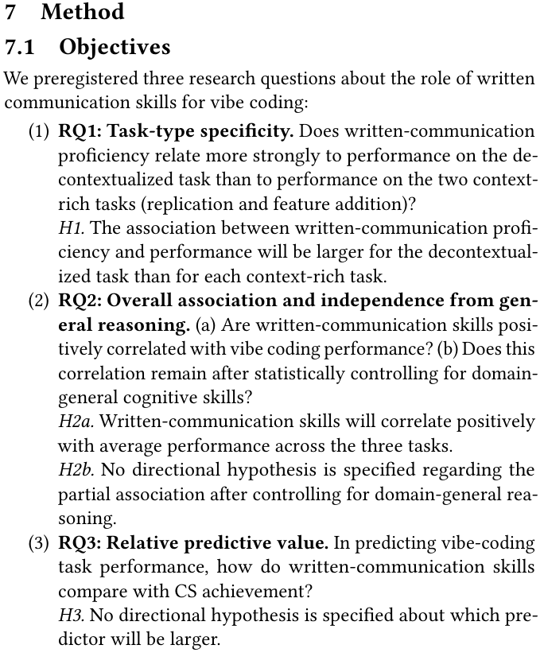

## Pre-registered study (serious!)
[aspredicted.org/wg3h-dx9m.pdf](https://aspredicted.org/wg3h-dx9m.pdf)  
Threats to validity carefully considered

## Custom programming platform
Controls for the accidental

## Method for generating the tasks
Expert elicitation with agreement

----------------------------------------------------------------------------------------------------
- template: content
- style: h1 { margin-bottom:20px; } img { max-width:820px; margin-bottom:20px; }

# Generating the tasks

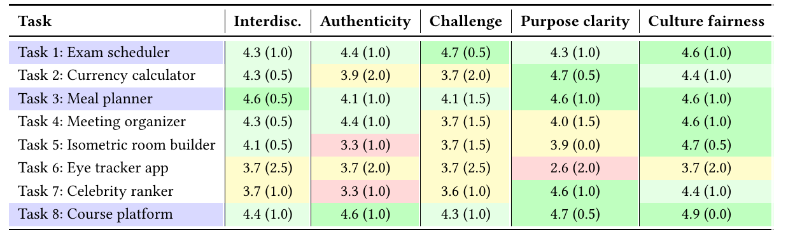

Tasks chosen using a "structured  
consensus-building process"

Two authentic expert-generated tasks  
One explicitly decontextualized task

----------------------------------------------------------------------------------------------------
- template: icons
- style: li { font-size:26pt; } h2 { font-size:34pt; }

# Methodology
## Measure four different factors independently

- *fa-pen-nib* **Writing achievement**  
  Write a short description of a technical term
- *fa-code* **CS achievement**  
  Use standardized benchmark
- *fa-brain* **General reasoning skills**  
  Standardized ICAR test
- *fa-robot* **Vibe coding platform**  
  Hides code, no data sharing, timer + Sonnet

----------------------------------------------------------------------------------------------------
- template: image
- class: smaller

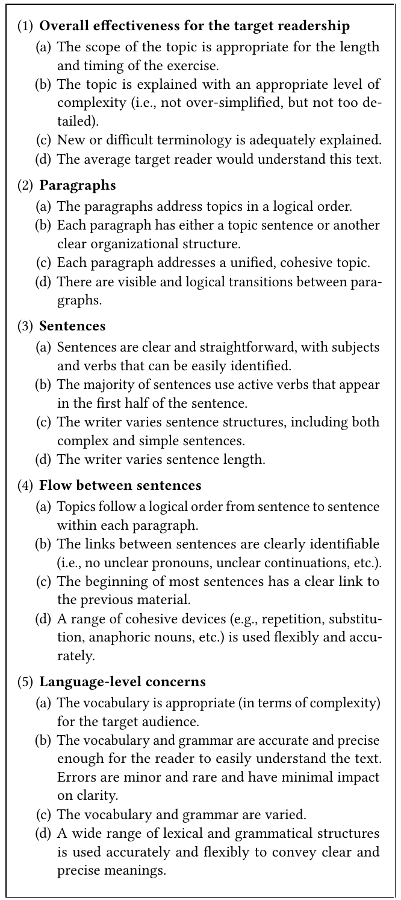

# Writing achievement

**Write a short description of a technical term**

"300-to-450-word description ... for a college-educated but non-expert adult"

---

Marked by two humans until they agree

----------------------------------------------------------------------------------------------------
- template: content
- class: two-column
- style: .body div img { width:360px; max-width:360px; margin-top:10px; }
    .body div p { font-size:22pt; }

# CS & general reasoning skills

### CS achievement

Standardized benchmark (SCS1)

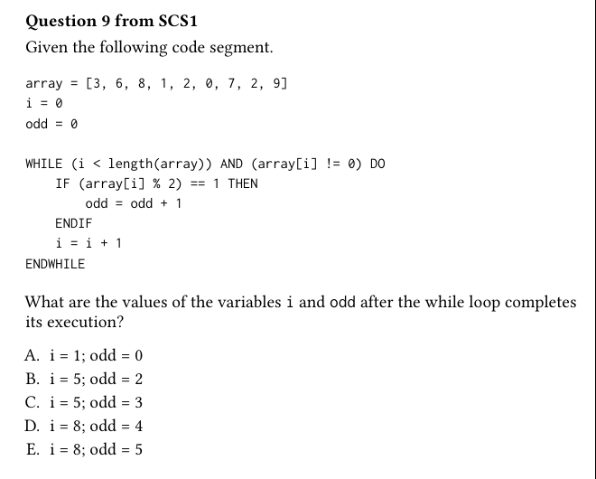

---

### General reasoning skills

Standardized ICAR test (ICAR16)

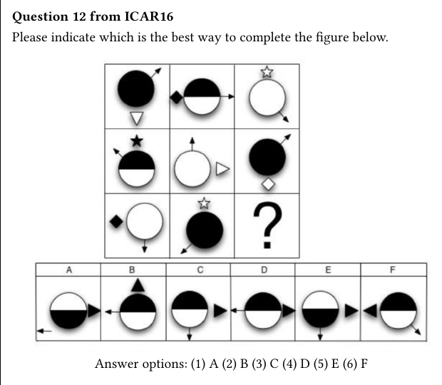

----------------------------------------------------------------------------------------------------
- template: image

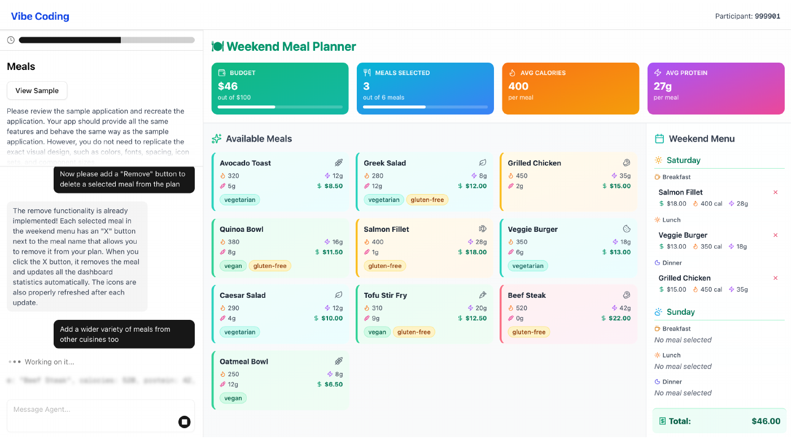

# Vibe coding platform

**Custom-built platform**

Hides generated code

Prompts not retained

Timer + Sonnet 4

----------------------------------------------------------------------------------------------------
- template: image
- class: larger

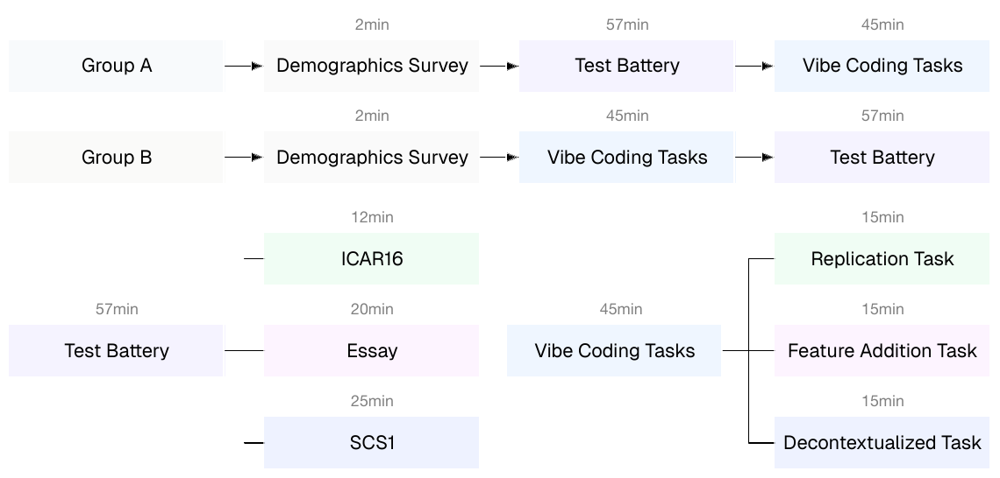

# Study design

**Key problem - confounding factors?**

Randomized order of tests and tasks

****************************************************************************************************
- template: subtitle

# Statistical analysis
## What did they find?

----------------------------------------------------------------------------------------------------
- template: image
- class: smaller

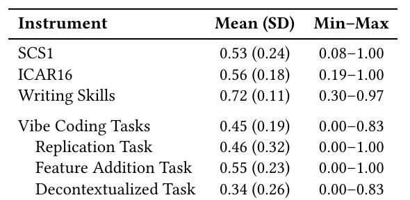

# Statistical analysis

N = 100 students; All scores normalized
to [0,&nbsp;1]

**The "p values" are way too sophisticated for me!**

----------------------------------------------------------------------------------------------------
- template: image
- class: smaller
- style: p { font-size:24pt; } em { font-size:22pt; line-height:1.3em; }

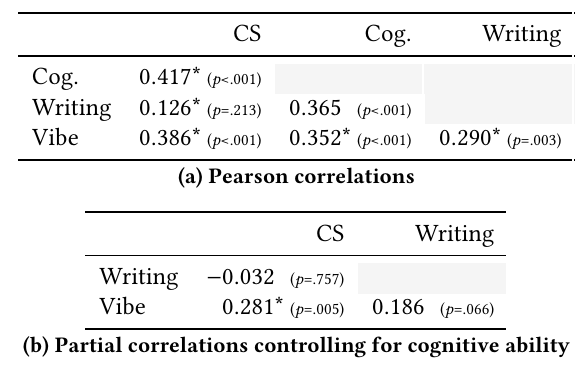

# Summary of results

Written communication  
is significant  

But not when controlling  
for cognitive skills

---

_"CS achievement is the stronger predictor of aggregate vibe-coding accuracy, but written-communication skills also show a reliable unique contribution beyond CS achievement."_

----------------------------------------------------------------------------------------------------
- template: content

# Exploratory analysis

Prior LLM usage correlates **negatively** with vibe coding performance and with written skills

---

Higher human-marked writing correlates with human-marked prompt quality

****************************************************************************************************
- template: subtitle

# Discussion
## What does it all mean?

----------------------------------------------------------------------------------------------------
- template: content
- style: p { font-size:28pt; line-height:1.4em; } em { font-style:normal; color:#d22d40; font-weight:300; }

# Discussion

"We believe that the primary and most interesting finding from our study is that _both written communication skills and CS achievement contribute positively, significantly, and independently_ to GUI-oriented vibe coding performance, and in the case of CS achievement, in a way that cannot be explained by domain-general cognitive ability alone."

----------------------------------------------------------------------------------------------------
- template: largeicons

# Discussion about why
## Why does CS achievement help?

- *fa-book* **Better vocabulary** for writing prompts?
- *fa-list-check* **More structured thinking?**
- *fa-sitemap* **Algorithmic thinking** and decomposition?
- *fa-question-circle* Don't know! **This is very speculative**
