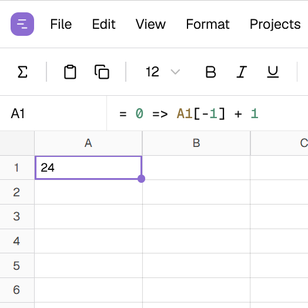
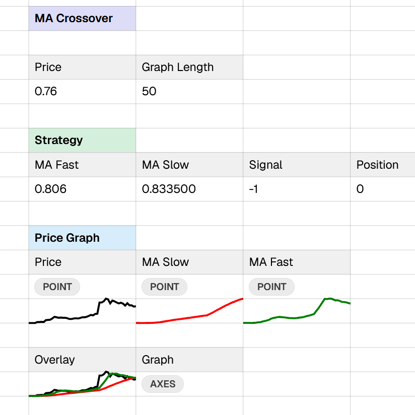
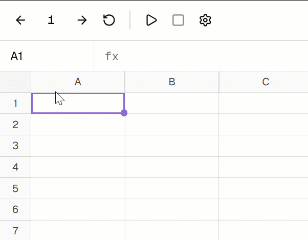
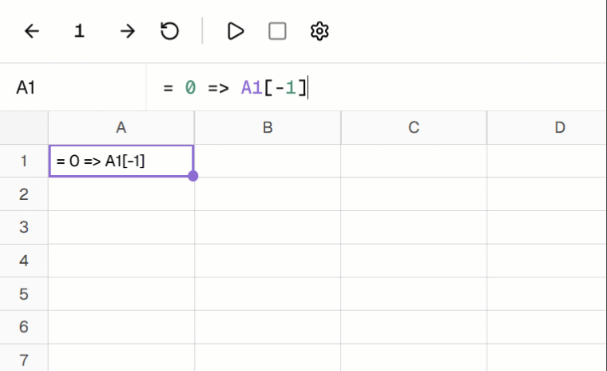
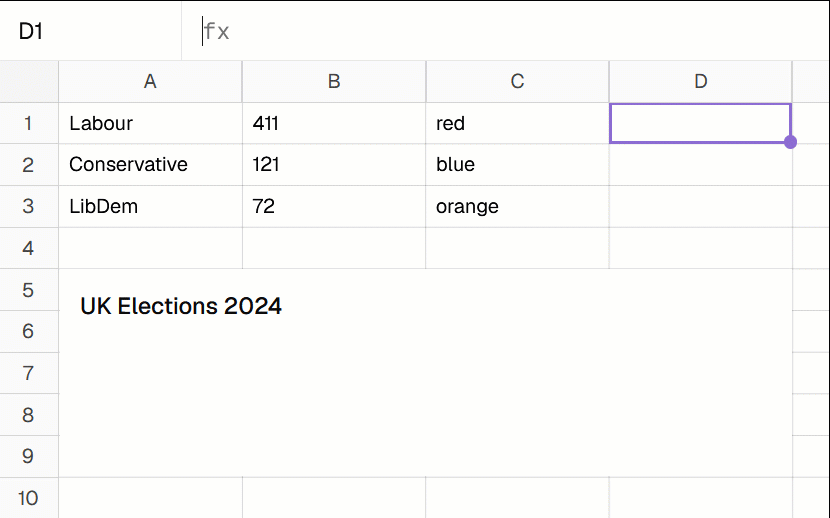
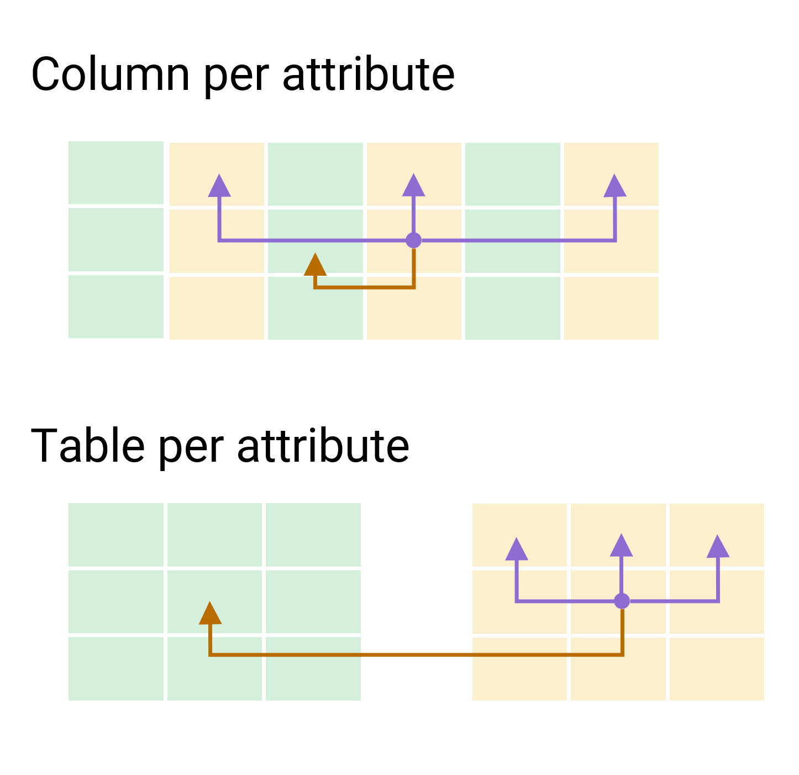

- title: Programming Systems, or What Programming Language Research Cannot See

****************************************************************************************************
- template: title

# Timeline: _Adding the time<br> dimension to spreadsheets_


---

**Tomas Petricek** & Tomáš Boďa  
Charles University, Prague  

_<i class="fa fa-envelope"></i>_ [tomas@tomasp.net](mailto:tomas@tomasp.net)  
_<i class="fa fa-globe"></i>_ [https://tomasp.net](https://tomasp.net)  
_<i class="fa-brands fa-bluesky"></i>_ [@tomasp.net](https://bsky.app/profile/tomasp.net)    

<script type="text/javascript">
  window.onload = function() {
    document.querySelectorAll("pre code.language-timeline").forEach(el => {
      const esc = s => s.replace(/&/g, "&amp;").replace(/</g, "&lt;").replace(/>/g, "&gt;");
      const re = new RegExp([
        /("[^"]*")/,                                   // strings
        /(?<![\w$.])(\$?[A-Z]{1,3}\$?\d+)(?!\w)/,      // cell refs
        /\b(IF|KEYPRESS)\b/,                           // functions
        /(?<![\w$.])(\d+(?:\.\d+)?)(?!\w)/             // numbers
      ].map(r => r.source).join("|"), "g");
      el.innerHTML = esc(el.textContent).replace(re, (m, str, ref, fn, num) =>
        str ? `<span class="str">${str}</span>` :
        ref ? `<span class="ref">${ref}</span>` :
        fn  ? `<span class="fn">${fn}</span>`   :
              `<span class="num">${num}</span>`);
    });
  }
</script>
<style type="text/css">
pre code { font-size:20pt !important; }
code .ref { color:FireBrick; }
code .num { color:DarkGreen; }
code .str { color:Goldenrod; }
code .fn { color:RebeccaPurple; }
</style>

****************************************************************************************************
- template: content
- class: two-column
- style: h3 { color: #003657; line-height:1.1em; }

# Adding time to spreadsheets

### Using programming research in a new way



---

### Spreadsheets as a research problem



****************************************************************************************************
- template: subtitle
- style: i { font-size:20pt; position:relative; left:10px; top:-10px; }

# Demo
## Flappy Bird in Timeline [<i class="fa fa-up-right-from-square"></i>](https://timelinesheets.com/spreadsheet/1187c0bd-fe59-4efd-9541-622f35587031)

****************************************************************************************************
- template: lists
- class: bigger
- style: ul { list-style-type:none; margin-top:20px; } pre { margin-top:20px; margin-bottom:20px; } p { margin-left:40px; margin-top:20px; margin-bottom:20px; } h2 { font-weight:600; }

# Adding time to spreadsheets



## Implementing counter

```timeline
A1 = 0 => A1[-1] + 1
```

## Two language additions

`A1[-1]` to access past values  
`=>` to specify initial value  

## Synchronous dataflow

Compare formula with Lustre!  
`nat = 0 -> pre(nat) + 1;`

****************************************************************************************************
- template: lists
- class: bigger
- style: ul { list-style-type:none; margin-top:20px; } pre { margin-top:20px; margin-bottom:20px; } p { margin-left:40px; margin-top:20px; margin-bottom:20px; } h2 { font-weight:600; }

# Functional reactive programming



## Counting key presses

```timeline
A1 = 0 => A1[-1] +
  IF(KEYPRESS("A"), 1, 0)
```

## Two reactive concepts

- **Events** for discrete events
- **Bahaviors** for time-varying values

## There is more to do

- No switching to dynamically  
  reconfigure dataflow graph


****************************************************************************************************
- template: lists
- class: bigger2x
- style: ul { margin-top:20px; } pre { margin-top:20px; margin-bottom:20px; } p { margin-left:40px; margin-top:20px; margin-bottom:20px; } h2 { font-weight:600; }

# Composable visualizations



## Two problems

- Excel-like UI does not scale
- Need to see values over time

## Functional approach

- Domain-specific language
- **Primitives** like `COLUMN`
- **Combinators** like `OVERLAY`, `FILLCOLOR`
- Perfect fit for ranges & drag-down interaction

****************************************************************************************************
- template: content
- style: h2 { margin:50px 0px 20px 0px; padding:0px; font:600 30pt 'Roboto', sans-serif; }

# Coeffect-based optimization

## How many past values do we need to cache?

- Track the required number of past values
- `A1[-1]` creates $@\; 1$ requirement at `A1`

---

## Inspired by dataflow coeffects

<div style="padding:20px 50px; margin-top:20px">

$\dfrac{(x:\tau)\in\Gamma}{\Gamma \;@\; 0 \vdash x : \tau} \qquad \dfrac{\Gamma \;@\; n \vdash e : \tau}{\Gamma \;@\; (n+1) \vdash \textbf{prev}~e : \tau}$

</div>

****************************************************************************************************
- template: subtitle

# Timeline
## Research questions

****************************************************************************************************
- template: image
- class: smaller
- style: h1 { font-size:28pt; }



# Encoding third dimension

**Entities with multiple attri&shy;butes changing over time**

_Columns_ for entities  
_Rows_ for time steps

**Two ways of encoding attributes in a sheet**

Tested with a user study!

****************************************************************************************************
- template: icons
- style: i { margin-right:10px; }

# Open question
## What makes spreadsheets work?

- *fa-table* **Closeness of mapping**
- *fa-square-root-variable* **Low abstraction support**
- *fa-arrow-rotate-right* **High degree of liveness**
- *fa-list-ol* **Concrete programming**

****************************************************************************************************
- template: icons
- style: i { margin-right:10px; } li:nth-child(1) { color:#d22d40; }
    li:nth-child(2) { color:#d22d40; } li:nth-child(3) { color:#d22d40; }

# Adding time
## Do we lose something?

- *fa-table* **Closeness of mapping**
- *fa-square-root-variable* **Low abstraction support**
- *fa-arrow-rotate-right* **High degree of liveness**
- *fa-list-ol* **Concrete programming**

****************************************************************************************************
- template: content
- style: h1 { color:#003657; }

# Formal models of spreadsheets

### Following style of Gridlets

<div style="margin:20px 0px 50px 50px">

$\boxed{\textnormal{Formula evaluation:}~~\sigma \vdash F \Downarrow V }$

$\boxed{\textnormal{Sheet evaluation:}~~\sigma \Downarrow \gamma}$

</div>

### Evaluation order not fixed

<div style="margin:30px 0px 20px 50px">

$\dfrac
  {\forall a \in \textnormal{dom}(\sigma)~.~\gamma(a) = V \wedge \sigma \vdash \sigma(a) \Downarrow V}
  {\sigma \Downarrow \gamma}$

<div>

****************************************************************************************************
- template: title
- style: .items p { margin-top:0px; margin-bottom:8px; font-size:28pt; color:#d22d40; }
   i { margin-right:15px; } h1 { margin-bottom:60px; }

# Timeline: _Adding time to spreadsheets_

<div class="items">

_<i class="fa fa-table"></i>_ We still don't know why spreadsheets work...

_<i class="fa fa-divide"></i>_ Language research works for spreadsheets

_<i class="fa fa-terminal"></i>_ Think about systems, not languages!

</div>

---

**Tomas Petricek** & Tomáš Boďa

_<i class="fa fa-envelope"></i>_ [tomas@tomasp.net](mailto:tomas@tomasp.net)  
_<i class="fa fa-globe"></i>_ [https://tomasp.net](https://tomasp.net)  
_<i class="fa-brands fa-bluesky"></i>_ [@tomasp.net](https://bsky.app/profile/tomasp.net)    
